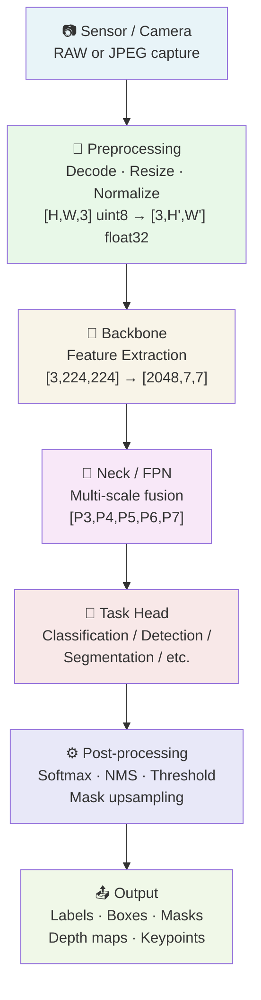
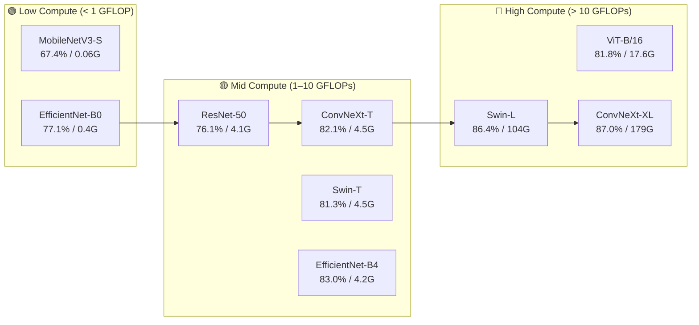

[← Back to Table of Contents](./README.md)

# Chapter 0 — Grand Overview of Computer Vision

> *"Seeing is not believing — it is a complex inference problem solved by billions of neurons working in parallel."*

---

## Table of Contents

1. [What Is Computer Vision?](#what-is-computer-vision)
2. [The Anatomy of a Computer Vision System](#the-anatomy-of-a-computer-vision-system)
3. [The Computer Vision Task Taxonomy](#the-computer-vision-task-taxonomy)
4. [A Brief History of Computer Vision](#a-brief-history-of-computer-vision)
5. [The Model Performance Landscape](#the-model-performance-landscape)
6. [Compute Requirements](#compute-requirements)
7. [How This Guide Is Organized](#how-this-guide-is-organized)
8. [Key Takeaways](#key-takeaways)
9. [Further Reading](#further-reading)

---

## What Is Computer Vision?

Computer vision (CV) is the scientific discipline concerned with enabling machines to interpret and understand visual information from the world — images, video, and other sensor data — in ways that are meaningful for downstream tasks. At the most abstract level, a CV system takes a tensor of pixel values (or voxels, point clouds, event streams, etc.) as input and produces structured semantic output: class labels, bounding boxes, segmentation masks, depth maps, 3D poses, captions, or answers to questions.

The field sits at the intersection of signal processing, applied mathematics, machine learning, and cognitive science. It draws on linear algebra (the language of image transformations), probability theory (for reasoning under uncertainty), optimization (to train models), and increasingly, the empirical science of scaling large neural networks on internet-scale data.

### CV as an Inverse Graphics Problem

One of the most clarifying ways to frame computer vision is as the *inverse* of computer graphics. Graphics solves the **forward problem**: given a full 3D scene description (geometry, materials, lights, camera pose), produce a 2D image via rendering. CV solves the **inverse problem**: given only the 2D image, recover the underlying scene.

```
Graphics (forward):  Scene ──[render]──▶ Image
Vision   (inverse):  Image ──[infer]───▶ Scene
```

Mathematically, if we denote the rendering function as:

$$I = \mathcal{R}(S, \mathbf{K}, \mathbf{E}, L)$$

where $I$ is the image, $S$ is the 3D scene, $\mathbf{K}$ is the camera intrinsic matrix, $\mathbf{E}$ is the extrinsic (pose), and $L$ is the lighting, then CV seeks to invert $\mathcal{R}$. The catch is that $\mathcal{R}$ is **many-to-one**: a projection from a high-dimensional space (3D scenes) to a lower-dimensional one (2D images) that discards depth, removes occluded surfaces, and conflates lighting with albedo. This makes the inverse **ill-posed** — infinitely many 3D scenes can produce the same 2D image.

This ill-posedness is precisely why CV is hard, and why priors (statistical regularities about the natural world) encoded in learned models are so powerful. Deep networks implicitly learn the manifold of natural images and use that knowledge to resolve ambiguities.


### Why Vision Is Hard: The Seven Challenges

Computer vision must contend with seven fundamental sources of variability that make it far harder than it might first appear:

1. **Viewpoint variation** — A single object looks radically different from different camera angles. A chair photographed from above looks nothing like the same chair from the side. Humans handle this through 3D mental models; early CV systems did not.

2. **Illumination variation** — The same scene under noon sunlight, fluorescent office light, and candlelight produces vastly different pixel values. A white piece of paper in shadow can be darker than a black piece of paper in direct light. Pixel intensities are a product of both *albedo* (intrinsic surface color) and *illuminance*, and disentangling them is non-trivial.

3. **Occlusion** — Objects are frequently partially or fully hidden by other objects. A pedestrian partially behind a car, or a face occluded by sunglasses, still needs to be recognized. Models must infer the complete object from partial evidence.

4. **Scale variation** — The same object can occupy anywhere from 1 pixel to the entire image depending on its distance from the camera. A person 1 m away might occupy 50% of the frame; the same person 50 m away occupies less than 0.1%.

5. **Deformation** — Many objects of interest (humans, animals, clothing) are non-rigid. A person sitting, standing, running, and jumping produces wildly different body configurations, all of which must be recognized as "person."

6. **Intra-class variation** — The category "chair" encompasses objects with wildly different shapes, colors, materials, and configurations (office chair, armchair, folding chair, beanbag). The within-class variance can exceed the between-class variance for some visual features.

7. **Background clutter** — Objects of interest appear against complex backgrounds that share many local features. A cat on a leopard-print couch, or a stop sign in a forest of red autumn leaves, is genuinely ambiguous to local detectors.

### The Perception–Generation Duality

A fascinating modern insight is that perception and generation are two sides of the same coin. A model that truly understands a scene should be able to *generate* new views of it; conversely, a model that can generate photorealistic images must have learned a rich representation of visual structure.

This duality has become a productive source of training signal. Autoencoders, variational autoencoders (VAEs), and generative adversarial networks (GANs) learn representations by solving a reconstruction problem. Masked autoencoders (MAE) learn by predicting masked image patches. Diffusion models like Stable Diffusion learn a score function over the image manifold that doubles as a powerful image prior.

### Representation Learning as the Unifying Theme

If there is a single conceptual thread running through all of modern CV, it is **representation learning**: the idea that the right intermediate representation of an image makes all downstream tasks easy. Before 2012, representations were hand-crafted (SIFT, HOG, LBP). Since 2012, they have been learned end-to-end. Since 2020, they have been learned on internet-scale data without task-specific labels (self-supervised and contrastive learning), producing **foundation models** — single encoders whose representations transfer to dozens of tasks.

> **Key insight:** The quality of the learned representation determines the ceiling on task performance. All of CV can be thought of as the search for better representations.

### Summary

- CV inverts the rendering process, recovering scene understanding from 2D projections.
- The inverse problem is ill-posed; models resolve ambiguity by learning priors over natural images.
- Seven fundamental challenges (viewpoint, illumination, occlusion, scale, deformation, intra-class variation, clutter) make CV genuinely hard.
- The field has converged on representation learning as its central paradigm.

---

## The Anatomy of a Computer Vision System

Regardless of task — whether you are classifying images, detecting objects, or estimating 3D scene geometry — every modern CV system follows the same high-level pipeline. Understanding this pipeline, and the tensor transformations at each stage, is essential for debugging, optimizing, and extending CV systems.

### The Full Pipeline



### Stage 1: Sensor and Capture

The input to any CV system is a digital signal. For cameras, this means a CMOS or CCD sensor capturing photons and producing a Bayer-patterned RAW image. Consumer cameras apply an Image Signal Processor (ISP) pipeline that includes demosaicing, white balance, tone mapping, and compression to JPEG. High-quality CV systems (autonomous vehicles, medical imaging, satellite imagery) often process RAW data directly to avoid ISP artifacts.

- **RGB cameras**: 3-channel, 8-bit per channel (uint8), values 0–255 per pixel.
- **Depth sensors (ToF, structured light)**: 1-channel, 16-bit depth in mm.
- **LiDAR**: unordered point cloud $(N \times 4)$ — $(x, y, z, \text{intensity})$.
- **Event cameras**: sparse stream of $(x, y, t, \text{polarity})$ events.

### Stage 2: Preprocessing

Raw images must be normalized before passing to neural networks. Standard preprocessing for ImageNet-pretrained models:

```python
import torch
from torchvision import transforms

preprocess = transforms.Compose([
    transforms.Resize(256),            # shorter side → 256 px
    transforms.CenterCrop(224),        # 224×224 crop
    transforms.ToTensor(),             # [H,W,3] uint8 → [3,H,W] float32 in [0,1]
    transforms.Normalize(
        mean=[0.485, 0.456, 0.406],    # ImageNet channel means
        std=[0.229, 0.224, 0.225]      # ImageNet channel stds
    ),
])
# Output tensor shape: [3, 224, 224], dtype=float32
```

The normalization shifts each channel to roughly zero mean and unit variance, which is critical for stable gradient flow through deep networks. At inference time on a batch of $B$ images, the tensor shape is `[B, 3, 224, 224]`.

### Stage 3: Backbone (Feature Extraction)

The backbone is the workhorse of the pipeline. It progressively reduces spatial resolution while increasing channel depth, building a hierarchy of representations:

| Stage | Output shape (ResNet-50) | Receptive field | What is captured |
|-------|--------------------------|-----------------|-----------------|
| Input | `[B, 3, 224, 224]` | 1×1 px | Raw pixels |
| Stem | `[B, 64, 112, 112]` | ~7×7 px | Edges, colors |
| Stage 1 | `[B, 256, 56, 56]` | ~35×35 px | Textures, corners |
| Stage 2 | `[B, 512, 28, 28]` | ~91×91 px | Parts, patterns |
| Stage 3 | `[B, 1024, 14, 14]` | ~163×163 px | Object parts |
| Stage 4 | `[B, 2048, 7, 7]` | ~323×323 px | Whole objects |
| Global pool | `[B, 2048]` | Full image | Scene-level |

This hierarchical structure mirrors the primate visual cortex (V1 → V2 → V4 → IT), a parallel that is not coincidental — CNNs were architecturally inspired by neuroscience.

### Stage 4: Neck / Feature Pyramid Network (FPN)

For tasks requiring multi-scale reasoning (detection, segmentation), a **neck** module fuses features from different backbone stages to produce a feature pyramid. Each level handles objects of different sizes:

```python
# Simplified FPN structure
# Lateral connections + top-down pathway
P5 = lateral_5(C5)                          # [B, 256, 7, 7]
P4 = lateral_4(C4) + upsample(P5)           # [B, 256, 14, 14]
P3 = lateral_3(C3) + upsample(P4)           # [B, 256, 28, 28]
P2 = lateral_2(C2) + upsample(P3)           # [B, 256, 56, 56]
# P2 handles small objects (~32px), P5 handles large objects (~256px)
```

### Stage 5: Task Head

The task head translates the feature representation into the desired output format. Different tasks require different head architectures:

| Task | Head type | Output shape | Loss |
|------|-----------|--------------|------|
| Classification | Global pool + Linear | `[B, C]` logits | Cross-entropy |
| Object detection | Anchor-based or anchor-free | `[B, N, 4+C]` | Focal + L1/GIoU |
| Semantic segmentation | Upsampling + conv | `[B, C, H, W]` | Cross-entropy |
| Keypoint estimation | Heatmap prediction | `[B, K, H/4, W/4]` | MSE/L2 |
| Depth estimation | Dense regression | `[B, 1, H, W]` | Scale-inv. log |

### Stage 6: Post-processing

Raw network outputs are not directly usable:
- **Classification**: apply Softmax to convert logits to probabilities.
- **Detection**: apply Non-Maximum Suppression (NMS) to eliminate redundant boxes, then threshold by confidence score.
- **Segmentation**: upsample predicted mask (e.g., from 1/8 resolution) back to input resolution, then argmax over class dimension.
- **Keypoints**: soft-argmax or DARK (Distribution Aware Coordinate Decoding) on heatmaps.

### Summary

- Every CV system follows: Sensor → Preprocess → Backbone → Neck → Head → Post-process → Output.
- Tensor shapes evolve from `[B, 3, H, W]` uint8 to `[B, C_deep, H/32, W/32]` float32 in the backbone, then back to `[B, C_out, H, W]` in the output.
- The backbone is the most computationally expensive component (~70–80% of FLOPs in typical models).

---

## The Computer Vision Task Taxonomy

CV tasks differ in their **output representation**, **label granularity**, and **evaluation metric**. Understanding the taxonomy helps in selecting the right architecture, loss function, and dataset.

```mermaid
graph TD
    ROOT["Computer Vision Tasks"] --> UNDERST["Understanding"]
    ROOT --> GEN["Generation"]
    ROOT --> THREED["3D / Scene"]

    UNDERST --> IMG["Image-Level"]
    UNDERST --> REGION["Region/Instance-Level"]
    UNDERST --> PIXEL["Pixel-Level"]
    UNDERST --> KPT["Keypoint / Structure"]
    UNDERST --> ID["Identity / Biometric"]
    UNDERST --> VIDEO["Video / Temporal"]

    IMG --> CLS["Classification\n(single/multi-label)"]
    IMG --> RET["Image Retrieval"]
    IMG --> SCENE["Scene Recognition"]

    REGION --> DET["Object Detection\n(2D / 3D)"]
    REGION --> INST["Instance Segmentation"]
    REGION --> PAN["Panoptic Segmentation"]

    PIXEL --> SEM["Semantic Segmentation"]
    PIXEL --> DEPTH["Depth Estimation"]
    PIXEL --> FLOW["Optical Flow"]
    PIXEL --> NORM["Surface Normal Est."]

    KPT --> POSE["Human Pose\n(2D / 3D / Whole-body)"]
    KPT --> HAND["Hand Pose"]
    KPT --> FACE_KPT["Face Alignment"]

    ID --> FACE_DET["Face Detection"]
    ID --> FACE_REC["Face Recognition"]
    ID --> REID["Person Re-ID"]

    VIDEO --> VCLS["Video Classification"]
    VIDEO --> MOT["Multi-Object Tracking"]
    VIDEO --> TAL["Temporal Action Loc."]
    VIDEO --> VOS["Video Object Seg."]

    THREED --> MONO["Monocular Depth"]
    THREED --> DET3D["3D Object Detection"]
    THREED --> NERF["NeRF / 3DGS"]
    THREED --> SLAM["SLAM"]

    GEN --> SR["Super-Resolution"]
    GEN --> INP["Inpainting"]
    GEN --> T2I["Text-to-Image"]
    GEN --> VID_GEN["Video Generation"]

    style ROOT fill:#2d3748,color:#fff
    style UNDERST fill:#3182ce,color:#fff
    style GEN fill:#805ad5,color:#fff
    style THREED fill:#2f855a,color:#fff
```



### Image-Level Tasks

**Image classification** is the canonical "hello world" of CV. The task is to assign one or more labels from a fixed vocabulary to an entire image. In single-label classification (e.g., ImageNet ILSVRC), each image belongs to exactly one of $C$ classes, and the model outputs a probability distribution $p \in \mathbb{R}^C$ via Softmax. In multi-label classification (e.g., MS-COCO tags, VOC), an image can have multiple labels simultaneously, requiring independent Sigmoid activations per class.

**Fine-grained classification** distinguishes sub-categories of a superordinate category: 200 bird species (CUB-200-2011), 196 car models (Stanford Cars), 102 flower types (Oxford 102 Flowers). These tasks are challenging because inter-class differences are subtle (beak shape, wing pattern) while intra-class variation is large (same species at different ages or in different poses).

**Image retrieval** takes a query image and ranks a database of images by visual similarity. Modern systems use embedding-based retrieval: map images to unit vectors in a high-dimensional space, then retrieve by cosine similarity or approximate nearest neighbor search. Key datasets: Oxford Buildings (55 queries, 4,993 database images), Paris 6K, Google Landmarks v2.

**Scene recognition** classifies the type of place/environment (bedroom, highway, kitchen, office) rather than the objects within it. Places365 contains 365 scene categories with ~1.8M training images. Models must capture global layout and material context rather than individual objects.

| Task | Key Dataset | Metric | SoTA (2024) |
|------|-------------|--------|-------------|
| Single-label classification | ImageNet-1K | Top-1 Acc | ~91% (ViT-22B) |
| Multi-label classification | MS-COCO | mAP | ~91% (ASL-based) |
| Fine-grained (birds) | CUB-200-2011 | Top-1 Acc | ~92% (ViT-L fine-tuned) |
| Scene recognition | Places365 | Top-1 Acc | ~61% |
| Image retrieval | Oxford5K | mAP@100 | >90% (DELG) |

### Region / Instance-Level Tasks

**Object detection** simultaneously localizes and classifies all objects of interest in an image. Each detection is represented as a tuple $(x_1, y_1, x_2, y_2, \text{class}, \text{score})$. Evaluation uses mean Average Precision (mAP) with IoU thresholds (typically mAP@0.5 or mAP@[0.5:0.95] on MS-COCO). The task requires handling variable numbers of outputs, which is why detection heads output a large set of proposals that are then filtered.

**Instance segmentation** extends detection by producing a pixel-precise mask for each detected object, distinguishing individual instances of the same class (e.g., five separate people, each with their own mask). Mask R-CNN introduced the parallel mask head that became the standard approach.

**Panoptic segmentation** unifies semantic and instance segmentation: every pixel is assigned a label. "Thing" classes (objects with instances: cars, people) get instance IDs; "stuff" classes (amorphous regions: sky, road, grass) get only semantic labels. The Panoptic Quality (PQ) metric equals the product of Segmentation Quality (SQ) and Recognition Quality (RQ).

**Referring expression comprehension (REC)** grounds a natural language description to a specific region: "the man in the red hat on the left." This bridges CV and NLP and is a precursor to visual grounding in multimodal models.

### Pixel-Level Tasks

**Semantic segmentation** assigns a class label to every pixel in the image, treating all instances of a class as indistinguishable. The output is a dense label map $\hat{L} \in \{1,\ldots,C\}^{H \times W}$. Evaluation uses mean Intersection over Union (mIoU) across classes. Key datasets: PASCAL VOC 2012 (21 classes), ADE20K (150 classes), Cityscapes (19 classes, urban driving scenes).

**Depth estimation** produces a dense per-pixel depth map $D \in \mathbb{R}^{H \times W}$ representing the distance from the camera to the scene surface at each pixel. Monocular depth estimation (from a single image) is inherently ambiguous and requires learning scene priors. Stereo depth and ToF-based depth are geometrically grounded. Key metric: absolute relative error (AbsRel), $\delta < 1.25$ threshold.

**Optical flow** estimates the 2D motion field between consecutive frames: for each pixel at $(x, y)$ in frame $t$, it predicts a displacement $(u, v)$ to the corresponding pixel in frame $t+1$. This is useful for video stabilization, action recognition, and autonomous driving. EPE (End-Point Error) is the primary metric.

**Surface normal estimation** predicts the orientation of the surface at each pixel as a 3D unit vector. This is useful for AR/VR, robotics grasping, and material understanding.

### Keypoint / Structure Tasks

**Human pose estimation (2D)** detects anatomical landmarks (joints) of the human body: shoulders, elbows, wrists, hips, knees, ankles. The COCO pose format defines 17 keypoints. Most modern approaches use heatmap-based representations: for each of $K$ keypoints, a 2D Gaussian heatmap of size $H/4 \times W/4$ is predicted. Object Keypoint Similarity (OKS) is the evaluation metric, analogous to IoU for bounding boxes.

**3D pose estimation** additionally recovers the depth of each joint, either in camera coordinates (absolute) or body coordinates (relative/root-relative). This is critical for applications like sports analytics, rehabilitation monitoring, and avatar animation.

**Whole-body pose estimation** extends to hands, face, and feet in addition to the 17-keypoint body skeleton, producing up to 133 keypoints per person. This is necessary for sign language recognition and expressive avatar control.

### Identity and Biometric Tasks

**Face recognition** is arguably the most commercially deployed CV task. Modern face recognition systems typically: (1) detect faces with a lightweight detector, (2) align each face to a canonical pose using 5-point landmarks, (3) extract a 512-d embedding with a backbone, (4) compare embeddings using cosine similarity. The LFW (Labeled Faces in the Wild) benchmark reached human-level performance (~99.2%) in 2014. Current challenges focus on robustness to occlusion, aging, cross-ethnicity generalization, and deepfake detection.

**Person re-identification (Re-ID)** matches a person across cameras without using face information — relying instead on clothing appearance, body shape, and gait. This is essential for multi-camera surveillance systems and robotics. Market-1501 and DukeMTMC are standard benchmarks.

### Video / Temporal Tasks

**Video classification** assigns a label to an entire video clip (typically 1–10 seconds). Key datasets: Kinetics-400/600/700 (human actions), Sports-1M, Something-Something v2 (temporal reasoning). A key challenge is capturing temporal dynamics — Some-Something v2 specifically requires understanding *how* actions are performed, not just *what* objects are involved, necessitating temporal modeling beyond per-frame classification.

**Multi-object tracking (MOT)** estimates the trajectories of multiple objects across frames. The output is a set of tracklets, each with a consistent identity ID. The HOTA (Higher Order Tracking Accuracy) metric jointly measures detection quality and association quality. Challenges include identity switches (especially during occlusion) and re-entering objects.

**Temporal action localization** identifies where in a long video specific actions occur: start time, end time, action class. This is significantly harder than clip-level classification as it requires handling untrimmed videos with background segments.

### 3D and Scene-Level Tasks

**Neural Radiance Fields (NeRF)** represent a scene as a continuous function $f: (\mathbf{x}, \mathbf{d}) \to (c, \sigma)$ mapping a 3D point $\mathbf{x}$ and viewing direction $\mathbf{d}$ to color $c$ and volume density $\sigma$. Novel views are synthesized by volume-rendering along camera rays. NeRF enabled photorealistic view synthesis from as few as 20–100 input photographs, revolutionizing 3D content creation.

**3D Gaussian Splatting (3DGS)** represents scenes as collections of 3D Gaussians, achieving real-time rendering speeds (>100 FPS) while matching or exceeding NeRF's quality. It has become the dominant real-time 3D reconstruction approach.

**SLAM (Simultaneous Localization and Mapping)** simultaneously estimates camera pose and builds a map of the environment. Classical SLAM (ORB-SLAM, LSD-SLAM) uses geometric features; modern neural SLAM (iMAP, NICE-SLAM, SplaTAM) uses neural scene representations for denser, more robust mapping.

### Multimodal Tasks

**Visual Question Answering (VQA)** takes an image and a natural language question as input and produces a text answer. It requires joint understanding of visual content and language semantics. VQAv2 is the standard benchmark; a balanced version corrects language bias in the original VQA dataset.

**Image captioning** generates a natural language description of an image. CIDEr, BLEU, and SPICE are evaluation metrics. Modern captioners (GIT, BLIP-2, LLaVA) are trained on hundreds of millions of image-text pairs.

**Text-to-image generation** (DALL-E 2, Stable Diffusion, Midjourney, Imagen) produces high-resolution, photorealistic images from text prompts. The FID (Fréchet Inception Distance) and CLIP Score metrics are used for evaluation.

### Summary

- CV tasks span image-level (classification), region-level (detection), pixel-level (segmentation), keypoint (pose), identity, video, 3D, and multimodal categories.
- Each task has its own output format, evaluation metric, and benchmark dataset.
- Modern foundation models (SAM, DINO, CLIP) provide representations that transfer across many of these tasks.

---

## A Brief History of Computer Vision

Computer vision spans six decades, from neurophysiology experiments in the 1950s to foundation models in the 2020s. The field has gone through three major paradigm shifts: (1) hand-crafted features and rule-based systems, (2) learned shallow models (SVMs on SIFT/HOG), and (3) end-to-end deep learning, culminating in today's large pretrained vision foundation models.

```mermaid
timeline
    title Key Milestones in Computer Vision
    1959 : Hubel & Wiesel
         : Edge detectors in cat visual cortex
    1963 : Roberts
         : Block world — first CV PhD thesis
    1986 : Canny Edge Detector
         : Foundational low-level vision
    1999 : SIFT (Lowe)
         : Scale-invariant hand-crafted features
    2001 : Viola-Jones Face Detector
         : Real-time detection milestone
    2005 : HOG + SVM (Dalal & Triggs)
         : Pedestrian detection breakthrough
    2009 : ImageNet dataset launched
         : 14M images, 22K categories
    2012 : AlexNet (Krizhevsky et al.)
         : Deep learning revolution — 16% top-5 error vs 26%
    2014 : VGG-16 / GoogLeNet
         : Very deep networks. 7.3% top-5 error
    2014 : R-CNN (Girshick et al.)
         : Region proposals + CNNs for detection
    2015 : ResNet (He et al.)
         : Residual connections → 152 layers. 3.57% top-5
    2015 : FCN (Long et al.)
         : First end-to-end semantic segmentation
    2015 : YOLO v1 (Redmon et al.)
         : Real-time single-shot detection
    2017 : Mask R-CNN (He et al.)
         : Instance segmentation + pose in one model
    2017 : Transformer (Vaswani et al.)
         : Attention is All You Need
    2018 : BERT / GPT
         : Transformers dominate NLP → inspire vision
    2020 : ViT (Dosovitskiy et al.)
         : Transformers applied to image patches
    2021 : CLIP (Radford et al.)
         : Contrastive image-text pretraining at scale
    2021 : Swin Transformer
         : Hierarchical ViT with shifted windows
    2022 : MAE (He et al.)
         : Masked Autoencoders — scalable self-supervised
    2023 : SAM (Kirillov et al.)
         : Segment Anything — promptable segmentation
    2023 : DINOv2 (Oquab et al.)
         : Self-supervised ViT features for many tasks
    2024 : SAM 2 / Florence-2 / InternVL2
         : Video SAM, unified vision-language models
```



### Era 1: Classical Vision (1959–1998)

David Hubel and Torsten Wiesel's 1959 cat visual cortex experiments revealed that neurons in the primary visual cortex (V1) respond to oriented edges at specific locations — a finding that earned them the Nobel Prize and directly inspired the design of convolutional neural networks. The crucial insight was that early visual processing is *local* and *hierarchical*.

Through the 1970s–1990s, the dominant approach was to build explicit 3D models of the world. David Marr's landmark 1982 book *Vision* proposed a three-stage computational framework (primal sketch → 2.5D sketch → 3D model) that remained hugely influential. The focus on "block worlds" — scenes of simple polyhedra — gave way to attempts at general scene understanding, mostly through edge detectors, region growing, and constraint satisfaction.

This era produced many algorithms still in use today: Canny edge detection (1986), the Harris corner detector (1988), and watershed segmentation (1991). But these hand-crafted algorithms could not generalize beyond carefully controlled environments.

### Era 2: Statistical Learning and Feature Engineering (1999–2011)

The late 1990s and 2000s saw a paradigm shift toward statistical learning. Two key developments:

**SIFT (Scale-Invariant Feature Transform, Lowe 1999/2004)** described local image regions as 128-dimensional histograms of gradient orientations, computed at detected keypoints that were invariant to scale and rotation. SIFT descriptors were robust to illumination changes, viewpoint variation, and noise, enabling reliable image matching and the first practical structure-from-motion systems.

**HOG (Histogram of Oriented Gradients, Dalal & Triggs 2005)** applied a similar idea to pedestrian detection: divide an image window into a grid of cells, compute gradient orientation histograms in each cell, and train a linear SVM on the concatenated histograms. This became the dominant pedestrian and object detection method for several years.

The underlying recipe — hand-crafted features + kernel SVM — was powerful but limited. Feature engineering required domain expertise, and the features were designed for specific tasks. Accuracy was bounded by the quality of the hand-crafted descriptors.

### Era 3: Deep Learning Ignition (2012–2015)

The 2012 ImageNet Large Scale Visual Recognition Challenge (ILSVRC) was a watershed moment. AlexNet, a deep convolutional neural network with 8 layers (5 conv + 3 FC), trained on two GTX 580 GPUs using data augmentation and dropout, achieved **15.3% top-5 error** — demolishing the previous best of 26.2% (a hand-crafted SIFT-based system). The improvement was so dramatic that it convinced the research community to abandon feature engineering almost overnight.

Key architectural and training innovations that made AlexNet work:
- **ReLU activations** (faster training than sigmoid/tanh, no vanishing gradient saturation)
- **Dropout** (regularization that prevents co-adaptation of neurons)
- **Data augmentation** (random crops, horizontal flips — multiplied the effective dataset size)
- **GPU training** (10× speedup enabling training on 1.2M images in days)
- **Local Response Normalization** (less important in hindsight, removed in later networks)

VGGNet (2014) showed that depth was critical — going from AlexNet's 8 layers to 16–19 layers of uniform 3×3 convolutions improved accuracy significantly. GoogLeNet/Inception (2014) used parallel multi-scale convolutions to achieve similar depth with fewer parameters. ResNet (He et al., 2015) introduced residual (skip) connections that allowed training networks of 152+ layers, reducing ImageNet top-5 error to **3.57%** — below human performance (~5%).

### Era 4: The Task Diversification Era (2014–2019)

With classification "solved," the community turned to harder tasks:

**Detection**: R-CNN (2014) used selective search region proposals + CNN features + SVM classifiers. Fast R-CNN (2015) shared convolutional features. Faster R-CNN (2015) replaced selective search with a Region Proposal Network (RPN), enabling end-to-end training. YOLO v1 (2015) was the first real-time single-shot detector.

**Segmentation**: Fully Convolutional Networks (FCN, 2015) replaced fully connected layers with $1\times1$ convolutions, enabling dense per-pixel prediction. DeepLab (2015+) used dilated convolutions to increase receptive field without downsampling. Mask R-CNN (2017) extended Faster R-CNN with a mask head for instance segmentation.

**Pose estimation**: Stacked hourglass (2016) used an encoder-decoder with skip connections to estimate keypoint heatmaps. OpenPose (2017) enabled real-time multi-person pose estimation.

**Style transfer and early generative models**: Gatys et al. (2015) showed that CNN feature statistics captured texture, enabling artistic style transfer. GANs (Goodfellow et al., 2014) initiated the era of learned image synthesis.

### Era 5: The Attention and Transformer Revolution (2017–2022)

The Transformer architecture (Vaswani et al., 2017) — originally designed for machine translation — introduced self-attention, which computes pairwise relationships between all elements in a sequence. After dominating NLP (BERT, GPT), it was applied to vision.

**Vision Transformer (ViT, Dosovitskiy et al., 2020)** split an image into 16×16 non-overlapping patches, treated each patch as a "token" (analogous to a word), and processed the sequence with a standard Transformer encoder. When trained on large datasets (JFT-300M), ViT matched or exceeded the best CNNs. When trained on ImageNet-1K alone, it underperformed, showing that Transformers require more data than CNNs but scale better.

**Swin Transformer (Liu et al., 2021)** added hierarchical structure (multi-scale feature maps) and shifted window attention (limiting self-attention to local windows for efficiency), making Transformers practical for dense prediction tasks like detection and segmentation.

**CLIP (Radford et al., OpenAI, 2021)** was a paradigm shift in *how* to learn representations. Instead of supervised classification, CLIP trained a dual-encoder (image + text) using contrastive loss on 400 million image-text pairs scraped from the internet. The learned embeddings align image and text in a shared space, enabling zero-shot classification (no task-specific training) simply by comparing image embeddings to text embeddings of class names. CLIP's representations transfer remarkably well to diverse downstream tasks.

**MAE (He et al., 2021)** applied masked language modeling to vision: randomly mask 75% of image patches and train the model to reconstruct the masked regions. Despite (or because of) the high masking ratio, MAE learned strong representations efficiently, enabling ViT-H/14 pretrained on ImageNet-1K to reach 87.8% top-1 accuracy with fine-tuning.

### Era 6: Foundation Models (2022–Present)

**Segment Anything Model (SAM, Kirillov et al., Meta AI, 2023)** trained on the SA-1B dataset (11M images, 1.1 billion masks — the largest segmentation dataset by far) to produce a promptable segmentation model. Given a point, box, or mask as prompt, SAM segments the corresponding object. SAM's zero-shot generalization to unseen objects and domains demonstrated the power of large-scale pretraining for dense prediction tasks.

**DINOv2 (Oquab et al., Meta AI, 2023)** used self-supervised pretraining (self-distillation with no labels) on a curated dataset of 142M images to produce a frozen ViT encoder whose features work for depth estimation, semantic segmentation, and classification without task-specific fine-tuning. The key insight was data curation — filtering and deduplicating web images significantly improves representation quality.

**Multimodal foundation models** (GPT-4V, LLaVA, InternVL, Qwen-VL, Gemini Vision) combine powerful language model backbones with visual encoders (CLIP ViT or DINOv2), enabling complex visual reasoning, OCR, chart understanding, and GUI interaction through natural language.

### Summary

| Era | Years | Key paradigm | Best ImageNet top-1 |
|-----|-------|-------------|---------------------|
| Classical | 1959–1998 | Rules + hand-craft | N/A |
| Feature engineering | 1999–2011 | SIFT/HOG + SVM | ~70% (Bag of Words) |
| Early deep learning | 2012–2014 | AlexNet/VGG | 74–76% top-1 |
| Very deep CNNs | 2015–2018 | ResNet/DenseNet | 77–81% top-1 |
| Efficient CNNs | 2018–2020 | EfficientNet/RegNet | 83–85% top-1 |
| ViT era | 2020–2022 | ViT/Swin/MAE | 87–90% top-1 |
| Foundation models | 2022–present | CLIP/SAM/DINOv2 | 90–91% top-1 |

---

## The Model Performance Landscape

Benchmarks provide a standardized way to compare models. The two most important are **ImageNet** (image classification) and **MS-COCO** (detection and segmentation). However, benchmarks measure performance under specific conditions and can diverge from real-world utility — a fact worth keeping in mind.

### ImageNet Top-1 Accuracy: Key Models

| Model | Year | Params (M) | GFLOPs | Top-1 Acc (%) | Training data |
|-------|------|-----------|--------|---------------|---------------|
| AlexNet | 2012 | 61 | 0.7 | 63.3 | IN-1K |
| VGG-16 | 2014 | 138 | 15.5 | 73.4 | IN-1K |
| GoogLeNet | 2014 | 7 | 1.5 | 74.8 | IN-1K |
| ResNet-50 | 2015 | 25 | 4.1 | 76.1 | IN-1K |
| ResNet-152 | 2015 | 60 | 11.6 | 78.3 | IN-1K |
| DenseNet-201 | 2017 | 20 | 4.3 | 77.4 | IN-1K |
| SENet-154 | 2017 | 116 | 20.8 | 81.3 | IN-1K |
| EfficientNet-B7 | 2019 | 66 | 37.0 | 84.3 | IN-1K |
| ViT-L/16 | 2020 | 307 | 190.7 | 85.2 | IN-21K+1K |
| Swin-L | 2021 | 197 | 103.9 | 86.4 | IN-21K+1K |
| ConvNeXt-XL | 2022 | 350 | 179 | 87.0 | IN-21K+1K |
| ViT-H/14 (MAE) | 2021 | 632 | 1245 | 87.8 | IN-1K |
| EVA-02-L | 2023 | 304 | 362 | 89.6 | merged-38M |
| ViT-22B | 2023 | 22,000 | — | 90.9 | JFT-3B |

> **Note:** Top-1 accuracy above ~90% involves extremely large models trained on proprietary data. For practical use, 80–87% accuracy at <100M parameters is achievable.

### Accuracy-Efficiency Frontier



### COCO Detection mAP: Key Detectors

| Detector | Backbone | Year | mAP@0.5:0.95 | FPS (V100) |
|----------|----------|------|--------------|------------|
| Faster R-CNN | ResNet-50-FPN | 2015 | 37.9 | 26 |
| Mask R-CNN | ResNet-101-FPN | 2017 | 41.2 | 11 |
| FCOS | ResNet-101-FPN | 2019 | 44.7 | 17 |
| CenterNet | DLA-34 | 2019 | 37.4 | 52 |
| YOLOv5-L | CSPDarkNet | 2020 | 48.7 | 71 |
| DETR | ResNet-50 | 2020 | 42.0 | 28 |
| Deformable DETR | ResNet-50 | 2020 | 46.2 | 19 |
| Swin-L Cascade RCNN | Swin-L | 2021 | 58.7 | 5 |
| DINO (Det.) | Swin-L | 2022 | 63.3 | 4 |
| YOLOv8-X | CSPDarkNet | 2023 | 53.9 | 52 |
| Co-DETR | ViT-L | 2023 | 66.0 | 2 |
| YOLOv10-X | CSPDarkNet | 2024 | 54.4 | 47 |

### How to Read Benchmark Tables

Benchmarks compress complex trade-offs into single numbers. Before drawing conclusions:

1. **Check training data**: IN-1K vs IN-21K vs JFT-3B → massive training data advantages are not transferable to most practitioners.
2. **Check augmentation recipe**: strong augmentation (MixUp, CutMix, RandAugment) can add 2–4% top-1 accuracy independently of architecture.
3. **Check inference resolution**: many models report accuracy at 384×384 or 448×448 but are trained at 224×224 — higher resolution costs more compute.
4. **Check multi-scale testing**: testing at multiple scales adds ~1–2% but multiplies inference cost 5–10×.
5. **Pareto dominance**: a model is only better if it is *both* more accurate *and* faster/smaller. A model that is 0.5% more accurate but 3× slower may not be a good trade-off.

### Summary

- ImageNet top-1 accuracy has improved from ~63% (AlexNet, 2012) to ~91% (ViT-22B, 2023), but meaningful improvements require much larger models and data.
- COCO detection mAP has improved from ~22 (DPM, 2010) to ~66 (Co-DETR, 2023).
- For most real-world tasks, mid-tier models (ResNet-50, EfficientNet-B4, YOLOv8-M) offer the best trade-off.

---

## Compute Requirements

The history of CV is inseparable from the history of GPU computing. Understanding compute requirements is essential for budgeting training costs, selecting deployment targets, and evaluating the environmental impact of large models.

### Training Compute for Landmark Models

| Model | Year | Params (M) | FLOPs/image | Training GPU-hrs | GPU | Est. Cost (USD) |
|-------|------|-----------|-------------|-----------------|-----|-----------------|
| AlexNet | 2012 | 61 | 1.4G | ~600 | GTX 580 (×2) | ~$50 |
| VGG-16 | 2014 | 138 | 30.9G | ~2,100 | Titan Black (×4) | ~$300 |
| ResNet-50 | 2015 | 25 | 8.2G | ~720 | K40 (×8) | ~$500 |
| ResNet-152 | 2015 | 60 | 22.6G | ~2,900 | K40 (×8) | ~$2,000 |
| Mask R-CNN | 2017 | 63 | ~400G* | ~1,440 | V100 (×8) | ~$2,000 |
| EfficientNet-B7 | 2019 | 66 | 74G | ~8,800 | TPUv3 pod | ~$10,000 |
| ViT-L/16 (JFT) | 2020 | 307 | 380G | ~49,000 | TPUv3 (×512) | ~$100K+ |
| CLIP ViT-L/14 | 2021 | 428 | — | ~120,000 | V100 (×256) | ~$500K+ |
| MAE ViT-H | 2021 | 632 | 2.5T† | ~7,200 | A100 (×64) | ~$50K |
| Swin-L | 2021 | 197 | 207G | ~3,200 | V100 (×64) | ~$40K |
| SAM ViT-H | 2023 | 636 | — | ~32,000 | A100 (×256) | ~$250K |
| DINOv2 ViT-g/14 | 2023 | 1,100 | — | ~22,000 | A100 (×64) | ~$175K |

*Per image during detection training. †FLOPs for input resolution 224×224 with MAE reconstruction head.

> Cost estimates use cloud GPU pricing (A100: ~$2–4/hr, V100: ~$2–3/hr) and are rough approximations. Actual academic compute (owned hardware) is lower by 5–10×.

### Inference Latency and Throughput

| Model | Input | A100 Latency | A100 Throughput | V100 Latency | Edge (RK3588) |
|-------|-------|-------------|-----------------|-------------|---------------|
| MobileNetV3-S | 224² | 0.6ms | 2,800 img/s | 1.1ms | 18ms |
| ResNet-50 | 224² | 2.4ms | 680 img/s | 4.3ms | 105ms |
| EfficientNet-B4 | 380² | 6.1ms | 260 img/s | 11ms | 380ms |
| ViT-B/16 | 224² | 3.5ms | 560 img/s | 7.8ms | 850ms |
| ViT-L/16 | 224² | 12ms | 165 img/s | 26ms | >2s |
| Swin-T | 224² | 4.2ms | 480 img/s | 9.1ms | 320ms |
| YOLOv8-S (det.) | 640² | 3.8ms | 520 img/s | 7.6ms | 85ms |
| YOLOv8-X (det.) | 640² | 19ms | 105 img/s | 41ms | >1s |
| SAM ViT-H | 1024² | 48ms | 21 img/s | 110ms | N/A |

### Compute Trends and the Scaling Law

Training compute has roughly followed a **3.4× per year** growth rate since 2012 (Amodei & Hernandez, 2018). Key observations:

1. **Parameter count ≠ compute cost**: A MoE (Mixture of Experts) model with 600B parameters may activate only 10% of parameters per forward pass, with inference cost similar to a 60B dense model.

2. **Chinchilla scaling laws** (Hoffmann et al., 2022): for a given compute budget $C$, the optimal model has $N^* \approx 0.1 \cdot C^{0.5}$ parameters and should see $D^* \approx 20 \cdot N$ training tokens. Many earlier models were "compute-optimal but data-starved" — subsequent work trained smaller models on more data.

3. **The edge gap**: The gap between server-class inference (A100, ~300 TFLOPS FP16) and edge deployment (phone SoC, ~2–5 TOPS) is 50–100×. Models that achieve SoTA on server benchmarks often cannot run in real time on a smartphone. Quantization, pruning, and knowledge distillation are the tools used to bridge this gap.

4. **Memory is often the binding constraint**: A ViT-L/16 model in FP32 occupies 1.2 GB. With a batch of 32 at 224×224, activations require another ~3 GB. Total ~4.2 GB — above the 4 GB limit of many mobile and embedded GPUs. FP16 halves memory; INT8 quantization halves it again.

```python
# Estimating model memory requirements
def model_memory_gb(params_millions, precision_bytes=4):
    """Estimate memory for model parameters alone."""
    params = params_millions * 1e6
    memory_bytes = params * precision_bytes
    return memory_bytes / (1024**3)

# Examples
print(f"ResNet-50 FP32: {model_memory_gb(25, 4):.2f} GB")        # 0.09 GB
print(f"ViT-L/16 FP32:  {model_memory_gb(307, 4):.2f} GB")       # 1.14 GB
print(f"ViT-H/14 FP32:  {model_memory_gb(632, 4):.2f} GB")       # 2.35 GB
print(f"ViT-L/16 FP16:  {model_memory_gb(307, 2):.2f} GB")       # 0.57 GB
print(f"ViT-L/16 INT8:  {model_memory_gb(307, 1):.2f} GB")       # 0.29 GB
```

### Summary

- Training large CV models requires tens to hundreds of thousands of GPU-hours and costs $10K–$1M+ at cloud rates.
- Inference latency ranges from <1ms (MobileNet on A100) to >100ms (SAM ViT-H on V100).
- The 50–100× gap between server and edge compute requires explicit optimization (quantization, pruning, distillation) for deployment.
- Memory is often more constraining than raw FLOP count in production deployment.

---

## How This Guide Is Organized

This guide covers computer vision across six thematic dimensions. Understanding the dependency structure helps plan a learning path.

```mermaid
graph TD
    CH0["Ch.0: Grand Overview\n(This Chapter)"] --> CH1

    subgraph FOUNDATIONS["📐 Foundations"]
        CH1["Ch.1: Image Fundamentals"] --> CH17["Ch.17: CNN Fundamentals"]
        CH1 --> CH32["Ch.32: Datasets"]
        CH1 --> CH33["Ch.33: Data Augmentation"]
    end

    subgraph TASKS["🎯 CV Tasks (Use Cases)"]
        CH2["Ch.2: Classification"]
        CH3["Ch.3: Object Detection"]
        CH4["Ch.4: Semantic Segmentation"]
        CH5["Ch.5: Instance Segmentation"]
        CH6["Ch.6: Object Tracking"]
        CH7["Ch.7: Pose Estimation"]
        CH8["Ch.8: Face Recognition"]
        CH9["Ch.9: Depth Estimation"]
        CH10["Ch.10: Optical Flow"]
        CH11["Ch.11: Video Understanding"]
        CH12["Ch.12: 3D Vision"]
        CH13["Ch.13: Anomaly Detection"]
        CH14["Ch.14: OCR / Document"]
        CH15["Ch.15: Medical Imaging"]
        CH16["Ch.16: Multimodal Tasks"]
    end

    subgraph ARCH["🏗️ Architectures"]
        CH18["Ch.18: Classification Arch."]
        CH19["Ch.19: Detection Arch."]
        CH20["Ch.20: Segmentation Arch."]
        CH21["Ch.21: Pose Arch."]
        CH22["Ch.22: Face Arch."]
        CH23["Ch.23: Tracking Arch."]
        CH24["Ch.24: Vision Transformers"]
        CH25["Ch.25: Multimodal Arch."]
    end

    subgraph OPT["⚡ Optimization"]
        CH26["Ch.26: Optimization Overview"]
        CH27["Ch.27: Quantization"]
        CH28["Ch.28: Pruning & Sparsification"]
        CH29["Ch.29: Knowledge Distillation"]
        CH30["Ch.30: Neural Arch. Search"]
        CH31["Ch.31: Efficient Inference"]
    end

    subgraph TRAINING["🏋️ Data & Training"]
        CH34["Ch.34: Training Recipes"]
        CH35["Ch.35: Self-Supervised Learning"]
    end

    subgraph DEPLOY["🚀 Deployment & Ecosystem"]
        CH36["Ch.36: Deployment"]
        CH37["Ch.37: Ecosystem & Libraries"]
        CH38["Ch.38: Evaluation & Benchmarks"]
    end

    subgraph FRONTIER["🔬 Frontier"]
        CH39["Ch.39: Vision-Language Models"]
        CH40["Ch.40: Foundation Models"]
        CH41["Ch.41: Generative Vision"]
        CH42["Ch.42: Frontier Research"]
    end

    CH17 --> CH2 & CH3 & CH4 & CH5
    CH3 --> CH6
    CH4 --> CH5
    CH5 --> CH15
    CH24 --> CH39 & CH40 & CH41
    CH18 & CH19 & CH20 --> CH26
    CH26 --> CH27 & CH28 & CH29
    CH27 & CH28 & CH29 --> CH31 --> CH36

    style CH0 fill:#2d3748,color:#fff
    style FOUNDATIONS fill:#ebf8ff
    style TASKS fill:#fff5f5
    style ARCH fill:#f0fff4
    style OPT fill:#fffff0
    style TRAINING fill:#fef3c7
    style DEPLOY fill:#fdf4ff
    style FRONTIER fill:#f0f9ff
```



### Suggested Learning Paths

**For beginners (no CV background):**
Ch.0 → Ch.1 → Ch.17 → Ch.2 → Ch.3 → Ch.32 → Ch.34 → Ch.38

**For ML practitioners transitioning to CV:**
Ch.0 → Ch.17 → Ch.24 → Ch.18 → Ch.19 → Ch.35 → Ch.40

**For production engineers / MLOps:**
Ch.0 → Ch.2 → Ch.3 → Ch.26 → Ch.27 → Ch.29 → Ch.31 → Ch.36 → Ch.37 → Ch.38

**For researchers:**
Ch.0 → Ch.24 → Ch.35 → Ch.39 → Ch.40 → Ch.41 → Ch.42

**For medical imaging specialists:**
Ch.0 → Ch.1 → Ch.4 → Ch.5 → Ch.9 → Ch.15 → Ch.27 → Ch.36

---

## Key Takeaways

1. **Computer vision is an ill-posed inverse problem.** Recovering 3D scene understanding from 2D images requires learned priors. No amount of algorithmic cleverness can recover information that was destroyed in projection.

2. **The shift from hand-crafted to learned representations was the most important transition in CV history.** AlexNet's 2012 result was not a gradual improvement — it was a discontinuous jump that made a decade of feature engineering obsolete in two years.

3. **Scale is the dominant variable in modern CV.** More data, larger models, and more compute consistently improve performance, following predictable scaling laws. The field has not found the limits of this scaling yet.

4. **Representation learning is the unifying theme.** Whether supervised, self-supervised, or contrastive, all modern CV methods are ultimately learning to map images to useful vector representations.

5. **CLIP changed the paradigm.** By training on 400M image-text pairs, CLIP produced representations that generalize across tasks and modalities. The combination of scale + contrastive learning + internet data is now the dominant paradigm.

6. **Foundation models (SAM, DINOv2, CLIP) provide general-purpose visual understanding.** Rather than training task-specific models from scratch, practitioners increasingly fine-tune or probe pretrained foundation models.

7. **The gap between research benchmarks and real-world deployment is large.** Benchmark performance under controlled conditions does not guarantee performance in production, where distribution shift, adversarial inputs, edge compute constraints, and labeling noise all matter.

8. **Bias-variance trade-off manifests differently in CV.** Large models have low bias but can overfit; data augmentation reduces effective variance; foundation model fine-tuning with limited data benefits from high-bias (frozen) encoders. Understanding these trade-offs guides model selection.

9. **Compute is the binding constraint for deployment.** Understanding FLOPs, parameters, memory, and latency — not just accuracy — is essential for production CV systems.

10. **The field is moving toward multimodal, general-purpose systems.** The distinction between "pure CV" and "multimodal AI" is dissolving. Future CV practitioners must understand both vision and language modeling.

---

## Further Reading

The following papers are essential reading for anyone serious about computer vision. They are listed in rough chronological order.

1. **Hubel, D. H., & Wiesel, T. N. (1962).** "Receptive fields, binocular interaction and functional architecture in the cat's visual cortex." *Journal of Physiology*. — The foundational neuroscience that inspired CNNs.

2. **Lowe, D. G. (2004).** "Distinctive image features from scale-invariant keypoints." *International Journal of Computer Vision*, 60(2), 91–110. — SIFT features; the dominant hand-crafted approach for a decade.

3. **Krizhevsky, A., Sutskever, I., & Hinton, G. E. (2012).** "ImageNet classification with deep convolutional neural networks." *NeurIPS*. — AlexNet; the paper that started the deep learning revolution in CV.

4. **He, K., Zhang, X., Ren, S., & Sun, J. (2016).** "Deep residual learning for image recognition." *CVPR*. — ResNet; residual connections that enabled training 100+ layer networks.

5. **Ren, S., He, K., Girshick, R., & Sun, J. (2015).** "Faster R-CNN: Towards real-time object detection with region proposal networks." *NeurIPS*. — The standard two-stage detection framework.

6. **He, K., Gkioxari, G., Dollár, P., & Girshick, R. (2017).** "Mask R-CNN." *ICCV*. — Unified framework for detection, instance segmentation, and keypoint estimation.

7. **Dosovitskiy, A., et al. (2020).** "An image is worth 16×16 words: Transformers for image recognition at scale." *ICLR 2021*. — ViT; applying Transformers directly to image patches.

8. **Radford, A., et al. (2021).** "Learning transferable visual models from natural language supervision." *ICML*. — CLIP; contrastive language-image pretraining on 400M pairs.

9. **He, K., Chen, X., Xie, S., Li, Y., Dollár, P., & Girshick, R. (2022).** "Masked autoencoders are scalable vision learners." *CVPR*. — MAE; efficient self-supervised pretraining via masked image modeling.

10. **Kirillov, A., et al. (2023).** "Segment anything." *ICCV*. — SAM; foundation model for promptable segmentation on 1.1B masks.

11. **Oquab, M., et al. (2023).** "DINOv2: Learning robust visual features without supervision." *TMLR*. — Self-supervised ViT features that generalize to many dense vision tasks without fine-tuning.

---

**Next: [Chapter 1 — Image Fundamentals →](./01_image_fundamentals.md)**

---
*Last updated: May 2026*
