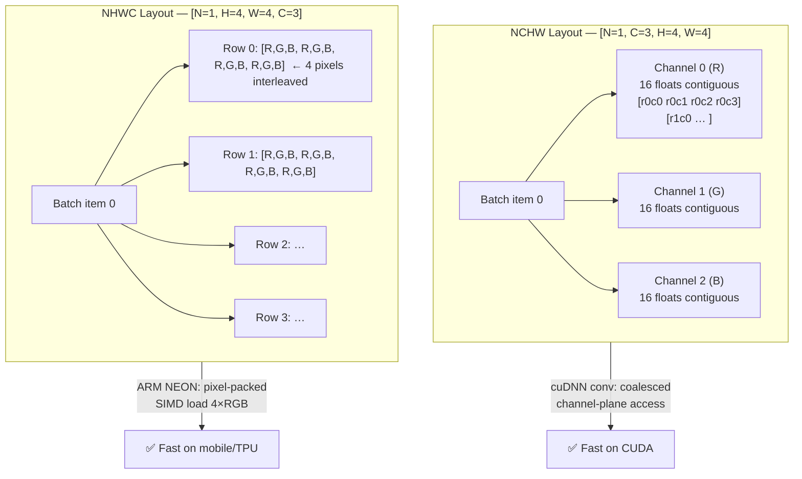
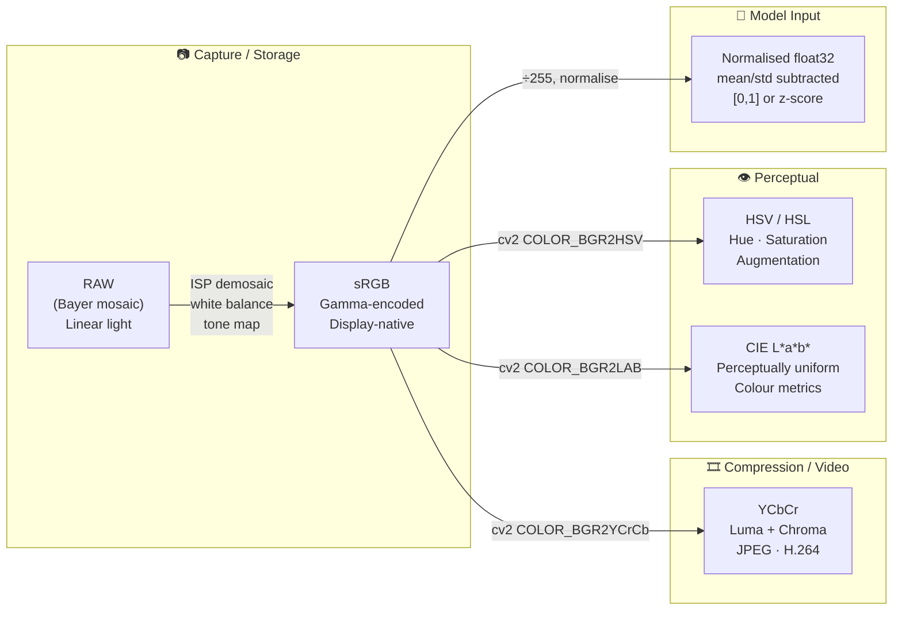
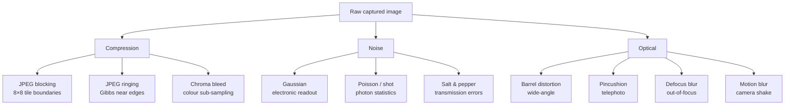
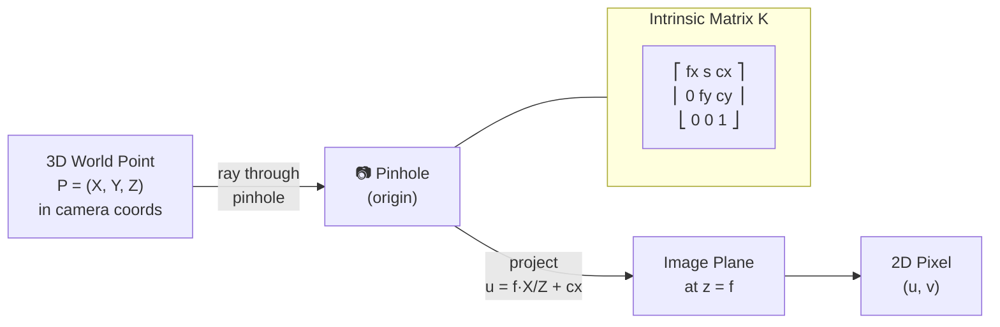
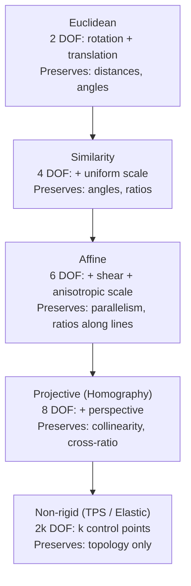

[← Back to Table of Contents](./README.md)

# Chapter 1 — Image Fundamentals

> *"An image is a 3D tensor. Everything else is interpretation."*

This chapter builds the mathematical and engineering foundation required for every subsequent topic in computer vision. We cover how images are represented in memory, why different frameworks use different conventions, how color spaces encode visual information, and how preprocessing decisions affect model performance.

---

## Images as Tensors

A digital image is a discrete, finite-dimensional array of numbers. At the hardware level it is a contiguous block of bytes; at the algorithmic level it is a rank-3 (or rank-4 when batched) tensor. Understanding precisely *how* those bytes are arranged is essential for writing bug-free, high-performance code.

### Spatial and Channel Dimensions

A color image has three logical dimensions:

- **H** — height in pixels (rows)
- **W** — width in pixels (columns)
- **C** — channels (3 for RGB/BGR, 1 for grayscale, 4 for RGBA, …)

Different libraries order these dimensions differently:

| Convention | Order | Used by | Reason |
|---|---|---|---|
| **HWC** | `[H, W, C]` | NumPy, PIL, OpenCV, TensorFlow (default) | "Pixel-first": all channels of one pixel are contiguous in memory |
| **CHW** | `[C, H, W]` | PyTorch (single image) | Channel-first: one full channel plane is contiguous |
| **NCHW** | `[N, C, H, W]` | PyTorch (batched), cuDNN | Optimised for CUDA memory access patterns in conv kernels |
| **NHWC** | `[N, H, W, C]` | TensorFlow (batched), some mobile runtimes | Better for certain ARM NEON SIMD intrinsics |

**Why does the convention matter?** Modern convolutional kernels on NVIDIA GPUs achieve peak throughput when memory access is spatially local. cuDNN's NCHW layout places all values for a given `(n, c)` channel plane in a contiguous 2-D block of `H × W` floats, enabling coalesced memory loads as the convolution slides its kernel across the spatial dimensions.

### What a "Pixel" Is Physically

Sensors do *not* capture RGB directly. A CMOS sensor is covered with a **Bayer colour filter array (CFA)** — a mosaic of red, green, and blue filters (in the RGGB pattern: two green, one red, one blue per 2×2 block). Each photosite measures **one** colour. The missing two colours per pixel are reconstructed by **demosaicing** (interpolation from neighbouring photosites). This is done in the **Image Signal Processor (ISP)** before any software ever sees the data.

```
Bayer RGGB pattern (2×2 tile, tiled across sensor):
  R  G  R  G
  G  B  G  B
  R  G  R  G
  G  B  G  B
```

**RAW files** store the raw Bayer mosaic before demosaicing; **processed images** (JPEG, PNG) store the RGB result after the full ISP pipeline (demosaicing → white balance → colour correction → tone mapping → gamma encoding). Models trained on processed images will behave differently on RAW input.

### Pixel Values and Coordinate System

The **origin** (0, 0) is at the **top-left** corner of the image in virtually all imaging libraries. The x-axis increases rightward, the y-axis increases downward. This differs from mathematical convention (y-axis upward) and is a common source of sign-flip bugs in geometric operations.

- `img[0, 0]` → top-left pixel
- `img[H-1, W-1]` → bottom-right pixel
- `img[r, c]` → row `r` from top, column `c` from left

### Memory Layout: Row-Major (C order)

NumPy defaults to **row-major (C-contiguous)** storage. For a `[H, W, C]` HWC array the element at `[r, c, k]` lives at byte offset:

$$\text{offset} = r \cdot (W \cdot C) + c \cdot C + k$$

This means all channels of pixel `(r, c)` are adjacent in memory. When you call `img_t.permute(2, 0, 1)` to go from HWC → CHW, PyTorch creates a **view** with modified strides — no data is copied, but the memory is no longer contiguous. Calling `.contiguous()` forces a fresh allocation in the new layout.

**Strides** encode the byte distance to move for each index increment:

```python
import numpy as np
img = np.zeros((480, 640, 3), dtype=np.uint8)  # HWC
print(img.strides)  # (1920, 3, 1)  — strides in bytes: 640*3=1920 per row, 3 per column, 1 per channel
                    # For float32 (4 bytes/element) a [480,640,3] array would give (7680, 12, 4)
img_chw = np.ascontiguousarray(img.transpose(2, 0, 1))  # CHW
print(img_chw.strides)  # (307200, 640, 1)  — 480*640*1=307200 bytes per channel plane
```

### NCHW Memory Layout Diagram



### Tensor Shapes Through a Typical Pipeline

```python
import torch
from PIL import Image
import numpy as np

img_pil = Image.open("cat.jpg")          # PIL image object: mode="RGB", size=(W, H)
img_np  = np.array(img_pil)              # [H, W, 3], dtype=uint8, range [0, 255]
                                         # e.g. [480, 640, 3] for a 640×480 JPEG

img_t   = torch.from_numpy(img_np)       # [H, W, 3] = [480, 640, 3], dtype=uint8
                                         # shares memory with img_np — zero-copy

img_t   = img_t.permute(2, 0, 1)        # [3, H, W] = [3, 480, 640], dtype=uint8
                                         # CHW format required by PyTorch conv layers
                                         # .permute() returns a non-contiguous view

img_t   = img_t.float() / 255.0         # [3, H, W], dtype=float32, range [0.0, 1.0]
                                         # .float() allocates new tensor (uint8 → float32)

img_t   = img_t.unsqueeze(0)            # [1, 3, H, W] = [1, 3, 480, 640]
                                         # NCHW: adds batch dimension N=1 at position 0

# Memory footprint of this single-image batch:
#   1 × 3 × 480 × 640 × 4 bytes = 3,686,400 bytes ≈ 3.5 MB  (float32)
```

### Memory Footprint Table

| dtype | Bytes/element | 224×224×3 image | 1080p (1920×1080×3) | Notes |
|---|---|---|---|---|
| `uint8` | 1 | 150 KB | 5.9 MB | Storage, I/O |
| `float32` | 4 | 602 KB | 23.7 MB | Training standard |
| `float16` | 2 | 301 KB | 11.9 MB | Mixed-precision inference |
| `bfloat16` | 2 | 301 KB | 11.9 MB | TPU training, same as fp16 |
| `int8` | 1 | 150 KB | 5.9 MB | Post-quantisation inference |

> **Key insight:** A batch of 32 ImageNet images in float32 occupies 32 × 602 KB ≈ **19 MB** — trivial on a modern GPU. The real memory pressure comes from intermediate activation maps inside the network, not the input images.

---

## Color Spaces

A colour space is a mathematical model that maps the physical continuum of light spectra to a finite set of numbers. No single colour space is best for all purposes; the choice depends on the task.

### RGB — The Camera-Native Space

**RGB** (Red, Green, Blue) is an **additive** colour model: colours are formed by adding light of three primary wavelengths. It is the native output of digital cameras (after ISP processing) and the native input of displays.

- Range: each channel `[0, 255]` for uint8, `[0.0, 1.0]` for float32
- Channels are highly correlated (a bright pixel has all three channels high)
- Non-perceptually uniform: equal Euclidean distances in RGB ≠ equal perceptual differences

### BGR — OpenCV's Historical Convention

OpenCV reads images in **BGR** order — Blue first, then Green, Red. This quirk dates to the early 1990s when OpenCV was developed at Intel and several Windows GDI bitmap formats stored pixels as BGR in memory. The convention persisted for backwards compatibility. **Every** OpenCV image is BGR by default, and forgetting to convert to RGB before feeding a model trained on RGB images is one of the most common bugs in computer vision.

```python
import cv2
import numpy as np

img_bgr  = cv2.imread("cat.jpg")                      # [H, W, 3], dtype=uint8, BGR order
                                                       # img_bgr[:,:,0] = Blue channel
                                                       # img_bgr[:,:,2] = Red  channel

img_rgb  = cv2.cvtColor(img_bgr, cv2.COLOR_BGR2RGB)   # [H, W, 3], RGB — swaps ch 0 and 2
img_hsv  = cv2.cvtColor(img_bgr, cv2.COLOR_BGR2HSV)   # [H, W, 3], HSV
                                                       # ch0=H [0,179], ch1=S [0,255], ch2=V [0,255]
                                                       # Note: OpenCV H is [0,179], not [0,360]!

img_lab  = cv2.cvtColor(img_bgr, cv2.COLOR_BGR2LAB)   # [H, W, 3], CIE L*a*b*
                                                       # ch0=L [0,255], ch1=a [0,255], ch2=b [0,255]
                                                       # (OpenCV shifts/scales to uint8 range)

img_gray = cv2.cvtColor(img_bgr, cv2.COLOR_BGR2GRAY)  # [H, W], single channel grayscale
                                                       # Y = 0.114*B + 0.587*G + 0.299*R
```

### HSV / HSL — Perceptual Decomposition

**HSV** (Hue, Saturation, Value) and **HSL** (Hue, Saturation, Lightness) decouple *what colour* something is from *how bright/vivid* it is.

| Component | Meaning | Range (HSV) | Range (HSL) |
|---|---|---|---|
| **H** (Hue) | Colour angle on the colour wheel | 0°–360° | 0°–360° |
| **S** (Saturation) | Vividness / purity | 0–1 (grey→pure) | 0–1 (grey→pure) |
| **V** (Value) | Brightness of the brightest component | 0–1 (black→bright) | — |
| **L** (Lightness) | Perceptual lightness | — | 0–1 (black→white) |

**Why use HSV for augmentation?** Hue-shift augmentation `H ← (H + δ) mod 360` changes the apparent colour of all objects uniformly without affecting brightness or contrast. This is a strong regulariser — a cat is still a cat whether it is orange or grey. Operating directly in RGB to achieve the same effect would require a non-trivial three-channel transformation.

### YCbCr — Luminance-Chrominance Separation

**YCbCr** separates luminance (Y) from chrominance (Cb, Cr):

$$Y  = 0.299 R + 0.587 G + 0.114 B$$
$$C_b = 128 - 0.168736 R - 0.331264 G + 0.5 B$$
$$C_r = 128 + 0.5 R - 0.418688 G - 0.081312 B$$

The human visual system is far more sensitive to luminance variation than to chrominance variation. JPEG and video codecs (H.264, HEVC) exploit this by applying **chroma subsampling**: storing Y at full resolution but Cb/Cr at half resolution (4:2:0), cutting bandwidth by ~50% with minimal perceptible quality loss.

### CIE L\*a\*b\* — Perceptual Uniformity

**LAB** is designed so that equal Euclidean distances correspond to equal perceived colour differences (ΔE). The axes are:

- **L\*** — Lightness, 0 (black) → 100 (white)
- **a\*** — green (negative) → red (positive), roughly −128 to +127
- **b\*** — blue (negative) → yellow (positive), roughly −128 to +127

LAB is device-independent and is the preferred space for:
- Perceptual colour distance metrics
- Style transfer (matching colour statistics)
- Histogram equalisation without colour cast

### Grayscale Conversion

The ITU-R BT.709 standard luminance formula (used for sRGB displays) is:

$$Y = 0.2126 R + 0.7152 G + 0.0722 B$$

The older BT.601 formula (used by OpenCV's `COLOR_BGR2GRAY`) also weights green heavily, though slightly less than BT.709:

$$Y = 0.299 R + 0.587 G + 0.114 B$$

Both formulas give the highest weight to green, reflecting the eye's peak photopic sensitivity near 555 nm. BT.709 pushes this further (0.7152 vs 0.587) to reflect the tighter sRGB primaries used on modern displays.

### Color Space Properties Diagram



### Color Space Comparison Table

| Space | Channels | Range (uint8) | Perceptually uniform | Primary use case |
|---|---|---|---|---|
| RGB / BGR | R, G, B | [0, 255] each | No | Model input, display |
| HSV | H, S, V | [0,179], [0,255], [0,255] | Partial | Colour augmentation |
| YCbCr | Y, Cb, Cr | [0,255] each | No | Video compression |
| CIE L\*a\*b\* | L\*, a\*, b\* | [0,255] (scaled) | **Yes** | Colour metrics, style |
| Grayscale | Y | [0, 255] | No | Texture analysis |

---

## Preprocessing Pipelines

Preprocessing is the transformation chain from raw pixels on disk to a normalised tensor ready for a neural network. The pipeline differs between **training** and **inference** for good reasons.

### Why Training and Inference Pipelines Differ

During **training** we want aggressive **data augmentation** to prevent overfitting — each epoch shows the network a slightly different view of every image. During **inference** we want **determinism and consistency** — the same image must always produce the same prediction.

**Order of operations matters critically.** Consider resize-then-crop vs. crop-then-resize:

- **Resize to 256 → CenterCrop to 224** (ImageNet standard for validation): the entire image context is preserved; the crop removes only border pixels.
- **RandomCrop to 224 → Resize to 224**: produces a different effective scale distribution and may cut objects at the border.
- **RandomResizedCrop**: the canonical training transform — randomly samples a sub-rectangle with area in [8%, 100%] of the original and aspect ratio in [3/4, 4/3], then resizes it to the target size. This single transform replaces separate crop+resize steps and is more efficient.

### Training vs. Inference Pipeline Diagram


### Complete Transform Pipeline with Shape Annotations

```python
import torchvision.transforms as T
import torchvision.transforms.functional as F
import torch

# ── Training Transform ────────────────────────────────────────────────────────
train_transform = T.Compose([
    # Input: PIL Image, mode='RGB', arbitrary size e.g. (W=640, H=480)

    T.RandomResizedCrop(
        size=224,           # output square side length
        scale=(0.08, 1.0),  # crop area as fraction of original image area
        ratio=(3/4, 4/3),   # crop aspect ratio (width/height) range
    ),
    # → PIL Image, 224×224

    T.RandomHorizontalFlip(p=0.5),
    # → PIL Image, 224×224  (mirrored ~50% of the time)

    T.ColorJitter(
        brightness=0.4,   # multiply V channel by U[1-0.4, 1+0.4]
        contrast=0.4,     # scale grey-point distance
        saturation=0.4,   # scale saturation
        hue=0.1,          # add δ ∈ [-0.1, 0.1] to hue (fraction of 360°)
    ),
    # → PIL Image, 224×224

    T.ToTensor(),
    # → Tensor [3, 224, 224], dtype=float32, range [0.0, 1.0]
    # (divides uint8 by 255, swaps HWC → CHW)

    T.Normalize(
        mean=[0.485, 0.456, 0.406],  # ImageNet R, G, B channel means
        std =[0.229, 0.224, 0.225],  # ImageNet R, G, B channel stds
    ),
    # → Tensor [3, 224, 224], dtype=float32
    # R channel: (x - 0.485) / 0.229  →  approx range [-2.12, +2.64]
    # G channel: (x - 0.456) / 0.224  →  approx range [-2.04, +2.43]
    # B channel: (x - 0.406) / 0.225  →  approx range [-1.80, +2.64]
])

# ── Validation Transform ──────────────────────────────────────────────────────
val_transform = T.Compose([
    T.Resize(256),         # resize shorter edge to 256, keep aspect ratio
    # → PIL Image, 256×? or ?×256

    T.CenterCrop(224),     # deterministic: take central 224×224 patch
    # → PIL Image, 224×224

    T.ToTensor(),          # → Tensor [3, 224, 224], float32, range [0, 1]
    T.Normalize(mean=[0.485, 0.456, 0.406], std=[0.229, 0.224, 0.225]),
    # → Tensor [3, 224, 224], float32, z-scored
])
```

### Aspect Ratio Preservation

When resizing an image with different height and width to a fixed square, you must choose between:

1. **Stretch to square**: distorts object proportions; fast; commonly used when the model is robust.
2. **Resize + CenterCrop**: adds a slight crop bias toward the centre; standard for ImageNet classifiers.
3. **Letterboxing (pad to square)**: preserves all content; adds border padding; essential for detectors.

```python
import numpy as np
import cv2

def letterbox(
    img: np.ndarray,       # [H, W, 3] uint8 BGR
    target: int = 640,     # target square side length
    colour: tuple = (114, 114, 114),  # grey padding (YOLO default)
) -> tuple[np.ndarray, float, tuple[int, int]]:
    """Resize with letterboxing, preserving aspect ratio.

    Returns:
        padded_img: [target, target, 3] uint8
        scale:      scale factor applied to original image
        (dw, dh):   padding added on each side (width, height)
    """
    h, w = img.shape[:2]                        # original H, W
    scale = target / max(h, w)                  # scale so longest side = target
    new_w, new_h = int(w * scale), int(h * scale)

    resized = cv2.resize(img, (new_w, new_h), interpolation=cv2.INTER_LINEAR)
    # resized: [new_h, new_w, 3]

    # Compute padding to reach target × target
    dw = (target - new_w) / 2   # horizontal padding (float, will be rounded)
    dh = (target - new_h) / 2   # vertical padding   (float, will be rounded)

    # The ±0.1 bias ensures that when dh/dw is exactly x.5, rounding favours
    # slightly less padding on the top/left side (top < bottom, left < right).
    # This avoids off-by-one errors that would make the padded image 1 px too large.
    top    = int(round(dh - 0.1))
    bottom = int(round(dh + 0.1))
    left   = int(round(dw - 0.1))
    right  = int(round(dw + 0.1))

    padded = cv2.copyMakeBorder(
        resized, top, bottom, left, right,
        cv2.BORDER_CONSTANT, value=colour,
    )
    # padded: [target, target, 3] — guaranteed square

    return padded, scale, (int(dw), int(dh))
```

### Interpolation Methods

When resizing, the choice of interpolation algorithm affects quality and speed:

| Method | cv2 flag | Quality | Speed | Best for |
|---|---|---|---|---|
| Nearest-neighbour | `INTER_NEAREST` | Lowest | Fastest | Segmentation masks (preserves label IDs) |
| Bilinear | `INTER_LINEAR` | Medium | Fast | Standard image resize |
| Bicubic | `INTER_CUBIC` | High | Slower | Upscaling images |
| Lanczos (sinc) | `INTER_LANCZOS4` | Highest | Slowest | Print-quality upscaling |
| Area (box) | `INTER_AREA` | Good for shrink | Medium | Downscaling (avoids aliasing) |

> **Rule of thumb:** use `INTER_AREA` when shrinking (avoids Moire patterns), `INTER_LINEAR` for most cases, `INTER_CUBIC` when quality matters for upscaling.

### Normalization

#### Why Normalize?

An unnormalised pixel in `[0, 255]` passed to a randomly initialised linear layer produces outputs of order `O(255 × W)` where `W` is the weight magnitude. The gradients of loss with respect to early-layer weights become enormous, causing instability. Normalization addresses this in two ways:

1. **Zero-centering** (`x - mean`): the gradient of a linear layer `y = Wx + b` with respect to `W` is proportional to `x`. If `x` is always positive (as raw pixel values are), all weight updates point in the same direction, creating zig-zagging in gradient descent. Zero-centering allows gradients of both signs.

2. **Unit variance** (`÷ std`): ensures that the pre-activation inputs to the first layer have variance ≈ 1, matching the assumed distribution of subsequent BatchNorm layers and allowing deeper gradient flow without saturation.

#### ImageNet Statistics

The ImageNet-1K training set (1.28M images) has these per-channel statistics after dividing by 255:

| Channel | Mean | Std |
|---|---|---|
| R | 0.485 | 0.229 |
| G | 0.456 | 0.224 |
| B | 0.406 | 0.225 |

The B channel mean (0.406) is lower than R (0.485) because outdoor/natural scenes tend to have warmer tones (more red/green) than blue. Even when fine-tuning on a very different domain, using these ImageNet statistics is usually preferable to computing domain-specific ones, as the pretrained weights were optimised for this normalisation.

```python
import torchvision.transforms as T
import torch

# Standard ImageNet normalization
normalize = T.Normalize(
    mean=[0.485, 0.456, 0.406],  # ImageNet channel means (R, G, B)
    std =[0.229, 0.224, 0.225]   # ImageNet channel stds  (R, G, B)
)

# Manually verify what normalization does to pixel range:
zero = torch.tensor([0.0, 0.0, 0.0])      # black pixel before norm
one  = torch.tensor([1.0, 1.0, 1.0])      # white pixel before norm

mean = torch.tensor([0.485, 0.456, 0.406])
std  = torch.tensor([0.229, 0.224, 0.225])

norm_zero = (zero - mean) / std  # ≈ [-2.118, -2.036, -1.804]  — large negative
norm_one  = (one  - mean) / std  # ≈ [ 2.249,  2.429,  2.640]  — large positive
# Network weights are initialised for inputs near zero; the normalised range [-2, +2.6]
# is much better behaved than the raw [0, 255] range.

train_transform = T.Compose([
    T.RandomResizedCrop(224),    # PIL [H, W] → PIL [224, 224]
    T.RandomHorizontalFlip(),    # PIL [224, 224] → PIL [224, 224]  (50% chance)
    T.ColorJitter(brightness=0.4, contrast=0.4, saturation=0.4, hue=0.1),
    T.ToTensor(),                # PIL [H, W, 3] uint8 → Tensor [3, H, W] float32 [0,1]
    normalize,                   # Tensor [3, 224, 224] → [3, 224, 224] z-scored
])
```

---

## Data Types and Precision

### Numeric Formats Used in Vision

| dtype | Bytes | Min | Max | Precision | Typical use |
|---|---|---|---|---|---|
| `uint8` | 1 | 0 | 255 | 1 (integer) | Image storage, I/O |
| `int8` | 1 | -128 | 127 | 1 (integer) | Quantised inference |
| `float16` | 2 | ≈ -65504 | ≈ 65504 | ~3 decimal digits | Mixed-precision training/inference |
| `bfloat16` | 2 | ≈ -3.4×10³⁸ | ≈ 3.4×10³⁸ | ~2 decimal digits | TPU training, wider range than fp16 |
| `float32` | 4 | ≈ -3.4×10³⁸ | ≈ 3.4×10³⁸ | ~7 decimal digits | Standard training |
| `float64` | 8 | ≈ -1.8×10³⁰⁸| ≈ 1.8×10³⁰⁸ | ~15 decimal digits | Scientific computing only |

### float16 vs. bfloat16

Both use 2 bytes, but the exponent/mantissa split differs:

```
float32:   1 sign + 8 exponent + 23 mantissa = 32 bits
float16:   1 sign + 5 exponent + 10 mantissa = 16 bits  ← narrow range, overflow risk
bfloat16:  1 sign + 8 exponent +  7 mantissa = 16 bits  ← same dynamic range (exponent) as fp32, much less precision
```

**bfloat16** (Brain Float 16, developed by Google for TPUs) avoids the overflow problem of float16 during backpropagation (gradients can temporarily exceed ±65504). PyTorch supports bfloat16 on Ampere+ GPUs and all TPUs. NVIDIA Hopper (H100) has hardware acceleration for both.

### Mixed Precision Training

In AMP (Automatic Mixed Precision), the forward pass and gradient computation run in float16/bfloat16, but:

- The master copy of weights is kept in float32
- Loss scaling is applied to avoid underflow of small fp16 gradients
- Certain numerically sensitive ops (e.g., softmax, layer norm) are kept in fp32

```python
import torch
from torch.cuda.amp import autocast, GradScaler

scaler = GradScaler()           # loss scaler to prevent fp16 gradient underflow

for images, labels in loader:   # images: [N, 3, 224, 224] float32 on CPU
    images = images.cuda()      # [N, 3, 224, 224] float32 on GPU

    with autocast():            # forward pass runs in float16 automatically
        outputs = model(images) # activations in float16, saves ~2× memory
        loss = criterion(outputs, labels)

    scaler.scale(loss).backward()   # scale loss before backward to prevent underflow
    scaler.step(optimizer)
    scaler.update()
```

### Memory Footprint Worked Example

For a standard **224×224×3** ImageNet image:

$$\text{uint8} = 224 \times 224 \times 3 \times 1 = 150{,}528 \text{ bytes} \approx 147 \text{ KB}$$
$$\text{float32} = 224 \times 224 \times 3 \times 4 = 602{,}112 \text{ bytes} \approx 588 \text{ KB}$$
$$\text{float16} = 224 \times 224 \times 3 \times 2 = 301{,}056 \text{ bytes} \approx 294 \text{ KB}$$

For a **batch of 256** float32 images:
$$256 \times 602{,}112 = 154{,}140{,}672 \text{ bytes} \approx 147 \text{ MB}$$

---

## Image Quality and Artifacts

Understanding image degradations matters for two reasons: (1) real-world deployment images may be degraded, and (2) simulating degradations during training (as augmentation) improves robustness.

### Compression Artifacts

**JPEG** uses the **Discrete Cosine Transform (DCT)**. The image is divided into non-overlapping **8×8 pixel blocks**; each block is transformed to frequency space and the high-frequency coefficients are quantised (rounded to coarser values). At high compression ratios this produces:

- **Blocking**: visible 8×8 tile boundaries where colour is discontinuous
- **Ringing (Gibbs phenomenon)**: oscillation near sharp edges caused by truncating high-frequency components
- **Colour bleed**: chroma sub-sampling spreads colour across block boundaries

**PNG** uses lossless LZ77 (Deflate) compression on filtered rows. No compression artifacts, but files are ~5–10× larger than JPEG for photographic content.

### Noise Models

| Noise type | Model | Source | Typical augmentation |
|---|---|---|---|
| **Gaussian** | `n ~ N(0, σ²)` added to each pixel | Electronic readout noise | `img + np.random.randn(...) * σ` |
| **Poisson (shot)** | Variance proportional to signal | Photon counting statistics | `np.random.poisson(img)` |
| **Salt-and-pepper** | Random pixels set to 0 or 255 | Transmission errors | Replace random `p` fraction of pixels |
| **Speckle** | Multiplicative: `n ~ N(1, σ²)` | Coherent imaging (SAR, ultrasound) | `img * np.random.randn(...) * σ` |

```python
import numpy as np

def add_gaussian_noise(
    img: np.ndarray,    # [H, W, 3] float32, range [0, 1]
    sigma: float = 0.05,
) -> np.ndarray:
    """Add zero-mean Gaussian noise with standard deviation sigma."""
    noise = np.random.randn(*img.shape).astype(np.float32) * sigma
    # noise: [H, W, 3] float32, each element ~ N(0, sigma²)
    return np.clip(img + noise, 0.0, 1.0)


def psnr(
    original: np.ndarray,  # [H, W, 3] float32 reference image
    noisy: np.ndarray,     # [H, W, 3] float32 degraded image
) -> float:
    """Peak Signal-to-Noise Ratio in dB. Higher = better quality."""
    mse = np.mean((original - noisy) ** 2)
    if mse == 0:
        return float('inf')
    return 10.0 * np.log10(1.0 / mse)  # assumes max signal value = 1.0
    # Typical values: >40 dB excellent, 30-40 dB good, <30 dB poor
```

### Blur Types

- **Gaussian blur**: convolution with a Gaussian kernel `G(x,y) = exp(-(x²+y²)/(2σ²))`; used to suppress noise and simulate defocus.
- **Motion blur**: convolution with a linear kernel of length `L` at angle `θ`; simulates camera shake.
- **Defocus blur**: convolution with a disk kernel of radius `r`; simulates out-of-focus lens.

### Lens Distortion

Real lenses deviate from the ideal pinhole model. The **radial distortion** model:

$$x_\text{distorted} = x(1 + k_1 r^2 + k_2 r^4 + k_3 r^6)$$

where `r² = x² + y²` is the normalised radius from the principal point.

- **Barrel distortion** (k₁ < 0): lines bow outward — typical of wide-angle and fisheye lenses
- **Pincushion distortion** (k₁ > 0): lines bow inward — typical of telephoto lenses

**Tangential distortion** (from lens-sensor misalignment) is modelled with coefficients `p₁, p₂`.

### Artifact Overview Diagram



---

## Camera Models and Intrinsics

Understanding how 3D world coordinates project to 2D image coordinates is essential for depth estimation, 3D object detection, visual SLAM, and NeRF.

### The Pinhole Camera Model

The simplest camera model assumes a tiny aperture (pinhole) so that exactly one ray from each 3D point reaches the image plane. A 3D point in **camera coordinates** `(X, Y, Z)` (Z = depth along optical axis) projects to a **2D image point** `(u, v)` via:

$$u = f_x \frac{X}{Z} + c_x, \qquad v = f_y \frac{Y}{Z} + c_y$$

In **homogeneous coordinates** this is a single matrix multiplication — the great advantage of the projective framework:

$$\begin{pmatrix} u \\ v \\ 1 \end{pmatrix} = \frac{1}{Z} \underbrace{\begin{pmatrix} f_x & s & c_x \\ 0 & f_y & c_y \\ 0 & 0 & 1 \end{pmatrix}}_{\mathbf{K}} \begin{pmatrix} X \\ Y \\ Z \end{pmatrix}$$

The **intrinsic matrix K** encodes:

| Element | Meaning | Typical value |
|---|---|---|
| `f_x` | Focal length in x (pixels) = `f / pixel_width_mm` | 800–2000 px |
| `f_y` | Focal length in y (pixels) = `f / pixel_height_mm` | Usually ≈ f_x |
| `c_x` | Principal point x (optical axis x-intercept) | ≈ W/2 |
| `c_y` | Principal point y (optical axis y-intercept) | ≈ H/2 |
| `s` | Skew (non-rectangular pixels, nearly always 0) | 0 |

### Pinhole Camera Diagram



### Projecting a 3D Point to 2D

```python
import numpy as np

def project_points(
    points_3d: np.ndarray,   # [N, 3] float64 — camera-frame 3D points (X, Y, Z)
    K: np.ndarray,           # [3, 3] float64 — intrinsic matrix
) -> np.ndarray:             # [N, 2] float64 — pixel coordinates (u, v)
    """Project 3D camera-frame points to 2D pixel coordinates."""
    # points_3d: N × [X, Y, Z]
    X, Y, Z = points_3d[:, 0], points_3d[:, 1], points_3d[:, 2]

    # Perspective divide (pinhole projection)
    x_norm = X / Z   # normalised image coordinates (no intrinsics yet)
    y_norm = Y / Z

    # Apply intrinsics
    u = K[0, 0] * x_norm + K[0, 1] * y_norm + K[0, 2]   # f_x·x + s·y + c_x
    v =                     K[1, 1] * y_norm + K[1, 2]   # f_y·y + c_y

    return np.stack([u, v], axis=-1)   # [N, 2]


# Example: 1080p camera with f=800, no skew, principal point at image centre
K = np.array([
    [800.0,   0.0, 960.0],   # f_x=800, s=0, c_x=960 (=1920/2)
    [  0.0, 800.0, 540.0],   # f_y=800,      c_y=540 (=1080/2)
    [  0.0,   0.0,   1.0],
], dtype=np.float64)

pts = np.array([[0.0, 0.0, 5.0],     # point on optical axis, 5 m away → should be (960, 540)
                [1.0, 0.0, 5.0]])    # 1 m to the right at 5 m depth → u = 800*0.2 + 960 = 1120

pixels = project_points(pts, K)
print(pixels)   # [[ 960.  540.], [1120.  540.]]
```

### Radial Distortion Correction

```python
def undistort_points(
    pts_distorted: np.ndarray,  # [N, 2] pixel coordinates with distortion
    K: np.ndarray,              # [3, 3] intrinsic matrix
    dist: np.ndarray,           # [5,] distortion coefficients [k1, k2, p1, p2, k3]
) -> np.ndarray:                # [N, 2] undistorted pixel coordinates
    """Correct radial and tangential lens distortion."""
    import cv2
    pts = pts_distorted.reshape(-1, 1, 2).astype(np.float32)
    undistorted = cv2.undistortPoints(pts, K.astype(np.float32),
                                      dist.astype(np.float32), P=K)
    return undistorted.reshape(-1, 2)
```

---

## Frequency Domain Fundamentals

The Fourier transform reveals *which spatial frequencies* are present in an image. This is not just a theoretical tool — it directly shapes CNN behaviour, NeRF position encoding, and many classical image processing operations.

### The 2D Discrete Fourier Transform

The **2D DFT** of an M×N image `f(x, y)` is:

$$F(u, v) = \sum_{x=0}^{M-1} \sum_{y=0}^{N-1} f(x,y) \exp\!\left(-j 2\pi \left(\frac{ux}{M} + \frac{vy}{N}\right)\right)$$

- `F(0, 0)` — the DC component: the mean pixel value (global brightness)
- Low `(u, v)` — slowly varying components: large-scale shapes and colour gradients
- High `(u, v)` — rapidly varying components: edges, textures, noise

The **magnitude spectrum** `|F(u,v)|` is usually displayed on a log scale after shifting the DC to the centre (`np.fft.fftshift`).

### Spectral Content and CNN Bias

CNNs trained with SGD exhibit a **spectral bias** (also called *frequency principle*): they learn low-frequency functions first and only fit high-frequency components slowly. This is related to the Neural Tangent Kernel having larger eigenvalues for low-frequency modes. Practical consequences:

- CNNs generalise better on low-frequency patterns (global shape) than high-frequency patterns (fine texture)
- High-frequency adversarial perturbations (imperceptible to humans) easily fool CNNs
- Augmentations like Gaussian blur force the network to rely less on high-frequency cues

### Fourier Features in NeRF

Neural Radiance Fields (NeRF) use **Fourier positional encoding** to allow MLPs to represent high-frequency geometry:

$$\gamma(p) = \left[\sin(2^0 \pi p),\ \cos(2^0 \pi p),\ \sin(2^1 \pi p),\ \cos(2^1 \pi p),\ \ldots,\ \sin(2^{L-1} \pi p),\ \cos(2^{L-1} \pi p)\right]$$

where `p ∈ [0, 1]` is a normalised coordinate and `L` is the number of frequency bands (typically 10 for position, 4 for direction). Without this encoding, the network converges to an overly smooth solution.

### 2D FFT in Practice

```python
import numpy as np
import cv2

def visualise_spectrum(
    img_gray: np.ndarray,   # [H, W] uint8 or float32 grayscale image
) -> np.ndarray:            # [H, W] uint8 — log-magnitude spectrum, DC centred
    """Compute and visualise the 2D Fourier magnitude spectrum."""
    img_f = img_gray.astype(np.float32)

    # 2D FFT → complex array [H, W]
    F = np.fft.fft2(img_f)

    # Shift DC component from top-left corner to centre
    F_shifted = np.fft.fftshift(F)   # [H, W] complex128

    # Magnitude spectrum (log scale to compress dynamic range)
    magnitude = np.log1p(np.abs(F_shifted))  # log(1 + |F|), avoids log(0)

    # Normalise to [0, 255] for display
    magnitude = (magnitude / magnitude.max() * 255).astype(np.uint8)
    return magnitude


def apply_lowpass_filter(
    img_gray: np.ndarray,   # [H, W] float32
    cutoff_radius: int,     # mask radius in frequency space (pixels from DC)
) -> np.ndarray:            # [H, W] float32 — low-pass filtered image
    """Zero out high-frequency components beyond cutoff_radius."""
    H, W = img_gray.shape
    F = np.fft.fftshift(np.fft.fft2(img_gray))   # [H, W] complex

    # Build circular mask centred at (H//2, W//2)
    cy, cx = H // 2, W // 2
    Y, X = np.ogrid[:H, :W]
    mask = ((X - cx)**2 + (Y - cy)**2) <= cutoff_radius**2  # bool [H, W]

    # Apply mask and inverse FFT
    F_filtered = F * mask                              # zero out high freqs
    img_filtered = np.real(np.fft.ifft2(np.fft.ifftshift(F_filtered)))
    return img_filtered.astype(np.float32)
```

---

## Geometric Transformations

Geometric transformations are mappings from output pixel positions back to input pixel positions (inverse mapping). They are the backbone of data augmentation and enable spatial invariance.

### Transformation Hierarchy



### Affine Transformations

An affine transform maps homogeneous pixel coordinates with a **3×3 matrix** (2×3 in practical form since the last row is [0,0,1]):

$$\begin{pmatrix} x' \\ y' \end{pmatrix} = \underbrace{\begin{pmatrix} a_{11} & a_{12} \\ a_{21} & a_{22} \end{pmatrix}}_{\mathbf{A}} \begin{pmatrix} x \\ y \end{pmatrix} + \begin{pmatrix} t_x \\ t_y \end{pmatrix}$$

Common decompositions:

$$\text{Rotation by } \theta{:}\quad \mathbf{R} = \begin{pmatrix} \cos\theta & -\sin\theta \\ \sin\theta & \cos\theta \end{pmatrix}$$

$$\text{Uniform scale by } s{:}\quad \mathbf{S} = \begin{pmatrix} s & 0 \\ 0 & s \end{pmatrix}$$

$$\text{Shear by } \lambda_x, \lambda_y{:}\quad \mathbf{H} = \begin{pmatrix} 1 & \lambda_x \\ \lambda_y & 1 \end{pmatrix}$$

### Homography (Perspective Transform)

A **homography** H is a 3×3 matrix (8 DOF after normalising `H[2,2]=1`) that maps between two views of a planar surface:

$$\begin{pmatrix} x' w \\ y' w \\ w \end{pmatrix} = \begin{pmatrix} h_{11} & h_{12} & h_{13} \\ h_{21} & h_{22} & h_{23} \\ h_{31} & h_{32} & h_{33} \end{pmatrix} \begin{pmatrix} x \\ y \\ 1 \end{pmatrix}, \qquad x' = \frac{x'w}{w}, \quad y' = \frac{y'w}{w}$$

Applications: document rectification, bird's-eye-view transformation for autonomous driving, image stitching.

### Grid Sampling (Spatial Transformer Networks)

PyTorch's `torch.nn.functional.grid_sample` implements differentiable bilinear sampling. Given a sampling grid `θ` of shape `[N, H_out, W_out, 2]` containing normalised coordinates in `[-1, +1]`, it samples the input feature map at those locations:

```python
import torch
import torch.nn.functional as F
import torchvision.transforms.functional as TF

# ── Affine augmentation with torchvision ──────────────────────────────────────
def random_affine_augment(
    img_tensor: torch.Tensor,   # [C, H, W] float32
) -> torch.Tensor:              # [C, H, W] float32 — transformed image
    """Apply random affine transform: rotation, translation, scale, shear."""
    C, H, W = img_tensor.shape

    return TF.affine(
        img_tensor,
        angle=torch.empty(1).uniform_(-15, 15).item(),      # degrees
        translate=[
            int(torch.empty(1).uniform_(-0.1*W, 0.1*W).item()),  # pixels
            int(torch.empty(1).uniform_(-0.1*H, 0.1*H).item()),
        ],
        scale=torch.empty(1).uniform_(0.8, 1.2).item(),     # uniform scale
        shear=torch.empty(1).uniform_(-10, 10).item(),      # degrees
        interpolation=TF.InterpolationMode.BILINEAR,
        fill=0,  # fill value for pixels outside original bounds
    )


# ── Manual grid_sample for custom warp ───────────────────────────────────────
def apply_homography(
    img: torch.Tensor,          # [1, C, H, W] float32 NCHW
    H_mat: torch.Tensor,        # [3, 3] float64 homography matrix
    out_size: tuple[int,int],   # (H_out, W_out)
) -> torch.Tensor:              # [1, C, H_out, W_out] float32
    """Warp an image by a homography using differentiable grid_sample."""
    H_out, W_out = out_size

    # Build normalised target grid [-1, 1] × [-1, 1]
    ys = torch.linspace(-1, 1, H_out)   # [H_out]
    xs = torch.linspace(-1, 1, W_out)   # [W_out]
    grid_y, grid_x = torch.meshgrid(ys, xs, indexing='ij')
    # grid_y, grid_x: [H_out, W_out]

    ones = torch.ones_like(grid_x)
    coords = torch.stack([grid_x, grid_y, ones], dim=-1)  # [H_out, W_out, 3]
    coords_flat = coords.view(-1, 3).double().T             # [3, H_out*W_out]

    # Apply homography (inverse warp: where in source does each output pixel come from?)
    H_inv = torch.inverse(H_mat)                           # [3, 3]
    src_coords = H_inv @ coords_flat                       # [3, H_out*W_out]

    # Perspective divide
    src_xy = src_coords[:2] / src_coords[2:3]              # [2, H_out*W_out]
    grid = src_xy.T.float().view(1, H_out, W_out, 2)       # [1, H_out, W_out, 2] — (x, y)

    return F.grid_sample(img, grid, mode='bilinear', padding_mode='zeros', align_corners=True)
    # → [1, C, H_out, W_out]
```

---

## Supplementary Topics

### HDR Images and Tone Mapping

Standard digital images are encoded in 8 bits per channel (256 levels), capturing roughly a **3-stop** (8:1) dynamic range. The real world can have **100,000:1** luminance ratios between shadows and highlights. **High Dynamic Range (HDR)** images use 16-bit or 32-bit floating-point per channel to capture this full range.

To display HDR on an SDR screen, **tone mapping** compresses the range:

- **Reinhard**: `L_display = L / (1 + L)` — soft S-curve, no hard clipping
- **ACES filmic**: standardised cinema tone curve used in modern game engines
- **Exposure + gamma**: simple `clamp(L × exposure, 0, 1)^(1/2.2)`

For deep learning on HDR data, inputs should be tone-mapped consistently at preprocessing time; models trained on SDR images will fail on raw HDR input.

### Multi-Spectral and Hyperspectral Images

Standard cameras capture 3 broad spectral bands (R, G, B). Specialised sensors capture many more:

| Sensor type | Channels | Wavelength range | Application |
|---|---|---|---|
| RGB | 3 | 400–700 nm | General vision |
| Near-IR (NIR) | 1 extra | 700–1000 nm | Vegetation index, night vision |
| Multispectral | 4–10 | 400–900 nm | Satellite, precision agriculture |
| Hyperspectral | 100–300 | 400–2500 nm | Material identification, minerals |
| Thermal (LWIR) | 1 | 8–14 μm | Heat maps, autonomous driving |
| Depth (ToF/LiDAR) | 1 | N/A | 3D geometry |

For models accepting extra channels, initialise the additional channel weights from the mean of the RGB weights (a common and effective heuristic for pretrained-weight transfer).

### EXIF Metadata

JPEG files embed **EXIF (Exchangeable Image File Format)** metadata: camera make/model, focal length, aperture, shutter speed, ISO, GPS coordinates, and importantly **orientation**. The orientation tag (1–8) records whether the camera was held landscape or portrait. Many loaders (PIL, OpenCV) do *not* auto-rotate by default, causing upside-down or sideways images to silently enter the training pipeline.

```python
from PIL import Image, ExifTags

def load_with_exif_rotation(path: str) -> Image.Image:
    """Load image and apply EXIF orientation correction."""
    img = Image.open(path)
    try:
        exif = img._getexif()
        if exif:
            orientation_key = next(
                k for k, v in ExifTags.TAGS.items() if v == 'Orientation'
            )
            orientation = exif.get(orientation_key)
            # Handles pure-rotation orientations only (values 3, 6, 8).
            # Orientations 2, 4, 5, 7 include a horizontal/vertical mirror
            # component and are not handled here — add PIL.Image.transpose()
            # calls for those if mirrored images are present in the dataset.
            rotation_map = {3: 180, 6: 270, 8: 90}
            if orientation in rotation_map:
                img = img.rotate(rotation_map[orientation], expand=True)
    except (AttributeError, StopIteration):
        pass
    return img
```

### Video Frames and the Temporal Dimension

A video is a sequence of images with a temporal dimension T. The standard tensor layout for video in PyTorch is `[N, T, C, H, W]` or `[N, C, T, H, W]` depending on the model:

- **3D CNNs** (C3D, I3D, SlowFast) use `[N, C, T, H, W]` — temporal and spatial convolutions are unified
- **Transformers** (TimeSformer, VideoMAE) typically use `[N, T, H, W, C]` internally via patch embeddings

Temporal preprocessing adds a new concern: **frame sampling strategy**. Common strategies:

- **Dense sampling**: consecutive frames (captures fine motion)
- **Uniform sampling**: evenly spaced frames across the clip (captures slow actions)
- **Random temporal jitter**: sample a random contiguous segment of length T

---

## Summary

This chapter established the foundational representation and processing concepts that underpin all of computer vision:

1. **Tensor representation**: Images are rank-3 tensors. Framework conventions (HWC vs. CHW vs. NCHW) affect memory access patterns and must be handled correctly at every API boundary.

2. **Physical sensing**: Camera sensors use Bayer CFA mosaics; demosaicing and ISP processing produce the RGB images that models consume. The image coordinate origin is top-left with y pointing down.

3. **Color spaces** are purpose-built tools: RGB for display/models, HSV for augmentation, YCbCr for compression, LAB for perceptual metrics.

4. **Preprocessing order matters**: resize-then-crop vs. crop-then-resize produce different distributions; train and val pipelines must be designed differently.

5. **Normalisation** with ImageNet mean/std stabilises gradient flow by zero-centering activations and controlling variance.

6. **Data types** involve trade-offs: uint8 for storage, float32 for training, float16/int8 for efficient inference.

7. **Artifacts** (JPEG blocking, noise, blur, lens distortion) degrade model accuracy and should be understood and simulated in augmentation.

8. **Camera intrinsics** (focal length, principal point) govern the 3D→2D projection relationship essential for depth estimation and NeRF.

9. **Frequency analysis** reveals CNN spectral bias and motivates Fourier positional encodings.

10. **Geometric transforms** (affine, homography, TPS) form the toolkit for both augmentation and spatial reasoning.

---

## Key Formulas Quick Reference

| Concept | Formula |
|---|---|
| Pixel offset (HWC) | `offset = r·(W·C) + c·C + k` |
| Grayscale (BT.709) | `Y = 0.2126R + 0.7152G + 0.0722B` |
| Normalisation | `x_norm = (x − μ) / σ` |
| Pinhole projection | `u = f_x·X/Z + c_x`, `v = f_y·Y/Z + c_y` |
| Radial distortion | `x_d = x(1 + k₁r² + k₂r⁴ + k₃r⁶)` |
| 2D DFT | `F(u,v) = Σ f(x,y) exp(−j2π(ux/M + vy/N))` |
| PSNR | `PSNR = 10·log₁₀(MAX²/MSE)` dB |
| Fourier encoding (NeRF) | `γ(p) = [sin(2⁰πp), cos(2⁰πp), …, sin(2^{L-1}πp), cos(2^{L-1}πp)]` |
| Rotation matrix | `R(θ) = [[cosθ, −sinθ], [sinθ, cosθ]]` |
| Memory (bytes) | `N × C × H × W × bytes_per_element` |

**Next: [Chapter 2 — Image Classification →](./02_image_classification.md)**

---
*Last updated: May 2026*
