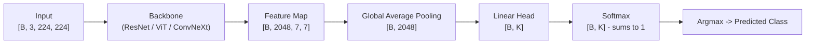
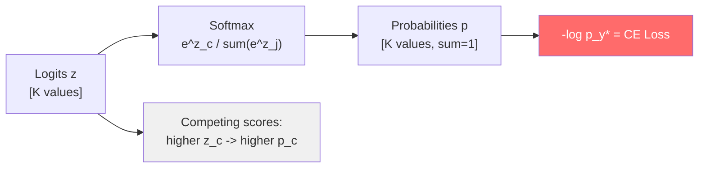
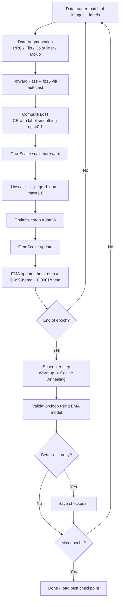
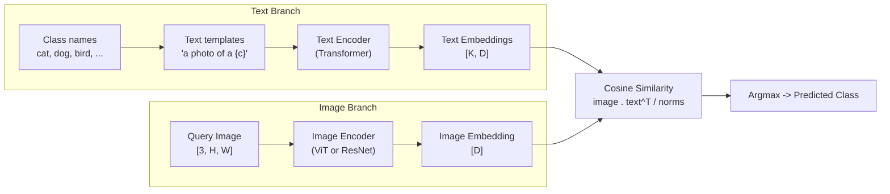
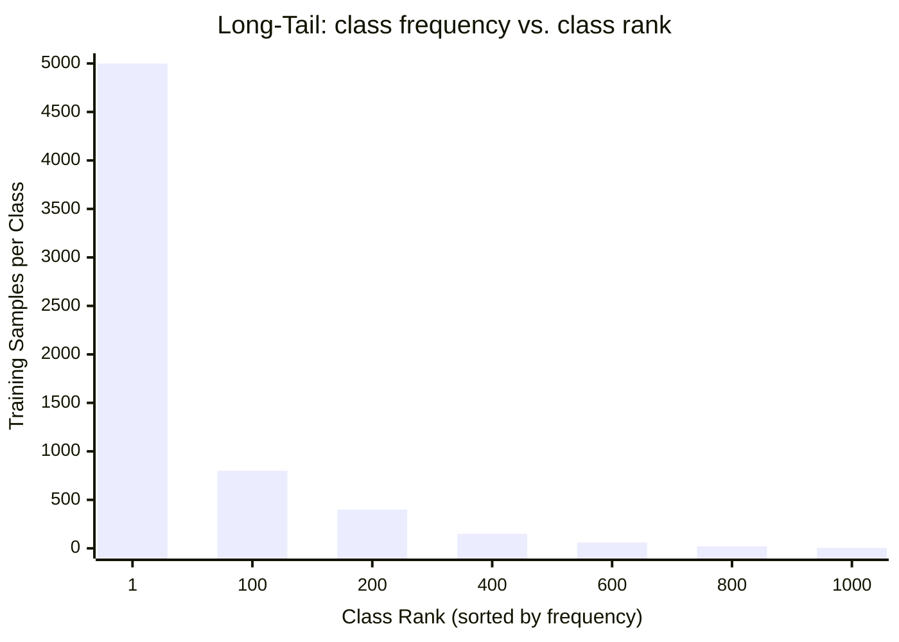

[← Back to Table of Contents](./README.md)

# Chapter 2 — Image Classification

> *"Image classification is the 'hello world' of computer vision — deceptively simple to implement, surprisingly hard to master."*

---

## The Classification Problem

At its core, image classification is a function approximation problem: learn a mapping

$$f: \mathbb{R}^{B \times C \times H \times W} \;\longrightarrow\; \mathbb{R}^{B \times K}$$

where $B$ is the batch size, $C$ the number of image channels (typically 3 for RGB), $H \times W$ the spatial resolution, and $K$ the number of target classes. The network outputs a vector of **logits** (unnormalized scores) for each image; a final softmax or argmax converts these to a predicted class.

### Single-Label vs. Multi-Label vs. Open-Vocabulary

| Setting | Output | Loss | Example Dataset |
|---|---|---|---|
| **Single-label** | One class per image | Cross-entropy | ImageNet, CIFAR-10 |
| **Multi-label** | Multiple classes per image | Binary cross-entropy | COCO, OpenImages, VOC |
| **Closed-set zero-shot** | Classes from fixed text vocabulary | Contrastive (CLIP) | ImageNet-21k + text |
| **Open-vocabulary** | Arbitrary textual description | Contrastive + CE | LAION-5B, CC12M |

**Single-label** classification assumes exactly one correct class per image and uses a softmax distribution over all $K$ classes. **Multi-label** classification allows any subset of classes to be present simultaneously — each class is treated as an independent binary problem with a sigmoid activation.

**Closed-set vs. open-set** is a critical practical distinction. In closed-set classification, every test image belongs to one of $K$ classes seen during training. In open-set scenarios, the model must either assign a "none of the above" label or provide a calibrated confidence score that drops for out-of-distribution inputs. **Open-vocabulary classification**, pioneered by CLIP (Radford et al., 2021), removes the closed-set constraint entirely: classes are represented as free-form text, and classification is performed by comparing image embeddings to text embeddings at inference time.

### Why Classification Is Harder Than It Looks

Several fundamental challenges make classification non-trivial even for "simple" settings:

- **Intra-class variation**: All images of a cat share the label "cat" but vary enormously in pose, lighting, breed, occlusion, and background. The model must be invariant to irrelevant variation while remaining sensitive to class-discriminative features.
- **Inter-class similarity**: A Siberian Husky and an Alaskan Malamute are visually nearly identical. Fine-grained classification requires the model to discover subtle discriminative cues — eye shape, ear positioning — that distinguish extremely similar classes.
- **Distribution shift**: Models trained on Internet-scraped images often fail on medical, satellite, or industrial images. ImageNet-C (corrupted ImageNet) tests robustness to 75 corruptions: Gaussian noise, motion blur, JPEG artifacts, and more.
- **Long-tail frequency**: Real datasets follow a power law — a handful of classes dominate the training data while hundreds of tail classes have only a few examples each.

### Forward Pass Mechanics

The canonical classification forward pass flows as follows:



Each step transforms the tensor shape. The backbone extracts hierarchical features via successive downsampling; global average pooling (GAP) collapses spatial dimensions to a single vector, providing translation invariance; the linear head maps to class space; softmax converts logits to a probability distribution.

**Activations flow through layers** as: raw pixel values → low-level edges (early layers) → mid-level textures and parts (middle layers) → high-level semantic concepts (deep layers). This hierarchy was first visualized by Zeiler & Fergus (2014) and is exploited directly by transfer learning.

### Gradient Flow and the Vanishing Gradient Problem

Before residual connections (ResNet, 2015), training networks deeper than ~20 layers was nearly impossible due to **vanishing gradients**. During backpropagation, the gradient of the loss with respect to early-layer parameters involves a chain of Jacobian matrix products:

$$\frac{\partial \mathcal{L}}{\partial \mathbf{W}_1} = \frac{\partial \mathcal{L}}{\partial \mathbf{h}_L} \cdot \prod_{l=2}^{L} \frac{\partial \mathbf{h}_l}{\partial \mathbf{h}_{l-1}} \cdot \frac{\partial \mathbf{h}_1}{\partial \mathbf{W}_1}$$

If the spectral norm of each Jacobian is $< 1$, the product exponentially decays to zero as $L$ increases — gradients at early layers become negligibly small, preventing learning. Residual connections solve this by providing a gradient highway:

$$\frac{\partial \mathbf{h}_{l+1}}{\partial \mathbf{h}_l} = \mathbf{I} + \frac{\partial \mathcal{F}(\mathbf{h}_l)}{\partial \mathbf{h}_l}$$

ensuring gradient magnitude stays $\geq 1$ even if $\mathcal{F}$'s Jacobian is small.

**Batch Normalization** (Ioffe & Szegedy, 2015) further stabilizes gradient flow by normalizing layer inputs to zero mean and unit variance:

$$\hat{x}_i = \frac{x_i - \mu_B}{\sqrt{\sigma_B^2 + \epsilon}}, \quad y_i = \gamma \hat{x}_i + \beta$$

where $\mu_B, \sigma_B^2$ are mini-batch statistics, and $\gamma, \beta$ are learned scale/shift parameters. BN prevents activations from saturating (where sigmoid/tanh gradients → 0), allows higher learning rates, and provides mild regularization via batch-level noise.

---

## Softmax and Cross-Entropy Loss

### Softmax: From Logits to Probabilities

The softmax function maps a vector of raw logits $\mathbf{z} \in \mathbb{R}^K$ to a valid probability distribution over $K$ classes:

$$\hat{p}_c = \text{softmax}(z_c) = \frac{e^{z_c}}{\sum_{j=1}^{K} e^{z_j}}, \quad \sum_{c=1}^{K} \hat{p}_c = 1$$

Because it is a monotone function of the logits, the argmax of $\hat{p}$ equals the argmax of $\mathbf{z}$, so softmax is only strictly needed during training (for computing probabilities and loss) and for calibrated inference. During prediction, raw logits suffice.

**Numerical stability — the log-sum-exp trick.** Direct computation of $e^{z_c}$ overflows for large logits (e.g., $e^{1000} = \infty$ in float32). The stable form subtracts the maximum before exponentiation:

$$\text{softmax}(z_c) = \frac{e^{z_c - \max_j z_j}}{\sum_{j} e^{z_j - \max_j z_j}}$$

This shift does not change the output (it cancels in numerator and denominator) but keeps all exponents $\leq 0$, preventing overflow. PyTorch's `F.softmax` applies this internally.

### Cross-Entropy Loss

Cross-entropy is derived from **maximum likelihood estimation (MLE)** of a categorical distribution. Given a model predicting $\hat{p}_c$ and a one-hot ground truth $y_c \in \{0, 1\}$, the negative log-likelihood (NLL) is:

$$\mathcal{L}_{CE} = -\sum_{c=1}^{C} y_c \log \hat{p}_c = -\log \hat{p}_{y^*}$$

where $y^*$ is the ground-truth class index. In practice PyTorch's `F.cross_entropy` fuses log-softmax and NLL into a single numerically stable operation, avoiding the need to compute softmax explicitly.



### Label Smoothing

Hard labels $y_c \in \{0, 1\}$ encourage the network to be arbitrarily confident, which harms calibration. **Label smoothing** (Szegedy et al., 2016) replaces hard targets with a soft mixture:

$$\tilde{y}_c = (1 - \varepsilon) \cdot y_c^{\text{hard}} + \frac{\varepsilon}{K}$$

With $\varepsilon = 0.1$ (standard), the correct class target becomes $0.9 + 0.0001 \approx 0.9$ instead of $1.0$, and each wrong class receives a small $\varepsilon/K$ probability mass. This prevents overconfidence, improves calibration, and often boosts accuracy by 0.2–0.5% on ImageNet.

### Temperature Scaling for Calibration

After training, a single scalar $T$ (temperature) can recalibrate model confidence without changing predictions:

$$\hat{p}_c^{\text{calib}} = \text{softmax}(z_c / T)$$

$T > 1$ softens the distribution (reduces overconfidence); $T < 1$ sharpens it. The optimal $T$ is found by minimizing NLL on a held-out validation set. Temperature scaling is the simplest post-hoc calibration method and is highly effective despite its simplicity.

### Focal Loss for Classification Imbalance

In long-tail datasets, easy majority-class examples dominate the gradient. **Focal loss** (Lin et al., 2017) down-weights well-classified examples:

$$\text{FL}(p_t) = -(1 - p_t)^\gamma \log(p_t), \quad p_t = \hat{p}_{y^*}$$

With $\gamma = 2$, an example already predicted correctly with $p_t = 0.9$ contributes only $(0.1)^2 = 0.01$ times the standard CE loss, forcing the model to focus learning on hard/minority examples.

```python
import torch
import torch.nn.functional as F

# -- Standard cross-entropy --------------------------------------------------
logits = torch.randn(4, 1000)          # [B=4, K=1000] -- raw classifier output
labels = torch.randint(0, 1000, (4,)) # [B=4]          -- ground-truth indices

loss    = F.cross_entropy(logits, labels)                # scalar: log_softmax + NLL
loss_ls = F.cross_entropy(logits, labels,
                          label_smoothing=0.1)           # label smoothing eps=0.1

# -- Softmax + top-k prediction ----------------------------------------------
probs  = F.softmax(logits, dim=-1)           # [B, K] -- sums to 1 per sample
top1   = probs.argmax(dim=-1)                # [B]    -- predicted class
top5_vals, top5_idx = probs.topk(5, dim=-1) # [B, 5] -- top-5 classes & scores

# -- Temperature scaling (post-hoc calibration) ------------------------------
T = 1.5                                      # scalar calibration temperature
probs_calib = F.softmax(logits / T, dim=-1)  # [B, K] -- softer distribution

# -- Focal loss implementation -----------------------------------------------
def focal_loss(logits, targets, gamma=2.0, reduction='mean'):
    # Focal loss: down-weights easy examples (high p_t) to focus on hard ones.
    # gamma=0 recovers standard CE; gamma=2 is the standard focal setting.
    ce = F.cross_entropy(logits, targets, reduction='none')  # [B]
    pt = torch.exp(-ce)           # p_t: probability assigned to correct class
    fl = (1 - pt) ** gamma * ce   # [B] -- scale CE by (1-p_t)^gamma
    return fl.mean() if reduction == 'mean' else fl
```

---

## Training Pipeline

A production-grade classification training pipeline has many interlocking components. Understanding each component and why it exists is essential for stable convergence.

### Mixed Precision Training

Modern GPU training uses **fp16 (half precision)** for the forward and backward passes to halve memory usage and leverage Tensor Core acceleration (typically 2–8× faster), while keeping a **fp32 master copy** of the weights for the optimizer step. This is because fp16 has limited dynamic range ($\sim 65504$ max value vs. $\sim 3.4 \times 10^{38}$ for fp32), so gradient accumulation must happen in fp32 to avoid underflow.

PyTorch's `torch.autocast` handles the cast automatically, and `GradScaler` scales the loss up before the backward pass to prevent fp16 gradients from underflowing to zero.

### Learning Rate Scheduling

Choosing a good learning rate schedule is often more impactful than choosing the optimizer:

- **Linear warmup (5 epochs)**: Starting from LR = 0 and linearly ramping to the base LR prevents early instability. The first gradient steps are noisy; a cold start prevents them from destabilizing the pretrained weights.
- **Cosine annealing**: After warmup, the LR follows $\eta_t = \eta_{\min} + \frac{1}{2}(\eta_{\max} - \eta_{\min})(1 + \cos(\pi t / T))$. The gradual decay allows the optimizer to settle into a flat minimum.
- **Cosine with restarts (SGDR)**: Multiple cosine cycles — each restart from a high LR can escape local minima.

### Exponential Moving Average (EMA)

EMA maintains a shadow copy of model weights with smoother temporal averaging:

$$\theta_{\text{EMA}} \leftarrow \alpha \cdot \theta_{\text{EMA}} + (1 - \alpha) \cdot \theta$$

With $\alpha = 0.9999$, the EMA model lags slightly behind training but is more stable. Almost all state-of-the-art results (EfficientNet, ViT) use EMA for final evaluation.

### Transfer Learning: Which Layers to Freeze

| Stage | Layers Frozen | Rationale |
|---|---|---|
| **Feature extraction** | All backbone layers | Head randomly initialized; backbone gradients would destabilize pretrained features |
| **Fine-tuning stage 1** | First 2/3 of backbone | Allow late layers to adapt to new domain; early edge/texture features are universal |
| **Full fine-tuning** | None | Low LR (10–100× smaller); all weights adapt jointly |

The key insight is **layer-wise learning rate decay**: assign smaller LR to earlier layers (generic features) and larger LR to later layers (dataset-specific combinations).

### Dropout and Regularization

**Dropout** (Srivastava et al., 2014) randomly zeroes activations with probability $p$ during training, forcing the network to learn redundant representations and preventing co-adaptation:

$$\tilde{h}_i = h_i \cdot \text{Bernoulli}(1-p) / (1-p)$$

The division by $(1-p)$ (inverted dropout) ensures the expected activation magnitude is unchanged at test time. Typical values: $p = 0.1$–0.2 for conv layers, $p = 0.5$ for fully-connected heads. **Stochastic Depth** (DropPath) randomly drops entire residual blocks rather than individual activations, serving as a structural form of regularization for deep ResNets and ViTs.

### Complete Training Loop

```python
import torch
import torch.nn as nn
from torch.cuda.amp import GradScaler, autocast
from torchvision import datasets, transforms, models
from torch.optim.lr_scheduler import CosineAnnealingLR, LinearLR, SequentialLR
import copy

# -- Dataset & DataLoader ----------------------------------------------------
train_transform = transforms.Compose([
    transforms.RandomResizedCrop(224),           # stochastic crop: scale 0.08-1.0
    transforms.RandomHorizontalFlip(),            # 50% chance horizontal flip
    transforms.ColorJitter(0.4, 0.4, 0.4, 0.1),  # brightness/contrast/sat/hue
    transforms.ToTensor(),
    transforms.Normalize([0.485, 0.456, 0.406],  # ImageNet mean
                         [0.229, 0.224, 0.225]),  # ImageNet std
])
val_transform = transforms.Compose([
    transforms.Resize(256),                      # resize shorter edge to 256
    transforms.CenterCrop(224),                  # deterministic 224x224 center crop
    transforms.ToTensor(),
    transforms.Normalize([0.485, 0.456, 0.406], [0.229, 0.224, 0.225]),
])

train_ds = datasets.ImageFolder('data/train', transform=train_transform)
val_ds   = datasets.ImageFolder('data/val',   transform=val_transform)
train_dl = torch.utils.data.DataLoader(train_ds, batch_size=256, shuffle=True,
                                        num_workers=8, pin_memory=True)
val_dl   = torch.utils.data.DataLoader(val_ds, batch_size=256, shuffle=False,
                                        num_workers=8, pin_memory=True)

# -- Model: pretrained ResNet-50 with custom head ----------------------------
NUM_CLASSES = len(train_ds.classes)
model = models.resnet50(weights='IMAGENET1K_V2')   # ImageNet top-1: 80.9%
model.fc = nn.Linear(2048, NUM_CLASSES)            # replace 1000-way head
model = model.cuda()

# -- EMA shadow model --------------------------------------------------------
ema_model = copy.deepcopy(model)
ema_decay  = 0.9999

def update_ema(ema, live, decay=0.9999):
    with torch.no_grad():
        for ep, lp in zip(ema.parameters(), live.parameters()):
            ep.data.mul_(decay).add_(lp.data, alpha=1.0 - decay)

# -- Optimizer & scheduler ---------------------------------------------------
optimizer = torch.optim.AdamW(model.parameters(), lr=1e-3, weight_decay=0.05)
scaler    = GradScaler()

EPOCHS        = 90
WARMUP_EPOCHS = 5

warmup_sched = LinearLR(optimizer, start_factor=1e-4, total_iters=WARMUP_EPOCHS)
cosine_sched = CosineAnnealingLR(optimizer, T_max=EPOCHS - WARMUP_EPOCHS, eta_min=1e-6)
scheduler    = SequentialLR(optimizer, [warmup_sched, cosine_sched],
                             milestones=[WARMUP_EPOCHS])

# -- Training loop -----------------------------------------------------------
best_acc = 0.0
for epoch in range(EPOCHS):
    model.train()
    for imgs, labels in train_dl:
        imgs, labels = imgs.cuda(), labels.cuda()   # [B,3,224,224], [B]

        optimizer.zero_grad()
        with autocast():                            # fp16 forward pass
            logits = model(imgs)                    # [B, NUM_CLASSES]
            loss   = nn.functional.cross_entropy(
                logits, labels, label_smoothing=0.1 # label smoothing eps=0.1
            )

        scaler.scale(loss).backward()               # scale loss for fp16 safety
        scaler.unscale_(optimizer)
        nn.utils.clip_grad_norm_(model.parameters(), max_norm=1.0)
        scaler.step(optimizer)
        scaler.update()
        update_ema(ema_model, model, ema_decay)     # update shadow weights

    scheduler.step()

    # Validation using EMA model
    ema_model.eval()
    correct = total = 0
    with torch.no_grad():
        for imgs, labels in val_dl:
            imgs, labels = imgs.cuda(), labels.cuda()
            with autocast():
                logits = ema_model(imgs)
            correct += (logits.argmax(1) == labels).sum().item()
            total   += labels.size(0)

    acc = correct / total
    print(f"Epoch {epoch+1:3d} | LR {scheduler.get_last_lr()[0]:.6f} | Acc {acc:.4f}")

    if acc > best_acc:
        best_acc = acc
        torch.save({'epoch': epoch, 'model': ema_model.state_dict(),
                    'acc': acc}, 'best_checkpoint.pth')
```

### Training Loop Flowchart



---

## Evaluation Metrics

### Top-1 and Top-5 Accuracy

**Top-1 accuracy** is the fraction of test images where the highest-confidence prediction equals the ground-truth label:

$$\text{Top-1} = \frac{1}{N} \sum_{i=1}^{N} \mathbf{1}[y_i = \hat{y}_i^{(1)}]$$

**Top-5 accuracy** counts a prediction correct if the true label appears anywhere in the top-5 predictions — useful when label ambiguity is high (e.g., an image of a Siamese cat plausibly belongs to multiple cat breeds):

$$\text{Top-5} = \frac{1}{N} \sum_{i=1}^{N} \mathbf{1}\!\left[y_i \in \{\hat{y}_i^{(1)}, \ldots, \hat{y}_i^{(5)}\}\right]$$

### Per-Class Precision, Recall, and F1

For class $c$ in a multi-class setting, define TP, FP, FN from the perspective of binary classification (class $c$ vs. all others):

$$\text{Precision}_c = \frac{\text{TP}_c}{\text{TP}_c + \text{FP}_c}, \quad \text{Recall}_c = \frac{\text{TP}_c}{\text{TP}_c + \text{FN}_c}, \quad F1_c = \frac{2 \cdot P_c \cdot R_c}{P_c + R_c}$$

**Macro-average** treats all classes equally (important for long-tail evaluation). **Weighted-average** weights each class by its support and can be misleadingly high when dominated by frequent classes.

### Confusion Matrix Analysis

A confusion matrix $M \in \mathbb{R}^{K \times K}$ shows $M_{ij}$ = number of images with true class $i$ predicted as class $j$. Diagonal entries are correct predictions; off-diagonal entries reveal systematic confusions.

**4-class example** (50 samples per class):

| True \\ Pred | Cat | Dog | Fox | Rabbit |
|---|---|---|---|---|
| **Cat** | **45** | 3 | 1 | 1 |
| **Dog** | 2 | **47** | 0 | 1 |
| **Fox** | 1 | 0 | **44** | 5 |
| **Rabbit** | 0 | 1 | 4 | **45** |

Reading this matrix: Fox (row 3) is frequently confused with Rabbit (col 4) — 5 out of 50 Fox images are predicted as Rabbit. This systematic confusion reveals a visual similarity between these classes. Common patterns:

- **High off-diagonal entry (i, j)**: class $i$ is systematically predicted as class $j$ — usually indicates visual similarity.
- **Asymmetric confusion** ($M_{ij} \neq M_{ji}$): the feature distribution of one class overlaps the other's decision boundary in one direction only.
- **Low diagonal** (poor recall): the model rarely predicts class $i$ — often a tail-class problem.

### Calibration: Expected Calibration Error (ECE)

A well-calibrated model produces confidence scores matching empirical accuracy. **ECE** measures deviation from this ideal across confidence bins:

$$\text{ECE} = \sum_{m=1}^{M} \frac{|B_m|}{N} \left| \text{acc}(B_m) - \text{conf}(B_m) \right|$$

Modern deep networks are typically **overconfident** (high ECE). Temperature scaling is the standard post-hoc fix, tuning a single scalar $T$ to minimize NLL on a validation set.

### Code: Evaluation with sklearn

```python
import numpy as np
from sklearn.metrics import confusion_matrix, classification_report
import torch

# -- Collect predictions over entire validation set --------------------------
all_preds, all_labels = [], []
model.eval()
with torch.no_grad():
    for imgs, labels in val_dl:
        imgs   = imgs.cuda()
        logits = model(imgs)                  # [B, K]
        preds  = logits.argmax(dim=1).cpu()   # [B]
        all_preds.append(preds)
        all_labels.append(labels)

all_preds  = torch.cat(all_preds).numpy()     # [N]
all_labels = torch.cat(all_labels).numpy()    # [N]

# -- Per-class precision / recall / F1 --------------------------------------
print(classification_report(all_labels, all_preds,
                             target_names=val_ds.classes))

# -- Confusion matrix --------------------------------------------------------
cm = confusion_matrix(all_labels, all_preds)  # [K, K]: rows=true, cols=pred

# -- Mean per-class accuracy (MCA) for long-tail evaluation ------------------
per_class_acc = np.diag(cm) / cm.sum(axis=1)  # [K]
mca = per_class_acc.mean()
print(f"Mean per-class accuracy (MCA): {mca:.4f}")

# -- Expected Calibration Error (ECE) ----------------------------------------
def compute_ece(probs, labels, n_bins=15):
    confidences  = probs.max(axis=1)           # highest predicted prob per sample
    predictions  = probs.argmax(axis=1)
    accuracies   = (predictions == labels).astype(float)
    ece = 0.0
    for low, high in zip(np.linspace(0, 1, n_bins), np.linspace(1/n_bins, 1+1/n_bins, n_bins)):
        mask = (confidences >= low) & (confidences < high)
        if mask.sum() > 0:
            ece += mask.mean() * abs(accuracies[mask].mean() - confidences[mask].mean())
    return ece
```

---

## Fine-Grained Recognition

Fine-grained visual recognition (FGVC) covers datasets where all images share the same coarse category but classes differ by subtle local details — the specific shape of a tail feather, the curvature of a headlight, or the precise wing planform of an aircraft.

### What Makes It Hard

The challenge is a fundamental tension in feature learning:
- **Global features** (overall color, silhouette) classify coarse categories well but are insufficient for fine-grained distinctions.
- **Local discriminative features** (beak shape, wheel arch, cockpit window) are the key cues but are spatially small and vary in location across images.
- Standard CNNs with global average pooling discard spatial detail, throwing away the discriminative information.

### Bilinear Pooling (B-CNN)

The **Bilinear CNN** (Lin et al., 2015) computes cross-feature covariance to capture second-order statistics:

$$\mathbf{B} = \phi(\mathbf{f}_1, \mathbf{f}_2) = \mathbf{f}_1 \otimes \mathbf{f}_2 = \mathbf{f}_1 \mathbf{f}_2^\top \in \mathbb{R}^{D \times D}$$

where $\mathbf{f}_1, \mathbf{f}_2 \in \mathbb{R}^{D \times H \times W}$ are feature maps from two streams. The outer product captures all pairwise feature interactions, encoding "which features co-occur at the same spatial location." After sign-sqrt normalization ($\mathbf{B} \leftarrow \text{sgn}(\mathbf{B})\sqrt{|\mathbf{B}|}$) and L2 normalization, bilinear features are fed to a linear classifier. This representation encodes texture information beyond first-order statistics and is more sensitive to subtle part co-occurrences.

### Attention-Based Fine-Grained Models

**CBAM (Convolutional Block Attention Module)** applies two sequential attention gates:
1. **Channel attention**: learns which feature channels (semantic concepts) are informative — global-pool → MLP → sigmoid gate on channel dimension.
2. **Spatial attention**: learns which spatial locations are discriminative — cross-channel statistics → conv → sigmoid gate on $H \times W$.

**Vision Transformers** handle fine-grained recognition naturally: each image patch becomes a token, and self-attention allows the model to relate any two patches regardless of spatial distance. The model can attend to discriminative parts globally, which is something that requires explicit part-detection mechanisms in CNN-based approaches.

### Key FGVC Datasets

| Dataset | Classes | Images | Domain | Key Challenge |
|---|---|---|---|---|
| CUB-200-2011 | 200 bird species | 11,788 | Birds | Pose variation, feather detail |
| Stanford Cars | 196 car models | 16,185 | Cars | Year/trim level subtle differences |
| FGVC-Aircraft | 100 aircraft variants | 10,200 | Aircraft | Wing shape, engine count |
| iNaturalist 2021 | 10,000 species | 2.7M | Wildlife | Extreme long-tail |
| NABirds | 555 bird species | 48,562 | North American birds | Fine-grained + long-tail |

---

## Multi-Label Classification

Multi-label classification predicts a **set** of labels for each image. An image of "a person riding a bicycle on a city street" simultaneously carries the labels: person, bicycle, street, building, sky. Unlike single-label where classes compete via softmax, each class is an independent binary decision.

### Loss: Sigmoid + Binary Cross-Entropy

Each class uses a **sigmoid** activation to produce an independent probability in $[0, 1]$:

$$p_c = \sigma(z_c) = \frac{1}{1 + e^{-z_c}}, \quad \mathcal{L}_{BCE} = -\frac{1}{K} \sum_{c=1}^{K} \left[ y_c \log p_c + (1-y_c) \log(1-p_c) \right]$$

Note the important difference from softmax: softmax forces $\sum_c p_c = 1$ (classes compete), while sigmoid treats each class independently allowing multiple classes to simultaneously have high probability.

### Asymmetric Loss (ASL)

In multi-label datasets, **positive examples are rare**: a typical COCO image has ~3 positive labels out of 80 classes. **Asymmetric Loss** (Ridnik et al., 2021) uses separate focusing parameters for positives and negatives:

$$\text{ASL}(p, y) = \begin{cases} (1 - p)^{\gamma_+} \log(p) & y = 1 \\ (p_m)^{\gamma_-} \log(1-p_m) & y = 0 \end{cases}$$

where $p_m = \max(p - m, 0)$ is a probability margin that shifts hard negatives. Typical settings: $\gamma_+ = 0$, $\gamma_- = 4$ (no focusing on positives, strong down-weighting of easy negatives). ASL achieves state-of-the-art mAP on COCO and OpenImages.

```python
import torch
import torch.nn.functional as F

# -- Multi-label setup -------------------------------------------------------
logits  = torch.randn(4, 80)                        # [B=4, C=80] -- raw logits
targets = torch.randint(0, 2, (4, 80)).float()      # [B=4, C=80] -- binary labels

# Standard BCE: each class independent binary classification
loss_bce = F.binary_cross_entropy_with_logits(logits, targets)  # scalar

probs = torch.sigmoid(logits)              # [B=4, C=80] -- probability per class
preds = (probs > 0.5).float()             # [B=4, C=80] -- binary predictions

# -- Asymmetric Loss (ASL) ---------------------------------------------------
def asymmetric_loss(logits, targets, gamma_neg=4, gamma_pos=0, margin=0.05):
    # ASL: separate focusing for positives (gamma_pos) and negatives (gamma_neg)
    # margin shifts negative probabilities to ignore near-zero easy negatives
    xs_pos = torch.sigmoid(logits)             # positive probability
    xs_neg = 1 - xs_pos                        # negative probability

    xs_neg = (xs_neg + margin).clamp(max=1)    # probability margin for negatives

    los_pos = targets       * torch.log(xs_pos.clamp(min=1e-8))
    los_neg = (1 - targets) * torch.log(xs_neg.clamp(min=1e-8))
    loss    = los_pos + los_neg                # [B, C]

    if gamma_neg > 0 or gamma_pos > 0:
        pt0 = xs_pos * targets                 # p_t for positives
        pt1 = xs_neg * (1 - targets)           # p_t for negatives
        pt  = pt0 + pt1
        gamma_factor = gamma_pos * targets + gamma_neg * (1 - targets)
        loss *= torch.pow(1 - pt, gamma_factor)

    return -loss.sum() / logits.size(0)

# -- mAP evaluation for multi-label (per-class AP, then mean) ----------------
# from sklearn.metrics import average_precision_score
# map_score = average_precision_score(all_targets, all_probs, average='macro')
# all_targets: [N, C] binary ground truth; all_probs: [N, C] predicted probabilities
```

---

## Zero-Shot and Few-Shot Classification

### Zero-Shot Classification with CLIP

**Zero-shot classification** requires classifying images into categories never seen during training. CLIP (Contrastive Language-Image Pre-training, Radford et al., 2021) makes this possible by learning a joint embedding space via contrastive pre-training on 400M image-text pairs from the Internet.

At inference, CLIP zero-shot classification works as follows:
1. For each class $c$, encode the text description $t_c$ = "a photo of a {class name}" using the text encoder $g$.
2. Encode the query image $x$ using the image encoder $f$.
3. Compute cosine similarity and take argmax:

$$\hat{c} = \arg\max_c \frac{f(x)^\top g(t_c)}{\|f(x)\| \cdot \|g(t_c)\|}$$

The CLIP paper uses **80 text templates** (e.g., "a photo of a {c}", "a blurry photo of a {c}", "a photo of the large {c}") and averages the text embeddings — "prompt ensembling" improves accuracy by ~3.5% on ImageNet over a single template. CLIP ViT-L/14 achieves 75.3% zero-shot top-1 on ImageNet with no ImageNet training data.



### Few-Shot Learning

Few-shot classification learns to classify new classes from only $K$ examples per class. The **$N$-way $K$-shot** protocol presents $N$ novel classes with $K$ labeled support examples and asks the model to classify unlabeled query images.

**Prototypical Networks** (Snell et al., 2017) compute a class prototype as the mean embedding of its support examples:

$$\mathbf{c}_n = \frac{1}{K} \sum_{(x_i, y_i) \in S_n} f_\theta(x_i), \quad p(y = n \mid x) = \frac{\exp(-d(f_\theta(x), \mathbf{c}_n))}{\sum_{n'} \exp(-d(f_\theta(x), \mathbf{c}_{n'}))}$$

**MAML (Model-Agnostic Meta-Learning)** learns a parameter initialization $\theta$ that can adapt to any new task with 1–5 gradient steps:

$$\theta^* = \theta - \alpha \nabla_\theta \mathcal{L}_{\tau}\!\left(\theta - \beta \nabla_\theta \mathcal{L}_{\tau}(\theta)\right)$$

The outer loop optimizes for fast adaptation; the inner loop simulates fine-tuning on a task.

---

## Long-Tail Distribution Problem

Real-world image datasets invariably follow a **power law**: the most frequent class appears exponentially more often than rare classes. ImageNet has this structure; iNaturalist 2021 has 10,000 species with some having fewer than 10 training images.

### Why Long-Tail Matters

A model trained naively on long-tail data exhibits **head-class bias**: it confidently predicts frequent classes and rarely predicts rare classes. On standard top-1 accuracy this appears acceptable, but **mean per-class accuracy (MCA)** exposes the failure — tail classes may have near-zero recall.

### Long-Tail Distribution Curve



The curve shows the characteristic "head" (left, high frequency), "body" (middle), and "tail" (right, rare classes). In iNaturalist, the top-1% of classes have >1000 images while the bottom 50% have <50.

### Strategies for Long-Tail Learning

| Strategy | Method | Key Idea | Limitation |
|---|---|---|---|
| **Re-sampling** | Class-balanced sampling | Oversample tail, undersample head | Repeated tail images → overfitting |
| **Re-weighting** | Inverse frequency weights | $w_c \propto 1/n_c$ | Destabilizes early training |
| **Two-stage** | BBN, Decoupled Training | Stage 1: instance-balanced; Stage 2: class-balanced head | Requires careful stage transition |
| **Logit adjustment** | Post-hoc correction | Shift logit by $\log \pi_c$ based on prior | Test-time only — no training benefit |
| **LDAM loss** | Label-Distribution-Aware Margin | Larger margin for rare classes | Harder to tune |
| **Augmentation** | Mixup / Copy-Paste | Paste tail-class objects onto new backgrounds | May need bounding box annotations |

**Logit adjustment** (Menon et al., 2021) adds a class-frequency correction at test time:

$$\hat{c} = \arg\max_c \left[ z_c - \tau \log \pi_c \right]$$

where $\pi_c = n_c / \sum_j n_j$ is the empirical class prior and $\tau$ is a temperature. Subtracting $\log \pi_c$ de-biases predictions toward rare classes.

**LDAM** encourages larger decision margins for rare classes. The margin for class $c$ is set proportional to $n_c^{-1/4}$, so a class with 10 samples gets a larger margin than one with 10,000 samples — the model must be more certain to predict rare classes.

---

## Practical Code: End-to-End Classification

The following complete script fine-tunes a pretrained ResNet-50 on a custom ImageFolder dataset with all best practices included and tensor shapes annotated at every step.

```python
"""
End-to-end image classification:
  1. Load ImageFolder dataset
  2. Fine-tune pretrained ResNet-50 (freeze then unfreeze)
  3. Evaluate with top-1 / top-5 accuracy
  4. Run single-image inference
"""

import torch
import torch.nn as nn
import torch.nn.functional as F
from torchvision import datasets, transforms, models
from torch.utils.data import DataLoader
from pathlib import Path
from PIL import Image

# -- Config ------------------------------------------------------------------
DATA_DIR    = Path('data')      # expects data/train/ and data/val/ subdirs
NUM_CLASSES = 10                # change to match your dataset
BATCH_SIZE  = 64
EPOCHS      = 20
LR          = 3e-4
DEVICE      = 'cuda' if torch.cuda.is_available() else 'cpu'

# -- Data pipeline -----------------------------------------------------------
mean = [0.485, 0.456, 0.406]   # ImageNet statistics
std  = [0.229, 0.224, 0.225]

train_tfm = transforms.Compose([
    transforms.RandomResizedCrop(224),          # [3, 224, 224] stochastic crop
    transforms.RandomHorizontalFlip(),
    transforms.RandAugment(num_ops=2, magnitude=9),  # policy-based augmentation
    transforms.ToTensor(),
    transforms.Normalize(mean, std),
])
val_tfm = transforms.Compose([
    transforms.Resize(256),
    transforms.CenterCrop(224),
    transforms.ToTensor(),
    transforms.Normalize(mean, std),
])

train_ds = datasets.ImageFolder(DATA_DIR / 'train', transform=train_tfm)
val_ds   = datasets.ImageFolder(DATA_DIR / 'val',   transform=val_tfm)
# train_ds.classes:       ['cat', 'dog', ...]     -- alphabetically sorted
# train_ds.class_to_idx:  {'cat': 0, 'dog': 1, ...}

train_dl = DataLoader(train_ds, batch_size=BATCH_SIZE, shuffle=True,
                      num_workers=4, pin_memory=True)
val_dl   = DataLoader(val_ds,   batch_size=BATCH_SIZE, shuffle=False,
                      num_workers=4, pin_memory=True)

# -- Model: ResNet-50 with replaced classification head ----------------------
model = models.resnet50(weights='IMAGENET1K_V2')
# Shape flow through ResNet-50:
#   [B, 3, 224, 224]  -> conv1          -> [B, 64, 112, 112]
#   [B, 64, 112, 112] -> layer1 (x3)    -> [B, 256,  56,  56]
#   [B, 256,  56,  56]-> layer2 (x4)    -> [B, 512,  28,  28]
#   [B, 512,  28,  28]-> layer3 (x6)    -> [B, 1024, 14,  14]
#   [B, 1024, 14,  14]-> layer4 (x3)    -> [B, 2048,  7,   7]
#   [B, 2048,  7,   7]-> avgpool (GAP)  -> [B, 2048]
#   [B, 2048]         -> fc             -> [B, NUM_CLASSES]

model.fc = nn.Linear(model.fc.in_features, NUM_CLASSES)  # replace head
model    = model.to(DEVICE)

# -- Stage 1: freeze backbone, train head only (5 epochs) -------------------
for name, param in model.named_parameters():
    if 'fc' not in name:
        param.requires_grad = False

optimizer = torch.optim.AdamW(
    filter(lambda p: p.requires_grad, model.parameters()),
    lr=LR, weight_decay=1e-4
)
scheduler = torch.optim.lr_scheduler.CosineAnnealingLR(optimizer, T_max=EPOCHS)
scaler    = torch.cuda.amp.GradScaler(enabled=(DEVICE == 'cuda'))

def train_one_epoch(model, loader, optimizer, scaler):
    model.train()
    total_loss = correct = total = 0
    for imgs, labels in loader:
        imgs, labels = imgs.to(DEVICE), labels.to(DEVICE)  # [B,3,224,224], [B]
        optimizer.zero_grad()
        with torch.cuda.amp.autocast(enabled=(DEVICE == 'cuda')):
            logits = model(imgs)                            # [B, NUM_CLASSES]
            loss   = F.cross_entropy(logits, labels, label_smoothing=0.1)
        scaler.scale(loss).backward()
        scaler.unscale_(optimizer)
        nn.utils.clip_grad_norm_(model.parameters(), max_norm=1.0)
        scaler.step(optimizer)
        scaler.update()
        total_loss += loss.item() * imgs.size(0)
        correct    += (logits.argmax(1) == labels).sum().item()
        total      += imgs.size(0)
    return total_loss / total, correct / total

@torch.no_grad()
def evaluate(model, loader):
    model.eval()
    correct1 = correct5 = total = 0
    for imgs, labels in loader:
        imgs, labels = imgs.to(DEVICE), labels.to(DEVICE)
        with torch.cuda.amp.autocast(enabled=(DEVICE == 'cuda')):
            logits = model(imgs)                            # [B, NUM_CLASSES]
        correct1 += (logits.argmax(1) == labels).sum().item()
        top5 = logits.topk(min(5, NUM_CLASSES), dim=1).indices  # [B, 5]
        correct5 += (top5 == labels.unsqueeze(1)).any(1).sum().item()
        total    += labels.size(0)
    return correct1 / total, correct5 / total

# -- Main loop with stage transition -----------------------------------------
best_acc      = 0.0
UNFREEZE_AT   = 5                          # epoch to unfreeze backbone

for epoch in range(1, EPOCHS + 1):
    if epoch == UNFREEZE_AT:               # Stage 2: full fine-tuning
        for p in model.parameters():
            p.requires_grad = True
        optimizer = torch.optim.AdamW(model.parameters(),
                                      lr=LR / 10, weight_decay=1e-4)
        scheduler = torch.optim.lr_scheduler.CosineAnnealingLR(
            optimizer, T_max=EPOCHS - UNFREEZE_AT)

    loss, train_acc      = train_one_epoch(model, train_dl, optimizer, scaler)
    val_top1, val_top5   = evaluate(model, val_dl)
    scheduler.step()

    print(f"[{epoch:3d}/{EPOCHS}] loss={loss:.4f}  "
          f"train@1={train_acc:.4f}  val@1={val_top1:.4f}  val@5={val_top5:.4f}")

    if val_top1 > best_acc:
        best_acc = val_top1
        torch.save({'epoch': epoch, 'state_dict': model.state_dict(),
                    'class_to_idx': train_ds.class_to_idx}, 'best.pth')

# -- Inference on a single image ---------------------------------------------
def predict_image(path: str):
    ckpt         = torch.load('best.pth', map_location=DEVICE)
    model.load_state_dict(ckpt['state_dict'])
    idx_to_class = {v: k for k, v in ckpt['class_to_idx'].items()}
    model.eval()

    x = val_tfm(Image.open(path).convert('RGB')).unsqueeze(0).to(DEVICE)  # [1,3,224,224]
    with torch.no_grad():
        probs = F.softmax(model(x), dim=-1)          # [1, NUM_CLASSES]
    for score, idx in zip(*probs.topk(5, dim=-1)):   # top-5 predictions
        print(f"  {idx_to_class[idx.item()]:30s}  {score.item():.4f}")

predict_image('my_photo.jpg')
```

---

## Benchmark: ImageNet

The **ImageNet Large Scale Visual Recognition Challenge (ILSVRC)** ran from 2010 to 2017, using a 1000-class subset of ImageNet with 1.28M training images, 50K validation images, and 100K test images. It became the de-facto benchmark for image classification and directly drove nearly a decade of deep learning research.

### Progress Over Time

| Year | Model | Top-1 (%) | Top-5 (%) | Params (M) | GFLOPs | Key Innovation |
|---|---|---|---|---|---|---|
| 2012 | AlexNet | 56.5 | 80.3 | 61 | 0.7 | Deep CNN on GPU, ReLU, Dropout |
| 2014 | VGGNet-16 | 71.3 | 89.9 | 138 | 15.5 | Very deep 3×3 conv stacks |
| 2015 | ResNet-50 | 76.1 | 92.9 | 25 | 4.1 | Residual connections, skip links |
| 2017 | SENet-154 | 82.7 | 96.2 | 146 | 20.8 | Channel squeeze-excitation |
| 2020 | EfficientNet-B7 | 84.3 | 97.0 | 66 | 37.0 | NAS compound scaling |
| 2021 | ViT-L/16 | 87.1 | 98.1 | 307 | 190 | Pure transformer, no convolutions |
| 2022 | ConvNeXt-XL | 87.8 | 98.2 | 350 | 179 | Modernized pure ConvNet |
| 2022 | Swin-L | 87.3 | 98.2 | 197 | 103 | Hierarchical shifted-window ViT |
| 2023 | DINOv2 ViT-G | 86.5 | — | 1100 | 750 | Self-supervised LVD-142M pretraining |

The jump from AlexNet (2012, 56.5%) to ResNet (2015, 76.1%) in just 3 years was driven by architectural innovation — residual connections solved the vanishing gradient problem for very deep networks. The ViT transition (2021) marked a second paradigm shift: pure attention-based architectures, once scaled and pre-trained on enough data, match or exceed convolutional architectures.

### Beyond Standard ImageNet

As models saturated the benchmark (approaching human-level accuracy at ~80%), the community introduced harder evaluation settings:

| Benchmark | Description | Challenge |
|---|---|---|
| **CIFAR-10 / CIFAR-100** | 32×32 images, 10/100 classes | Low resolution, diverse classes |
| **ObjectNet** | Controlled viewpoint/background variation | Out-of-distribution robustness |
| **ImageNet-C** | 75 corruption types (noise, blur, weather) | Corruption robustness (mCE metric) |
| **ImageNet-A** | Naturally adversarial images | Texture bias, overconfidence |
| **ImageNet-R** | Renditions (art, cartoons, sketches) | Domain generalization |
| **ImageNet-Sketch** | Sketch images of ImageNet classes | Shape-bias vs. texture-bias |

Models with strong texture bias (standard ResNets) fail dramatically on ImageNet-Sketch. Shape-biased models (trained with stylization augmentation or ViTs) generalize better, highlighting that learning shape rather than texture statistics is key for robust classification.

---

## Key Takeaways

1. **Classification is the foundation**: Every recognition task (detection, segmentation) builds on classification — understanding it deeply transfers to all downstream tasks.
2. **Loss design matters**: Label smoothing, temperature scaling, and focal loss each address specific failure modes (overconfidence, miscalibration, class imbalance).
3. **Transfer learning is almost always worth it**: ImageNet pretrained weights are a near-universal starting point; the choice is only how aggressively to fine-tune.
4. **Long-tail is the rule, not the exception**: Real-world datasets are long-tailed. Naive training optimizes head-class accuracy at the expense of tail classes; logit adjustment and two-stage training are practical fixes.
5. **Evaluation requires multiple metrics**: Top-1 accuracy alone is misleading; pair it with MCA (long-tail), ECE (calibration), and per-class confusion analysis.
6. **Modern architectures converge**: CNNs (ConvNeXt) and ViTs (Swin) achieve similar accuracy at similar compute when trained with the same recipes; training pipeline quality matters more than architecture choice.

## Further Reading

- **Krizhevsky et al. (2012)** — *ImageNet Classification with Deep Convolutional Neural Networks* (AlexNet)
- **He et al. (2016)** — *Deep Residual Learning for Image Recognition* (ResNet)
- **Müller et al. (2019)** — *When Does Label Smoothing Help?*
- **Radford et al. (2021)** — *Learning Transferable Visual Models From Natural Language Supervision* (CLIP)
- **Ridnik et al. (2021)** — *Asymmetric Loss For Multi-Label Classification*
- **Menon et al. (2021)** — *Long-tail learning via logit adjustment*
- **Wightman et al. (2021)** — *ResNet strikes back* (modern training recipes)
- **Liu et al. (2022)** — *A ConvNet for the 2020s* (ConvNeXt)

---

**Next: [Chapter 3 — Object Detection →](./03_object_detection.md)**

---
*Last updated: May 2026*
