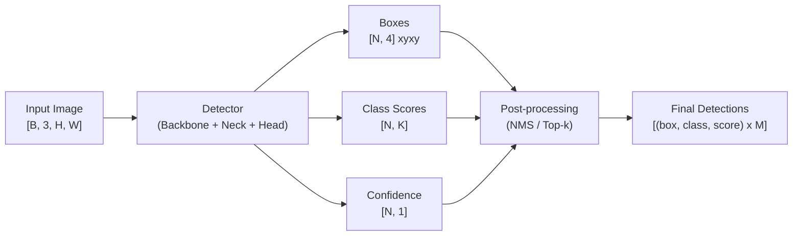
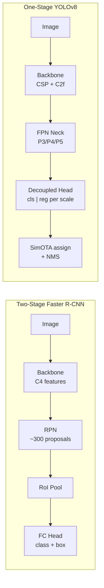
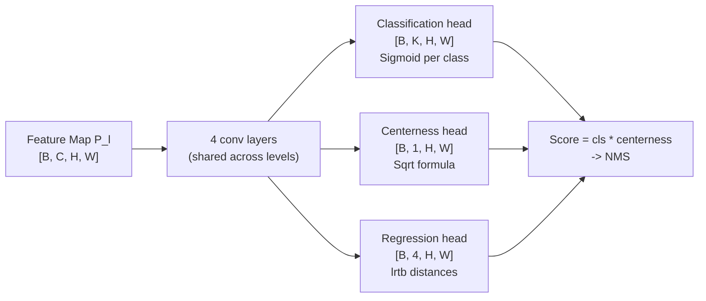
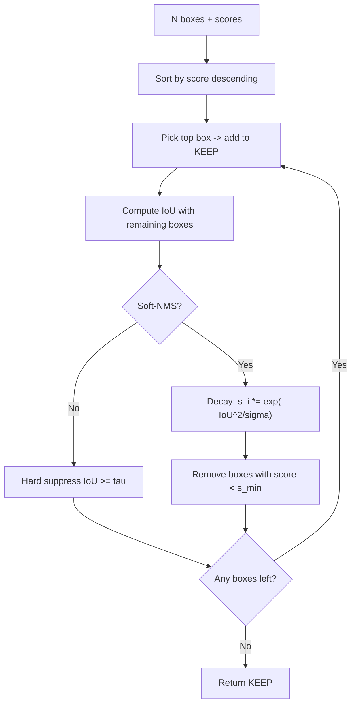
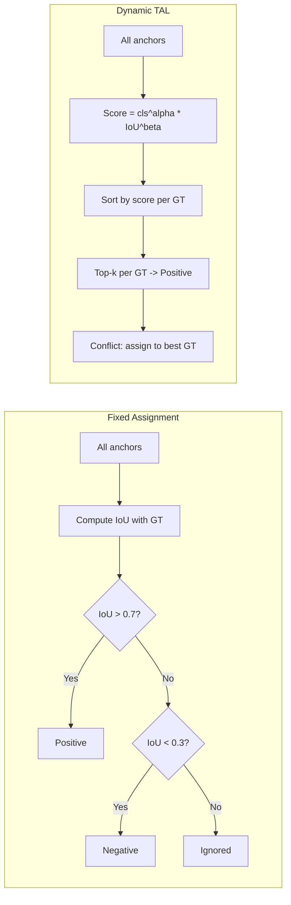
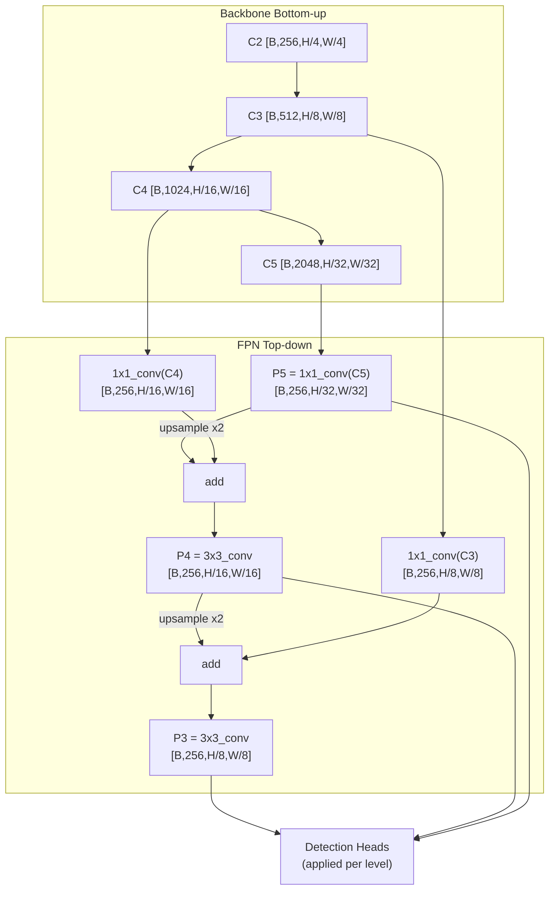
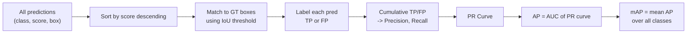

[← Back to Table of Contents](./README.md)

# Chapter 3 — Object Detection

> *"Detection is classification with a ruler — the hard part is the ruler."*

---

## The Detection Problem

Object detection is the task of simultaneously **localizing** and **classifying** all objects of interest in an image. Formally, given an image $I \in \mathbb{R}^{H \times W \times 3}$, the goal is to output a variable-length set of tuples:

$$\{(b_i,\, c_i,\, s_i)\}_{i=1}^{N}$$

where $b_i = [x_1, y_1, x_2, y_2]_i$ is a bounding box in pixel coordinates, $c_i \in \{1, \ldots, K\}$ is a class label, and $s_i \in [0, 1]$ is a confidence score. The number of detections $N$ is not fixed — it varies per image and is not known at inference time.

### Why Detection Is Harder Than Classification

This variability in output size is the fundamental challenge that separates detection from classification:
- **Variable-size output**: A network has a fixed-size output head. Producing a variable number of boxes requires design choices (anchor grids, query vectors, or greedy search).
- **Spatial localization**: The model must not only recognize an object but also precisely localize its extent.
- **Scale variation**: Objects in COCO range from 8×8 pixels (a tiny bird in the background) to 800×800 pixels (a person filling the frame) — a 10,000× range in area.
- **Overlap and occlusion**: Objects partially occlude each other; the model must separate them.
- **Background dominance**: For every foreground pixel, there are typically 10–100 background pixels, creating severe class imbalance.

### Bounding Box Formats

Different frameworks use different box representations. Knowing the conversions is essential for integrating datasets and models:

| Format | Representation | Used by | Notes |
|---|---|---|---|
| **xyxy** | $[x_1, y_1, x_2, y_2]$ | torchvision, COCO eval | Top-left and bottom-right corners |
| **xywh** | $[x, y, w, h]$ | COCO annotation files | Top-left corner + width/height |
| **cxcywh** | $[c_x, c_y, w, h]$ | YOLO, DETR | Center point + width/height |

Conversion formulas (xyxy → cxcywh):

$$c_x = \frac{x_1 + x_2}{2}, \quad c_y = \frac{y_1 + y_2}{2}, \quad w = x_2 - x_1, \quad h = y_2 - y_1$$

### Detection Output Decomposition



### Real-World Applications

| Domain | Example Use Case | Key Challenge |
|---|---|---|
| Autonomous driving | Pedestrian and vehicle detection | Real-time (<30ms), safety-critical |
| Retail analytics | Shelf product detection | Many small objects, similar appearance |
| Medical imaging | Lesion / nodule detection | High recall required, rare positives |
| Security / surveillance | Person detection in crowds | Occlusion, long-tail demographics |
| Robotics | Object grasping | 6-DOF pose estimation downstream |

---

## Two-Stage vs. One-Stage Detectors

The dominant architectural dichotomy in detection is between **two-stage** methods (separate region proposal and classification) and **one-stage** methods (single forward pass predicts everything). Transformer-based detectors (DETR family) blur this boundary further.

### Two-Stage: The R-CNN Family

**R-CNN (2014)**: The original region-based CNN. Selective search generates ~2000 region proposals (edge-based clustering); each proposal is warped to 227×227 and run through AlexNet; features are classified by SVMs. Painfully slow (~47s/image) but demonstrated the power of CNN features for detection.

**Fast R-CNN (2015)**: Key insight — run the CNN on the **entire image once**, then project proposals onto the feature map. RoI Pooling extracts a fixed-size feature ($7 \times 7$) for each proposal. End-to-end training with a joint softmax + bbox regression loss. **25× faster** than R-CNN.

**Faster R-CNN (2015)**: Replaces selective search with a **Region Proposal Network (RPN)** — a small conv network that slides over the feature map and predicts objectness + box offsets for $A$ anchor boxes at each location. Now fully end-to-end trainable. RPN shares features with the detection head.

**How the RPN works in detail:**
1. Slide a $3 \times 3$ conv window over the feature map (e.g., $C_4 \in \mathbb{R}^{B \times 512 \times H/16 \times W/16}$)
2. At each spatial location, predict $A$ anchor boxes (e.g., $A = 9$: 3 scales × 3 ratios)
3. For each anchor: a 2-class objectness score (foreground/background) and 4 regression deltas ($\Delta x, \Delta y, \Delta w, \Delta h$)
4. Apply NMS to propose top-$K$ regions (e.g., top-300)
5. Pass proposals to the detection head (RoI Pooling → FC layers → class + refined box)

### One-Stage: YOLO to YOLOv8

**YOLOv1 (2016)**: Divide image into $S \times S$ grid. Each cell predicts $B$ boxes and $C$ class probabilities in a single forward pass. Extremely fast (45 FPS) but poor accuracy on small objects and crowded scenes.

**SSD (2016)**: Multi-scale predictions from different feature map levels (similar to FPN). Uses anchor boxes at each scale. Achieves better small-object accuracy than YOLOv1.

**RetinaNet (2017)**: Single-scale FPN-based detector with Focal Loss to solve class imbalance. First single-stage detector to match Faster R-CNN accuracy.

**YOLOv8 (2023)**: Anchor-free, decoupled head (separate cls and reg branches), C2f CSP bottleneck backbone, SimOTA assignment. State-of-the-art real-time detection.

### DETR: End-to-End Detection with Transformers

**DETR (2020)** reformulates detection as a set prediction problem. $N$ learnable "object queries" attend over the image features via cross-attention; the $N$ output vectors each predict a (class, box) pair. Hungarian matching assigns ground truth to predictions, eliminating NMS entirely. Slow to converge (~500 epochs) but conceptually elegant.

### Accuracy vs. Speed Tradeoff

| Model | mAP@COCO | Latency (V100) | Params (M) | Use Case |
|---|---|---|---|---|
| Faster R-CNN R50 | 37.4 | 90ms | 42 | High-accuracy, offline |
| RetinaNet R50 | 36.5 | 55ms | 34 | Balanced |
| YOLOv8n | 37.3 | 6ms | 3.2 | Edge / mobile |
| YOLOv8x | 53.9 | 13ms | 68 | Real-time, high accuracy |
| DINO-4scale R50 | 49.0 | 45ms | 47 | Transformer accuracy |
| DINO-4scale Swin-L | 58.5 | 110ms | 218 | State-of-the-art accuracy |



---

## Anchor-Based Detection

### What Are Anchors?

**Anchors** (also called prior boxes) are a set of pre-defined reference boxes tiled across each location in the feature map. Instead of predicting absolute box coordinates, the network predicts **offsets** relative to these anchors, greatly simplifying the regression target.

For a typical Faster R-CNN RPN with scales $\{32^2, 64^2, 128^2, 256^2, 512^2\}$ and ratios $\{0.5, 1.0, 2.0\}$, there are $5 \times 3 = 15$ anchor shapes. At stride 16 on a $224 \times 224$ image, the feature map is $14 \times 14$, giving $14 \times 14 \times 15 = 2940$ anchors.

### Anchor Assignment

Each anchor is assigned to a ground truth box (positive) or background (negative) based on IoU:

| IoU Threshold | Assignment | Training Signal |
|---|---|---|
| $\text{IoU} \geq 0.7$ | **Positive** | Classification: foreground; Regression: learn delta |
| $\text{IoU} < 0.3$ | **Negative** | Classification: background; Regression: ignored |
| $0.3 \leq \text{IoU} < 0.7$ | **Ignored** | Not used in loss computation |

Additionally, for each ground truth box, the anchor with the highest IoU (even if below 0.7) is forced positive, ensuring every ground truth box has at least one positive anchor.

### Regression Targets (Delta Encoding)

Rather than predicting absolute coordinates, the network predicts **encoded offsets** from anchor to ground truth:

$$t_x = \frac{x_{gt} - x_a}{w_a}, \quad t_y = \frac{y_{gt} - y_a}{h_a}, \quad t_w = \log\frac{w_{gt}}{w_a}, \quad t_h = \log\frac{h_{gt}}{h_a}$$

The log encoding for width/height ensures the regression target is scale-independent: whether the ground truth is 2× or 0.5× the anchor size, the target magnitude is the same (log 2 = 0.693). At inference, the inverse transform recovers predicted box coordinates.

### Anchor-Free Advantages

Anchors introduce several pain points:
- **Hyper-parameter sensitivity**: the anchor scales, ratios, and assignment thresholds must be carefully tuned per dataset.
- **Imbalanced training**: the vast majority of anchors are negative, creating the class imbalance problem.
- **Inflexibility**: anchors are designed for typical object shapes; very non-square objects (traffic lights, text lines) fit poorly.

Modern anchor-free methods (FCOS, CenterNet, DETR) avoid these issues at the cost of different assignment challenges.

```python
import torch

def generate_anchors(feature_map_h, feature_map_w, stride,
                     scales=(32, 64, 128), ratios=(0.5, 1.0, 2.0)):
    """Generate all anchors for one feature map level.
    
    Returns:
        anchors: [H*W*A, 4] in xyxy format, absolute pixel coordinates
    """
    anchors = []
    for scale in scales:
        for ratio in ratios:
            # Anchor dimensions: area = scale^2, aspect = ratio
            h = scale / ratio ** 0.5
            w = scale * ratio ** 0.5

            for row in range(feature_map_h):
                for col in range(feature_map_w):
                    cx = (col + 0.5) * stride   # anchor center x
                    cy = (row + 0.5) * stride   # anchor center y
                    anchors.append([cx - w/2, cy - h/2,
                                    cx + w/2, cy + h/2])  # xyxy

    return torch.tensor(anchors, dtype=torch.float32)  # [H*W*A, 4]

# For a 28x28 feature map (stride=8, from 224x224 input):
anchors = generate_anchors(28, 28, stride=8)
print(f"Total anchors at this level: {anchors.shape[0]}")  # 28*28*9 = 7056
```

---

## Anchor-Free Detection

Anchor-free detectors predict boxes directly from pixel or point-level features without pre-defined reference shapes, eliminating anchor hyper-parameter tuning.

### FCOS: Fully Convolutional One-Stage Detector

**FCOS** (Tian et al., 2019) assigns positive samples to all pixels **inside** a ground truth box and predicts the distance from each pixel to the four box edges:

$$l^* = x - x_1, \ r^* = x_2 - x, \ t^* = y - y_1, \ b^* = y_2 - y$$

**Centerness**: Pixels at the center of an object are better positioned to predict the full box than pixels at the edges. FCOS adds a **centerness branch** that predicts:

$$\text{centerness}^* = \sqrt{\frac{\min(l^*, r^*)}{\max(l^*, r^*)} \cdot \frac{\min(t^*, b^*)}{\max(t^*, b^*)}} \in [0, 1]$$

Centerness is 1.0 at the object center and approaches 0 at the edges. It is multiplied with the classification score during NMS, suppressing low-quality boxes from edge pixels.



### CenterNet: Objects as Points

**CenterNet** (Zhou et al., 2019) detects each object as a **single point** (its center). The output is:
- **Heatmap** $\hat{Y} \in [0,1]^{H/R \times W/R \times K}$: a Gaussian peak at each object center for each class $K$ (rendered with a Gaussian kernel during training).
- **Size map** $\hat{S} \in \mathbb{R}^{H/R \times W/R \times 2}$: width and height at each center.
- **Offset map** $\hat{O} \in \mathbb{R}^{H/R \times W/R \times 2}$: sub-pixel correction for stride discretization.

At inference, local maxima in the heatmap (values larger than 8 neighbors) are extracted as detections. NMS is implicit in the heatmap structure — nearby duplicate detections produce a smooth Gaussian, not a sharp peak. This makes CenterNet NMS-free.

---

## IoU and Its Variants — A Deep Dive

### Standard IoU

Intersection over Union (IoU) measures the overlap between two bounding boxes as a ratio of intersection area to union area:

$$\text{IoU}(A, B) = \frac{|A \cap B|}{|A \cup B|} = \frac{|A \cap B|}{|A| + |B| - |A \cap B|} \in [0, 1]$$

IoU is scale-invariant (a small box with 50% overlap scores identically to a large box with 50% overlap) and is the standard metric for NMS thresholding and evaluation matching.

**Why IoU gradient = 0 for disjoint boxes**: When $|A \cap B| = 0$, IoU = 0 regardless of how far apart the boxes are. A prediction of $[0, 0, 10, 10]$ and $[12, 12, 20, 20]$ has the same IoU (= 0) as $[0, 0, 10, 10]$ and $[1000, 1000, 1010, 1010]$. Therefore $\frac{\partial \text{IoU}}{\partial \hat{b}} = 0$ when boxes don't overlap, providing no gradient signal for regression. This is a fundamental problem during early training when predictions may be far from ground truth.

### IoU Variants

$$\text{GIoU} = \text{IoU} - \frac{|C \setminus (A \cup B)|}{|C|}$$

where $C$ is the smallest enclosing box of $A$ and $B$. GIoU penalizes non-overlapping boxes by the proportion of the enclosing area not covered by either box. It is always $\leq \text{IoU}$ and has non-zero gradient when boxes are disjoint.

$$\text{DIoU} = \text{IoU} - \frac{\rho^2(\mathbf{b}, \mathbf{b}^{gt})}{c^2}$$

where $\rho(\mathbf{b}, \mathbf{b}^{gt})$ is the Euclidean distance between box centers and $c$ is the diagonal length of the enclosing box. DIoU directly minimizes center-point distance, encouraging faster convergence.

$$\text{CIoU} = \text{DIoU} - \alpha v, \quad v = \frac{4}{\pi^2}\left(\arctan\frac{w^{gt}}{h^{gt}} - \arctan\frac{w}{h}\right)^2, \quad \alpha = \frac{v}{1 - \text{IoU} + v}$$

CIoU adds an aspect ratio consistency term $v$ that penalizes predictions with a different width-to-height ratio than the ground truth. This improves bounding box quality metrics.

### Comparison Table

| Variant | Gradient when disjoint | What it penalizes | When to use |
|---|---|---|---|
| IoU | 0 (no signal) | Nothing beyond overlap | NMS threshold, evaluation |
| GIoU | Non-zero | Non-overlapping area | Loss when boxes may be disjoint early training |
| DIoU | Non-zero | Center distance | Fast convergence, also used in DIoU-NMS |
| CIoU | Non-zero | Center distance + aspect ratio | Best box regression loss (YOLOv8, DINO) |
| SIoU | Non-zero | Directional angle between centers | Some YOLO variants |

---

## ⭐ NMS — Non-Maximum Suppression Deep Dive

### Why Multiple Detections Occur

Every anchor or grid cell in the feature map independently predicts whether an object is present. For an object that overlaps multiple anchors (common when the object is large relative to the anchor stride), many anchors will independently predict high confidence scores for the same underlying object. NMS is the post-processing step that collapses these redundant predictions.

### Greedy NMS: Step-by-Step

**Input**: $N$ boxes with associated scores, IoU threshold $\tau$ (typically 0.45–0.6).

**Algorithm**:
1. Sort all boxes by confidence score in descending order.
2. Select the top-scoring box; add it to the kept set.
3. Compute IoU of this box with all remaining boxes.
4. Remove (suppress) all remaining boxes with $\text{IoU} \geq \tau$ (they likely detect the same object).
5. Repeat from step 2 on the remaining (unsuppressed) boxes.
6. Return the kept set.

```python
import torch

def compute_iou(box1, boxes):
    """Compute IoU of box1 [4] against boxes [N, 4]. All in xyxy format."""
    # Intersection
    ix1 = torch.max(box1[0], boxes[:, 0])   # [N]
    iy1 = torch.max(box1[1], boxes[:, 1])   # [N]
    ix2 = torch.min(box1[2], boxes[:, 2])   # [N]
    iy2 = torch.min(box1[3], boxes[:, 3])   # [N]
    inter = (ix2 - ix1).clamp(min=0) * (iy2 - iy1).clamp(min=0)  # [N]

    # Union
    area1 = (box1[2] - box1[0]) * (box1[3] - box1[1])             # scalar
    area2 = (boxes[:, 2] - boxes[:, 0]) * (boxes[:, 3] - boxes[:, 1])  # [N]
    union = area1 + area2 - inter                                   # [N]

    return inter / union.clamp(min=1e-6)                           # [N]


def nms(boxes, scores, iou_threshold=0.5):
    """Greedy NMS: suppress overlapping boxes, keep highest-scoring ones.
    
    Args:
        boxes:         [N, 4]  -- bounding boxes in xyxy format
        scores:        [N]     -- confidence scores (higher = more confident)
        iou_threshold: float   -- suppress if IoU >= this value
    Returns:
        keep:          list of int -- indices of kept boxes (K <= N)
    """
    # Step 1: sort boxes by descending confidence score
    order = scores.argsort(descending=True)   # [N] -- highest score first
    keep  = []

    while order.numel() > 0:
        # Step 2: always keep the current highest-score box
        i = order[0].item()
        keep.append(i)

        if order.numel() == 1:
            break   # no more boxes to compare against

        # Step 3: compute IoU of the kept box against all remaining candidates
        ious = compute_iou(boxes[i], boxes[order[1:]])   # [N-1]

        # Step 4: retain only boxes below the IoU threshold (different objects)
        # Boxes above threshold are redundant detections of the same object
        mask  = ious < iou_threshold               # [N-1] bool mask
        order = order[1:][mask]                    # keep non-overlapping boxes

    return keep  # list of kept indices


# Usage example
boxes  = torch.tensor([[100,100,200,200], [110,110,210,210],
                        [300,300,400,400]], dtype=torch.float32)
scores = torch.tensor([0.95, 0.88, 0.75])
kept   = nms(boxes, scores, iou_threshold=0.5)
print(f"Kept indices: {kept}")  # [0, 2] -- box 1 suppressed by box 0
```

### Soft-NMS: Decay Instead of Kill

Standard NMS uses a hard threshold: any box with $\text{IoU} \geq \tau$ is completely eliminated. This is a poor choice in **crowded scenes** (pedestrian crowds, dense traffic) where two legitimate detections may legitimately overlap with $\text{IoU} > 0.5$.

**Soft-NMS** (Bodla et al., 2017) decays the score of overlapping boxes rather than eliminating them:

**Gaussian Soft-NMS**: $s_i \leftarrow s_i \cdot \exp\!\left(-\frac{\text{IoU}(\mathcal{M}, b_i)^2}{\sigma}\right)$

**Linear Soft-NMS**: $s_i \leftarrow s_i \cdot (1 - \text{IoU}(\mathcal{M}, b_i))$ when $\text{IoU} \geq N_t$

Boxes with decayed scores below a minimum threshold $s_t$ are then discarded. The Gaussian variant improves COCO mAP by ~1–2 AP on crowded datasets.

### NMS Variants at a Glance

| Variant | Key Idea | When to Use |
|---|---|---|
| **Greedy NMS** | Hard suppress if IoU $\geq \tau$ | Standard; fast, simple |
| **Soft-NMS (Gaussian)** | Decay score by $\exp(-\text{IoU}^2/\sigma)$ | Crowded scenes (COCO pedestrians) |
| **DIoU-NMS** | Use DIoU (center distance) instead of IoU | Suppresses nearby same-center duplicates better |
| **WBF** (Weighted Box Fusion) | Weighted average position of overlapping boxes | Ensemble methods; more stable than voting |
| **Matrix NMS** | Parallel IoU matrix computation | Fast GPU implementation (SOLOv2) |

### NMS Hyperparameter Effects

| IoU Threshold | Effect |
|---|---|
| $\tau = 0.3$ (aggressive) | Many boxes suppressed; misses detections in crowds; cleaner output |
| $\tau = 0.5$ (standard) | Balanced; COCO default |
| $\tau = 0.7$ (permissive) | Many duplicate boxes kept; recall improves for dense objects |



---

## Label Assignment Strategies

Label assignment is the process of deciding which predictions are responsible for each ground truth box. It is one of the most impactful design decisions in modern detectors — the same architecture with different assignment strategies can differ by 2–3 AP.

### Fixed Assignment (IoU Threshold)

The simplest strategy: assign a prediction positive if it has $\text{IoU} \geq \tau_{pos}$ with a ground truth box. Problems:
- Same threshold used for large and small objects (a small object's best anchor may only achieve IoU = 0.55).
- The threshold is a global hyperparameter requiring tuning per dataset.

### ATSS: Adaptive Training Sample Selection

**ATSS** (Zhang et al., 2020) adapts the assignment threshold per ground truth box. For each ground truth, select the $k$ nearest anchors across all feature pyramid levels (based on center distance). Compute the mean $\mu_g$ and standard deviation $\sigma_g$ of their IoUs with the ground truth. Use $\mu_g + \sigma_g$ as the per-box IoU threshold. This naturally adapts: for a large object with high-IoU anchors, the threshold is high; for a small object, it is lower.

### OTA: Optimal Transport Assignment

**OTA** (Ge et al., 2021) frames label assignment as an **optimal transport problem**. Each ground truth "supplies" $s_i$ positive samples; the background "supplies" all remaining samples. Each anchor "demands" exactly 1 label. The cost between anchor $j$ and ground truth $i$ is based on classification and regression quality. OTA finds the globally optimal assignment (minimizing total cost) via the Sinkhorn-Knopp algorithm.

### SimOTA: Simplified Optimal Transport

**SimOTA** (used in YOLOX) approximates OTA without the Sinkhorn iterations:
1. For each ground truth box, compute a cost matrix $C_{ij}$ combining focal loss (cls) and IoU loss (reg).
2. Select the top-$k$ anchors (by lowest cost) inside the ground truth box for that ground truth.
3. If an anchor is assigned to multiple ground truths, assign it to the one with minimum cost.

### Task-Aligned Assigner (TAL)

**TAL** (TOOD, used in YOLOv8) uses a combined quality score:

$$t = s^\alpha \cdot u^\beta$$

where $s$ is the classification score for the correct class, $u$ is the IoU with the ground truth box, and $\alpha, \beta$ are weighting hyperparameters. The top-$k$ anchors per ground truth by this alignment score are assigned positive. This joint score ensures high-quality positives have both high classification confidence and high localization accuracy.



---

## Focal Loss

### The Class Imbalance Problem

In a one-stage detector with FPN, a single image produces $\sim 100,000$ anchor/pixel predictions. Of these, typically only **10–100** overlap with any ground truth object (foreground). The remaining $\sim 99,900$ are background. Standard cross-entropy loss for this 1000:1 ratio is dominated by easy background examples — even if each contributes small loss, their sheer number overwhelms the signal from rare foreground examples.

**Focal loss** (Lin et al., 2017) introduces a modulating factor to down-weight easy examples:

$$\text{FL}(p_t) = -(1-p_t)^\gamma \log(p_t)$$

where $p_t = p$ for foreground (ground truth = 1) and $p_t = 1-p$ for background (ground truth = 0). The focusing parameter $\gamma \geq 0$:

- $\gamma = 0$: standard cross-entropy (no modulation)
- $\gamma = 2$: standard focal (down-weights easy examples quadratically)

For an easy background example predicted with $p = 0.01$ (nearly no foreground probability), $p_t = 1 - 0.01 = 0.99$ and the modulating factor is $(1 - 0.99)^2 = 10^{-4}$ — this example contributes **10,000× less** than it would under standard CE.

**$\alpha$ balancing**: An additional hyperparameter $\alpha \in (0, 1)$ weights foreground class by $\alpha$ and background by $1-\alpha$ to further compensate for imbalance. Typical: $\alpha = 0.25$, $\gamma = 2$.

$$\text{FL}(p_t) = -\alpha_t (1-p_t)^\gamma \log(p_t)$$

### Training Initialization Trick

A critical implementation detail: initialize the final bias of the classification head to:

$$b_0 = -\log\frac{1-\pi}{\pi}, \quad \pi = 0.01$$

This sets the initial predicted probability for all classes to 0.01, preventing the early training instability caused by predicting ~0.5 probability for all classes (which would create enormous background loss on the first iteration).

```python
import torch
import torch.nn as nn
import torch.nn.functional as F

def focal_loss_detection(pred_logits, targets, alpha=0.25, gamma=2.0):
    """Focal loss for binary foreground/background classification in detection.
    
    Args:
        pred_logits: [N] -- raw logits (one per anchor/pixel)
        targets:     [N] -- binary labels (1=foreground, 0=background)
        alpha:       foreground weighting factor
        gamma:       focusing parameter
    Returns:
        scalar loss
    """
    p   = torch.sigmoid(pred_logits)           # [N] -- predicted foreground prob
    ce  = F.binary_cross_entropy_with_logits(
        pred_logits, targets.float(), reduction='none')  # [N]

    p_t = p * targets + (1 - p) * (1 - targets)         # p_t = p if y=1 else 1-p
    alpha_t = alpha * targets + (1 - alpha) * (1 - targets)  # alpha_t weight

    focal_weight = (1 - p_t) ** gamma         # [N] modulating factor
    loss = alpha_t * focal_weight * ce        # [N] scaled focal loss

    return loss.sum()                         # sum (not mean) over anchors

# -- Initialize bias for stability at training start -------------------------
def init_detection_head_bias(module, prior_prob=0.01):
    bias_value = -torch.log(torch.tensor((1 - prior_prob) / prior_prob))
    if hasattr(module, 'cls_logits'):          # RetinaNet-style head
        nn.init.constant_(module.cls_logits.bias, bias_value)
```

---

## Feature Pyramid Networks (FPN)

### The Scale Problem

Small objects (e.g., a 16×16 pixel car 500m away) are visible only in **high-resolution feature maps** early in the backbone (fine spatial detail, but low semantic content). Large objects (e.g., a person filling the frame) are better represented in **deep, semantically rich feature maps** (but downsampled by 32×, so small objects disappear). A single-scale detector must compromise.

**FPN** (Lin et al., 2017) creates a multi-scale feature pyramid with **strong semantics at all scales** by fusing bottom-up backbone features with top-down semantic context via lateral connections.

### FPN Architecture

**Bottom-up pathway** (standard backbone forward pass):
- $C_1$: stride 2, $H/2 \times W/2$ (usually not used — too expensive)
- $C_2$: stride 4, $H/4 \times W/4$, 256 channels
- $C_3$: stride 8, $H/8 \times W/8$, 512 channels
- $C_4$: stride 16, $H/16 \times W/16$, 1024 channels
- $C_5$: stride 32, $H/32 \times W/32$, 2048 channels

**Top-down pathway** (adds semantic context back to fine scales):
- $P_5 = \text{conv}_{1\times1}(C_5)$: 256 channels, stride 32
- $P_4 = \text{conv}_{1\times1}(C_4) + \text{upsample}(P_5)$: 256 channels, stride 16
- $P_3 = \text{conv}_{1\times1}(C_3) + \text{upsample}(P_4)$: 256 channels, stride 8
- $P_2 = \text{conv}_{1\times1}(C_2) + \text{upsample}(P_3)$: 256 channels, stride 4
- $P_6 = \text{maxpool}(P_5)$: stride 64 (for detecting very large objects)

The **lateral connection** is a $1 \times 1$ conv that reduces backbone channels to 256, followed by a $3 \times 3$ conv on the sum output to remove aliasing.



### FPN Variants

**PANet** (Liu et al., 2018) adds a **bottom-up path augmentation** on top of FPN: after the top-down FPN pass, add a second bottom-up pass to shorten the information path from low-level features. An edge in PANet connects $P_3$ back up to $P_4$, $P_5$, ensuring low-level details propagate all the way up.

**BiFPN** (EfficientDet) makes the lateral connections **bidirectional** and adds **learnable scalar weights** to the feature fusion:

$$P_4^{\text{out}} = \text{conv}\!\left(\frac{w_1 \cdot P_4^{\text{in}} + w_2 \cdot \text{resize}(P_5^{\text{in}}) + w_3 \cdot \text{resize}(P_3^{\text{in}})}{w_1 + w_2 + w_3 + \epsilon}\right)$$

The weights are learned end-to-end, allowing the network to adaptively modulate the contribution from each scale.

---

## Detection Loss Functions

The total detection loss is a **multi-task loss** combining classification and regression:

$$\mathcal{L} = \lambda_{\text{cls}} \mathcal{L}_{\text{cls}} + \lambda_{\text{reg}} \mathcal{L}_{\text{reg}} + \lambda_{\text{obj}} \mathcal{L}_{\text{obj}}$$

The objectness term $\mathcal{L}_{\text{obj}}$ is used in YOLO-style detectors but not in RetinaNet/FCOS (which use centerness instead).

### Classification Loss

**Focal loss** (described above) for one-stage detectors. Standard **cross-entropy** for two-stage detectors (where the RPN already filters background). The key difference: two-stage methods have a built-in hard example mining step (RoI sampling), so focal loss is not necessary.

### Regression Loss

| Loss | Formula | Properties |
|---|---|---|
| **L1** | $|t - \hat{t}|$ | Scale-sensitive, sparse gradient |
| **SmoothL1 (Huber)** | $0.5x^2$ if $|x|<1$ else $|x|-0.5$ | L2 near zero (smooth), L1 far (robust to outliers) |
| **IoU loss** | $1 - \text{IoU}(b, \hat{b})$ | Directly optimizes the evaluation metric |
| **CIoU loss** | $1 - \text{CIoU}(b, \hat{b})$ | Best practical regression loss |
| **DIoU loss** | $1 - \text{DIoU}(b, \hat{b})$ | Fast convergence |

**SmoothL1** is the Faster R-CNN default because it is robust to outlier predictions (large errors contribute linearly, not quadratically). **IoU-based losses** are increasingly preferred because they directly optimize the evaluation metric — SmoothL1 on $(t_x, t_y, t_w, t_h)$ does not.

### Balancing Coefficients

YOLO-style detectors use different weights for each loss component. YOLOv8 default:
- $\lambda_{\text{box}} = 7.5$ (regression — upweighted because box regression is harder)
- $\lambda_{\text{cls}} = 0.5$ (classification)
- $\lambda_{\text{dfl}} = 1.5$ (distribution focal loss for precise box regression)

The large weight on box regression reflects that localization quality is the harder learning signal.

---

## Evaluation: mAP Computation

### Step-by-Step Worked Example

Suppose we have **1 class** ("cat"), **3 ground truth boxes**, and **5 predictions** sorted by confidence:

| Pred | Confidence | IoU with GT1 | IoU with GT2 | IoU with GT3 | Match? |
|---|---|---|---|---|---|
| P1 | 0.95 | **0.82** | 0.10 | 0.05 | TP (matches GT1) |
| P2 | 0.90 | 0.20 | **0.75** | 0.08 | TP (matches GT2) |
| P3 | 0.85 | 0.15 | 0.20 | **0.90** | TP (matches GT3) |
| P4 | 0.70 | **0.60** | 0.15 | 0.10 | FP (GT1 already matched) |
| P5 | 0.50 | 0.05 | 0.10 | 0.15 | FP (no unmatched GT) |

**Precision-Recall computation** (IoU threshold = 0.5):

| After pred | TP | FP | Precision | Recall |
|---|---|---|---|---|
| P1 | 1 | 0 | 1.00 | 0.333 |
| P2 | 2 | 0 | 1.00 | 0.667 |
| P3 | 3 | 0 | 1.00 | 1.000 |
| P4 | 3 | 1 | 0.75 | 1.000 |
| P5 | 3 | 2 | 0.60 | 1.000 |

**AP** = area under the PR curve using all-points interpolation (COCO method):

$$AP = \sum_{r \in \{0, 0.01, 0.02, \ldots, 1.0\}} \max_{\tilde{r} \geq r} P(\tilde{r}) \cdot \Delta r$$

In this example, AP = 1.0 (perfect prediction for all 3 GT boxes).

### COCO mAP Metrics

| Metric | IoU Threshold | Object Size |
|---|---|---|
| **AP** (primary) | 0.5:0.05:0.95 (10 thresholds averaged) | All |
| **AP50** | 0.50 | All |
| **AP75** | 0.75 (strict) | All |
| **AP_S** | 0.5:0.05:0.95 | Area $< 32^2$ pixels |
| **AP_M** | 0.5:0.05:0.95 | $32^2 <$ area $< 96^2$ |
| **AP_L** | 0.5:0.05:0.95 | Area $> 96^2$ |

The COCO AP (averaging over 10 IoU thresholds from 0.5 to 0.95) is a much stricter metric than Pascal VOC's AP@0.5 — it requires high localization precision. AP75 specifically tests tight box quality.



---

## Practical Code: Inference with a Pre-Trained Detector

### YOLOv8 Inference with Ultralytics

```python
from ultralytics import YOLO
import cv2
import numpy as np
from pathlib import Path

# -- Load pre-trained model --------------------------------------------------
model = YOLO('yolov8n.pt')   # nano: 3.2M params, 6ms latency on T4
# Other sizes: yolov8s, yolov8m, yolov8l, yolov8x (larger = more accurate)

# -- Run inference on a single image -----------------------------------------
results = model.predict('image.jpg', conf=0.25, iou=0.45, imgsz=640)
# results[0] contains the detection output for the first image

result  = results[0]
boxes   = result.boxes                        # Boxes object
xyxy    = boxes.xyxy.cpu().numpy()            # [N, 4] in xyxy pixel coords
confs   = boxes.conf.cpu().numpy()            # [N]    confidence scores
cls_ids = boxes.cls.cpu().numpy().astype(int) # [N]    integer class indices
names   = result.names                        # dict: {0: 'person', 1: 'bicycle', ...}

print(f"Detected {len(xyxy)} objects:")
for i, (box, conf, cls) in enumerate(zip(xyxy, confs, cls_ids)):
    x1, y1, x2, y2 = box.astype(int)
    print(f"  [{i}] {names[cls]:15s} conf={conf:.3f}  box=({x1},{y1},{x2},{y2})")

# -- Visualize with OpenCV ---------------------------------------------------
img = cv2.imread('image.jpg')
for (x1, y1, x2, y2), conf, cls in zip(xyxy.astype(int), confs, cls_ids):
    label  = f"{names[cls]} {conf:.2f}"
    color  = (0, 255, 0)                       # green bounding box
    cv2.rectangle(img, (x1, y1), (x2, y2), color, thickness=2)
    cv2.putText(img, label, (x1, y1 - 8),
                cv2.FONT_HERSHEY_SIMPLEX, 0.6, color, 2)
cv2.imwrite('detections.jpg', img)

# -- Batch inference on a directory of images --------------------------------
results_batch = model.predict('images/', conf=0.25, stream=True)  # generator
for r in results_batch:
    print(f"Image: {r.path}  --  {len(r.boxes)} detections")

# -- Video stream inference --------------------------------------------------
cap = cv2.VideoCapture('video.mp4')
fps = cap.get(cv2.CAP_PROP_FPS)
W   = int(cap.get(cv2.CAP_PROP_FRAME_WIDTH))
H   = int(cap.get(cv2.CAP_PROP_FRAME_HEIGHT))
out = cv2.VideoWriter('output.mp4', cv2.VideoWriter_fourcc(*'mp4v'), fps, (W, H))

while cap.isOpened():
    ret, frame = cap.read()
    if not ret:
        break

    results = model(frame, conf=0.25, iou=0.45, verbose=False)   # [1 result]
    annotated = results[0].plot()                                  # draw boxes
    out.write(annotated)

cap.release()
out.release()
print("Video written to output.mp4")

# -- Export to ONNX for deployment -------------------------------------------
model.export(format='onnx', imgsz=640, half=True, simplify=True)
# Produces yolov8n.onnx suitable for TensorRT, OpenVINO, ONNX Runtime
```

### Running Inference with torchvision (Faster R-CNN)

```python
import torch
import torchvision
from torchvision import transforms as T
from PIL import Image

# -- Load pretrained Faster R-CNN (COCO 80 classes) --------------------------
model = torchvision.models.detection.fasterrcnn_resnet50_fpn(
    weights='DEFAULT'   # pretrained on COCO
)
model.eval()
device = 'cuda' if torch.cuda.is_available() else 'cpu'
model  = model.to(device)

# -- Preprocess image --------------------------------------------------------
transform = T.Compose([T.ToTensor()])   # Faster R-CNN normalizes internally

img   = Image.open('image.jpg').convert('RGB')
x     = transform(img).unsqueeze(0).to(device)  # [1, 3, H, W]

# -- Inference ---------------------------------------------------------------
COCO_CLASSES = [
    '__background__', 'person', 'bicycle', 'car', 'motorcycle', 'airplane',
    'bus', 'train', 'truck', 'boat', 'traffic light', ...
]  # 91 COCO classes (including background at index 0)

with torch.no_grad():
    preds = model(x)               # list of dicts, one per image

# preds[0] is a dict with keys: 'boxes' [N,4], 'labels' [N], 'scores' [N]
boxes  = preds[0]['boxes'].cpu()   # [N, 4] xyxy float
labels = preds[0]['labels'].cpu()  # [N]    integer class IDs (1-indexed)
scores = preds[0]['scores'].cpu()  # [N]    confidence scores

# Filter by confidence threshold
keep = scores > 0.5
for box, label, score in zip(boxes[keep], labels[keep], scores[keep]):
    x1, y1, x2, y2 = box.int().tolist()
    print(f"  {COCO_CLASSES[label]:15s} {score:.3f}  ({x1},{y1})-({x2},{y2})")
```

---

## Key Takeaways

1. **Two-stage vs. one-stage is a tradeoff, not a hierarchy**: Faster R-CNN dominates on accuracy-critical applications; YOLO-family dominates for real-time inference. Modern DETR-family methods approach the accuracy of two-stage while being end-to-end.
2. **Anchors are optional**: Anchor-free methods (FCOS, CenterNet, DETR) eliminate hyper-parameter tuning at the cost of different assignment challenges. Modern best-practice detectors (YOLOv8, RT-DETR) are anchor-free.
3. **FPN is almost universal**: Multi-scale feature fusion (FPN) is used in virtually every state-of-the-art detector. Understanding P3/P4/P5 tensor flows is essential for modifying and extending detector architectures.
4. **Label assignment drives accuracy**: The jump from fixed IoU assignment to ATSS/SimOTA/TAL is often worth +2–3 AP. Dynamic assignment adapts to object size and produces higher-quality positives.
5. **NMS is still a bottleneck**: Standard greedy NMS fails in crowded scenes. Soft-NMS and WBF help, but DETR-style approaches (which eliminate NMS entirely via bipartite matching) represent the long-term direction.
6. **mAP is your north star**: Always evaluate with COCO-style AP (averaged over IoU thresholds 0.5:0.95). AP50 is easier but less informative; AP75 and AP_S expose localization precision and small-object performance.

## Further Reading

- **Girshick et al. (2014)** — *Rich Feature Hierarchies for Accurate Object Detection* (R-CNN)
- **Ren et al. (2015)** — *Faster R-CNN: Towards Real-Time Object Detection with Region Proposal Networks*
- **Lin et al. (2017a)** — *Feature Pyramid Networks for Object Detection* (FPN)
- **Lin et al. (2017b)** — *Focal Loss for Dense Object Detection* (RetinaNet)
- **Tian et al. (2019)** — *FCOS: Fully Convolutional One-Stage Object Detection*
- **Carion et al. (2020)** — *End-to-End Object Detection with Transformers* (DETR)
- **Ge et al. (2021)** — *YOLOX: Exceeding YOLO Series in 2021*
- **Zhang et al. (2022)** — *DINO: DETR with Improved DeNoising Anchor Boxes for End-to-End Object Detection*
- **Jocher et al. (2023)** — *Ultralytics YOLOv8* (software)

---

**Next: [Chapter 4 — Semantic Segmentation →](./04_semantic_segmentation.md)**

---
*Last updated: May 2026*
