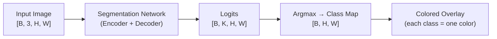
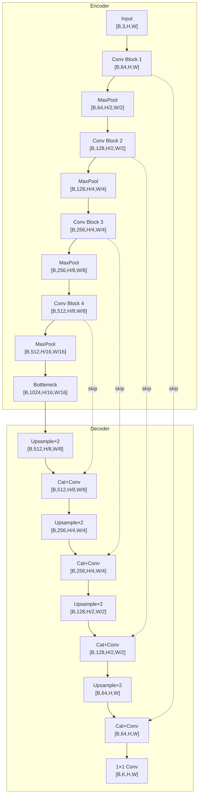
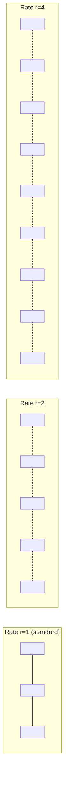
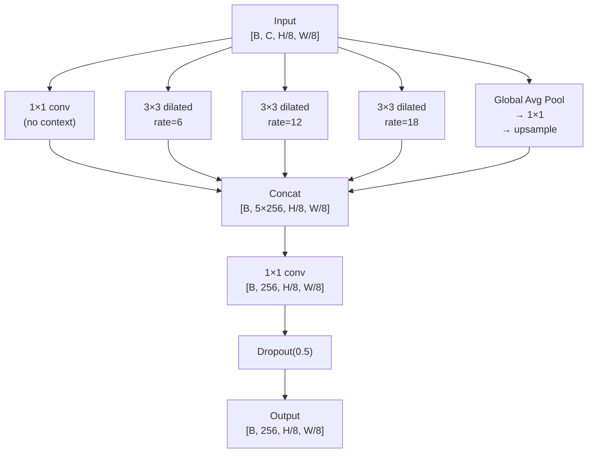
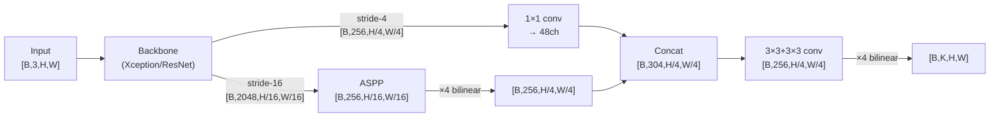
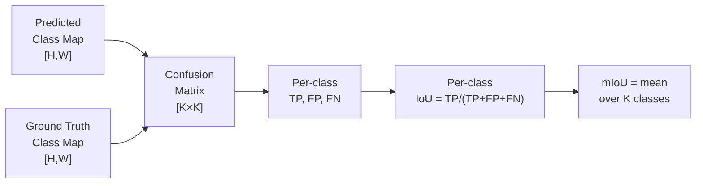
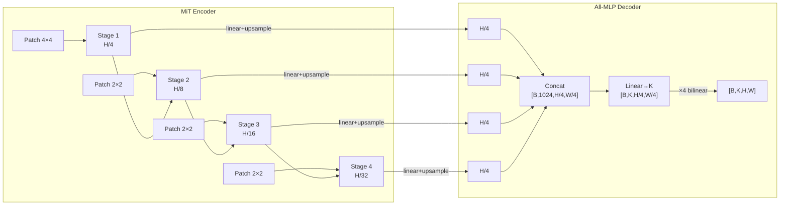

[← Back to Table of Contents](./README.md)

# Chapter 4 — Semantic Segmentation

> *"Where detection draws boxes around things, segmentation traces their exact boundaries — pixel by pixel."*

## The Segmentation Problem

Semantic segmentation is a **dense prediction** task: assign a class label $c \in \{1, \ldots, K\}$ to every pixel $(i, j)$ in the input image.

**Formal definition:**
- Input: image tensor $\mathbf{X} \in \mathbb{R}^{B \times 3 \times H \times W}$
- Output: class map $\mathbf{Y} \in \{1, \ldots, K\}^{B \times H \times W}$ (argmax form) or logit tensor $\mathbf{L} \in \mathbb{R}^{B \times K \times H \times W}$

Unlike object detection, semantic segmentation produces **no bounding boxes**, **no instance IDs** — every pixel simply carries a class label. Unlike instance segmentation, two adjacent people merge into a single "person" region.

### Applications

| Domain | Task | Classes (examples) | Dataset |
|---|---|---|---|
| Autonomous driving | Scene parsing | road, sidewalk, building, car, pedestrian, sky | Cityscapes (19 classes) |
| Medical imaging | Organ / lesion delineation | liver, tumor, polyp, retinal vessels | ISIC, PolypPVT, DRIVE |
| Satellite / aerial | Land-cover mapping | forest, water, urban, farmland | DeepGlobe, iSAID |
| Robotics | Scene understanding | floor, wall, table, graspable object | ADE20K, ScanNet |
| AR / VR | Scene matting | person, background | COCO-Stuff, Pascal VOC |

**Key challenge:** The output must match the input resolution ($H \times W$), but deep CNNs progressively reduce spatial resolution (stride 32 at the final layer of ResNet). Recovering fine spatial details while retaining rich semantics is the central design problem.



---

## Encoder-Decoder Architecture

### Why Backbones Destroy Spatial Resolution

A standard ResNet-50 backbone applies strides of 2 at multiple stages:

| Stage | Stride | Output for 512×512 input |
|---|---|---|
| stem (conv1) | 2 | 256×256 |
| layer1 (max pool) | 2 | 128×128 |
| layer2 | 2 | 64×64 |
| layer3 | 2 | 32×32 |
| layer4 | 2 | 16×16 |

The final feature map is **16×16** for a 512×512 input — a **32× reduction**. For classification this is fine; for pixel-level prediction it is catastrophic.

### FCN — The Founding Paper (2015)

Long et al. (2015) proposed the **Fully Convolutional Network (FCN)** — the first end-to-end trainable model for dense prediction:

1. Replace all fully-connected layers in VGG-16 with 1×1 convolutions.
2. Apply **bilinear upsampling ×32** on the final feature map → FCN-32s.
3. **FCN-16s**: add skip connection from `pool4` (stride 16), upsample ×2, add to ×16 upsampled deep features → ×16 upsample.
4. **FCN-8s**: further add skip from `pool3` (stride 8) → ×8 upsample.

FCN-8s improved on FCN-32s by +5 mIoU on PASCAL VOC by recovering finer spatial detail.

### U-Net (2015) — Symmetric Encoder-Decoder

U-Net introduced **symmetric skip connections** that concatenate (not add) encoder features to decoder features at each resolution level. Originally designed for biomedical image segmentation, it became the dominant architecture for medical imaging.



**Why concatenation beats addition for skip connections:**
- *Addition* sums encoder and decoder feature channels — information is merged and some is lost.
- *Concatenation* doubles the channel count — both encoder fine detail AND decoder semantics are fully preserved; the subsequent conv layers learn which to use.

### Architecture Comparison

| Model | Year | Skip connections | Output stride | Key idea |
|---|---|---|---|---|
| FCN-32s | 2015 | None | 32 | First fully conv network |
| FCN-8s | 2015 | pool3, pool4 (add) | 8 | Multi-scale fuse |
| U-Net | 2015 | All 4 levels (concat) | 1 | Symmetric decoder |
| SegNet | 2015 | Max-pool indices | 4 | Memory-efficient decoder |
| DeepLab v3+ | 2018 | Stride-4 features | 4 | ASPP + lightweight decoder |
| SegFormer-B5 | 2021 | 4 scales (MLP) | 4 | Transformer encoder + MLP head |

---

## Dilated (Atrous) Convolutions

### The Core Idea

Instead of reducing stride from 2→1 (which would require retraining from scratch), DeepLab keeps the stride but **removes the stride from layers 3 and 4**, compensating by increasing the dilation rate. This keeps the output at **stride 8** instead of stride 32 while maintaining the same receptive field.

**Dilated convolution formula (1D):**

$$y[i] = \sum_{k} x[i + r \cdot k] \cdot w[k], \quad \text{dilation rate } r$$

**Effective receptive field** of a $K \times K$ filter with dilation $r$:

$$\text{ERF} = (K - 1) \cdot r + 1$$

For $K=3$: rate 1 → ERF=3, rate 2 → ERF=5, rate 4 → ERF=9, rate 8 → ERF=17.



Each dashed segment represents a skipped position. The filter (3 elements) covers an increasingly large region.

### Gridding Artifact and Hybrid Dilation

A stacked sequence of identical dilation rates (e.g., all rate=2) creates a **grid pattern** — each activation only sees a sparse subset of input pixels with gaps in between. The fix is **Hybrid Dilated Convolution (HDC)**:

Instead of `[2, 2, 2, 2, ...]`, use a cyclic sequence like `[1, 2, 5, 1, 2, 5, ...]`. The maximum dilation rate $M$ should satisfy:

$$\gcd(\{r_i\}) = 1 \quad \text{(rates must not share a common factor > 1)}$$

This ensures all input positions are covered and no "blind spots" exist.

```python
import torch.nn as nn

class HybridDilatedBlock(nn.Module):
    """Three conv layers with HDC rates [1, 2, 5] — no gridding artifacts."""
    def __init__(self, channels: int):
        super().__init__()
        self.convs = nn.Sequential(
            nn.Conv2d(channels, channels, 3, padding=1, dilation=1),
            nn.BatchNorm2d(channels), nn.ReLU(inplace=True),
            nn.Conv2d(channels, channels, 3, padding=2, dilation=2),
            nn.BatchNorm2d(channels), nn.ReLU(inplace=True),
            nn.Conv2d(channels, channels, 3, padding=5, dilation=5),
            nn.BatchNorm2d(channels), nn.ReLU(inplace=True),
        )

    def forward(self, x):
        return self.convs(x)
```

---

## Atrous Spatial Pyramid Pooling (ASPP)

### The Multi-Scale Problem

A pedestrian 5 m away may occupy 30×70 pixels; the same pedestrian 50 m away occupies 3×7 pixels. A fixed receptive field fails to segment both at the same time. ASPP solves this by processing features at **multiple receptive field sizes in parallel**.

### ASPP Structure



Each branch uses 256 output channels → 5 branches → 1280 channels → 1×1 conv → 256.

### DeepLab Evolution

| Version | Year | Key contributions |
|---|---|---|
| DeepLab v1 | 2015 | Dilated conv (remove strides from ResNet), Dense CRF post-processing |
| DeepLab v2 | 2017 | ASPP with rates {6, 12, 18, 24}, multi-scale inference |
| DeepLab v3 | 2017 | Improved ASPP (rates {6,12,18} + global pooling), removed CRF |
| DeepLab v3+ | 2018 | Lightweight decoder (stride-4 skip), Xception backbone |

### ASPP PyTorch Implementation

```python
import torch
import torch.nn as nn
import torch.nn.functional as F

class ASPPModule(nn.Module):
    """Atrous Spatial Pyramid Pooling as in DeepLab v3."""
    def __init__(self, in_channels: int = 2048, out_channels: int = 256,
                 rates: tuple = (6, 12, 18)):
        super().__init__()
        # 1×1 conv branch
        self.b0 = nn.Sequential(
            nn.Conv2d(in_channels, out_channels, 1, bias=False),
            nn.BatchNorm2d(out_channels), nn.ReLU())
        # Dilated 3×3 branches
        self.dilated = nn.ModuleList([
            nn.Sequential(
                nn.Conv2d(in_channels, out_channels, 3,
                          padding=r, dilation=r, bias=False),
                nn.BatchNorm2d(out_channels), nn.ReLU())
            for r in rates])
        # Global average pooling branch
        self.gap = nn.Sequential(
            nn.AdaptiveAvgPool2d(1),
            nn.Conv2d(in_channels, out_channels, 1, bias=False),
            nn.BatchNorm2d(out_channels), nn.ReLU())
        # Projection: (1 + len(rates) + 1) * out_channels → out_channels
        n_branches = 1 + len(rates) + 1
        self.project = nn.Sequential(
            nn.Conv2d(n_branches * out_channels, out_channels, 1, bias=False),
            nn.BatchNorm2d(out_channels), nn.ReLU(),
            nn.Dropout(0.5))

    def forward(self, x: torch.Tensor) -> torch.Tensor:
        h, w = x.shape[2], x.shape[3]
        gap = F.interpolate(self.gap(x), size=(h, w),
                            mode="bilinear", align_corners=False)
        branches = [self.b0(x)] + [d(x) for d in self.dilated] + [gap]
        return self.project(torch.cat(branches, dim=1))
```

---

## Skip Connections and Multi-Scale Fusion

### Low-level vs. High-level Features

| Feature level | Stride | Channel count | Contains |
|---|---|---|---|
| Stride-4 (early) | 4 | 256 | Edges, colors, fine textures |
| Stride-8 (mid) | 8 | 512 | Object parts, local patterns |
| Stride-16 (deep) | 16 | 1024 | Object semantics |
| Stride-32 (deepest) | 32 | 2048 | Scene-level semantics |

### DeepLab v3+ Decoder



### Addition vs. Concatenation

$$\text{Add:} \quad \mathbf{f}_{out} = \mathbf{f}_{enc} + \mathbf{f}_{dec}$$

$$\text{Cat:} \quad \mathbf{f}_{out} = [\mathbf{f}_{enc} \; \| \; \mathbf{f}_{dec}], \quad C_{out} = C_{enc} + C_{dec}$$

Addition preserves channel count but loses information (rank-deficient merge). Concatenation doubles channels but a follow-up conv can selectively combine both sources. U-Net and DeepLab v3+ both choose **concatenation** for this reason.

### Deep Supervision

Auxiliary losses at intermediate decoder stages force intermediate representations to be semantically meaningful:

$$\mathcal{L}_{total} = \mathcal{L}_{final} + \lambda_1 \mathcal{L}_{aux1} + \lambda_2 \mathcal{L}_{aux2}$$

Typical $\lambda = 0.4$. This improves gradient flow through deep decoders and acts as regularization.

---

## Segmentation Loss Functions

### Pixel-wise Cross-Entropy

$$\mathcal{L}_{CE} = -\frac{1}{N} \sum_{i,j} \log p_{c^*}(i,j)$$

where $c^* = y_{ij}$ is the ground-truth class, $N = H \times W$. Simple and widely used, but **dominated by background** pixels in medical / satellite tasks (e.g., 95% background in polyp segmentation).

**Weighted CE:** assign weight $w_c \propto 1/f_c$ where $f_c$ is the pixel frequency of class $c$. Or use **median frequency balancing**: $w_c = \text{median}(\{f_k\}) / f_c$.

### Dice Loss

$$\text{Dice Loss} = 1 - \frac{2 \sum_i p_i g_i + \varepsilon}{\sum_i p_i + \sum_i g_i + \varepsilon}$$

where $p_i \in [0,1]$ is the predicted probability for the positive class, $g_i \in \{0,1\}$ is the ground truth, and $\varepsilon = 1$ for numerical stability.

**Generalized Dice Loss** (multi-class, weighted by inverse class volume):

$$\mathcal{L}_{GD} = 1 - 2 \frac{\sum_c w_c \sum_i p_{ci} g_{ci}}{\sum_c w_c (\sum_i p_{ci} + \sum_i g_{ci})}, \quad w_c = \frac{1}{\left(\sum_i g_{ci}\right)^2}$$

```python
import torch
import torch.nn as nn

class DiceLoss(nn.Module):
    """Soft Dice loss for binary or multi-class segmentation."""
    def __init__(self, smooth: float = 1.0, reduction: str = "mean"):
        super().__init__()
        self.smooth = smooth
        self.reduction = reduction

    def forward(self, logits: torch.Tensor, targets: torch.Tensor) -> torch.Tensor:
        # logits: [B, C, H, W]  targets: [B, H, W] integer class indices
        probs = logits.softmax(dim=1)                       # [B, C, H, W]
        n_classes = probs.shape[1]
        # One-hot encode targets: [B, H, W] → [B, C, H, W]
        gt = torch.zeros_like(probs)
        gt.scatter_(1, targets.unsqueeze(1), 1.0)           # [B, C, H, W]

        # Flatten spatial dims
        probs = probs.view(probs.shape[0], n_classes, -1)   # [B, C, N]
        gt    = gt.view(gt.shape[0], n_classes, -1)         # [B, C, N]

        intersection = (probs * gt).sum(dim=2)              # [B, C]
        union        = probs.sum(dim=2) + gt.sum(dim=2)     # [B, C]
        dice_per_cls = (2 * intersection + self.smooth) / (union + self.smooth)
        loss = 1 - dice_per_cls.mean(dim=1)                 # [B]
        return loss.mean() if self.reduction == "mean" else loss
```

### Tversky Loss

$$\mathcal{L}_{Tversky} = 1 - \frac{TP + \varepsilon}{TP + \alpha \cdot FP + \beta \cdot FN + \varepsilon}$$

- $\alpha = \beta = 0.5$ → equivalent to Dice
- $\alpha = 0.3, \beta = 0.7$ → penalize false negatives more → better **recall** (good for medical lesion detection)
- $\alpha = 0.7, \beta = 0.3$ → penalize false positives more → better **precision**

### Lovász-Softmax Loss

The Lovász extension provides a differentiable surrogate for the **mean IoU** (mIoU) metric:

$$\mathcal{L}_{Lov\acute{a}sz} = \frac{1}{C} \sum_c \overline{\Delta J_c}(\mathbf{m}(c))$$

where $\mathbf{m}(c)_i = 1 - p_{ci}$ are error values sorted in decreasing order, and $\overline{\Delta J_c}$ is the Lovász extension of the Jaccard index. This directly optimizes mIoU and outperforms cross-entropy + Dice in many scenarios.

### Loss Comparison

| Loss | Class imbalance | Boundary accuracy | Direct mIoU proxy | Notes |
|---|---|---|---|---|
| Cross-entropy | ✗ Poor | ✗ | ✗ | Fast, stable, easy to tune |
| Weighted CE | ✓ Good | ✗ | ✗ | Requires frequency estimation |
| Dice | ✓ Good | ~ | ~ | Most common for medical |
| Tversky | ✓ Tunable | ~ | ~ | Tune α,β per application |
| Lovász-Softmax | ✓ Good | ~ | ✓ Direct | Best mIoU proxy, slightly slower |
| Boundary loss | ~ | ✓ Best | ✗ | Combine with Dice for best results |
| CE + Dice | ✓ Good | ~ | ~ | $0.5×CE + 0.5×Dice$ most popular |

---

## Evaluation: mIoU

### Metrics Defined

**Per-class IoU (Jaccard Index):**
$$\text{IoU}_c = \frac{TP_c}{TP_c + FP_c + FN_c}$$

**Mean IoU (mIoU):** $\text{mIoU} = \frac{1}{K} \sum_{c=1}^{K} \text{IoU}_c$

**Pixel Accuracy:** $\text{PA} = \frac{\sum_c TP_c}{\text{total pixels}}$ — biased toward large classes.

**Mean Pixel Accuracy:** $\text{mPA} = \frac{1}{K} \sum_c \frac{TP_c}{TP_c + FN_c}$

**Frequency-Weighted IoU:**
$$\text{FWIoU} = \frac{1}{\sum_c (TP_c + FN_c)} \sum_c (TP_c + FN_c) \cdot \text{IoU}_c$$

**Boundary IoU (2021):** Compute IoU only within a $d$-pixel band around object boundaries. Sensitive to boundary quality; better than standard IoU for evaluating thin structures.

**Panoptic Quality:**
$$PQ = \underbrace{\frac{\sum_{(p,g) \in TP} \text{IoU}(p,g)}{|TP|}}_{\text{SQ (Segmentation Quality)}} \times \underbrace{\frac{|TP|}{|TP| + \frac{1}{2}|FP| + \frac{1}{2}|FN|}}_{\text{RQ (Recognition Quality)}}$$



```python
import torch

def compute_miou(preds: torch.Tensor, targets: torch.Tensor,
                 num_classes: int, ignore_index: int = 255) -> float:
    """
    Compute mIoU from prediction and target class maps.
    preds:   [B, H, W] integer class indices
    targets: [B, H, W] integer class indices
    """
    # Build confusion matrix efficiently
    mask = (targets != ignore_index)
    preds_flat   = preds[mask].long()
    targets_flat = targets[mask].long()

    # Combine into single index: true * K + pred
    combined = targets_flat * num_classes + preds_flat   # [N]
    cm = torch.bincount(combined, minlength=num_classes**2)
    cm = cm.reshape(num_classes, num_classes).float()    # [K, K]

    # Diagonal = TP; row sum = TP+FN; col sum = TP+FP
    tp = cm.diag()                                        # [K]
    fp = cm.sum(0) - tp                                   # [K]
    fn = cm.sum(1) - tp                                   # [K]

    iou = tp / (tp + fp + fn + 1e-10)                    # [K]
    valid_classes = (tp + fp + fn) > 0                    # exclude absent classes
    return iou[valid_classes].mean().item()


# Usage
# preds = model(images).argmax(dim=1)  # [B, H, W]
# miou  = compute_miou(preds, labels, num_classes=19)
```

---

## Panoptic Segmentation

Panoptic segmentation (Kirillov et al., 2019) unifies:
- **"Stuff"** classes: amorphous, uncountable regions (sky, road, grass) — handled by semantic segmentation.
- **"Things"** classes: countable, discrete objects (person, car, chair) — handled by instance segmentation.

| Task | Sky | Road | 3 People |
|---|---|---|---|
| Semantic | 1 region | 1 region | 1 merged "person" region |
| Instance | — | — | 3 separate person masks |
| Panoptic | 1 region (stuff) | 1 region (stuff) | 3 person instances (things) |

Each output pixel carries a unique `segment_id` encoding both class and instance index. Two pixels at `segment_id=3007` belong to instance 7 of class 30.

### Panoptic Quality (PQ) Example

Suppose we have 4 GT segments and 4 predicted segments. Matching rule: a predicted–GT pair is a TP if IoU > 0.5.

| Pair | IoU | Status |
|---|---|---|
| pred_1 ↔ gt_1 | 0.82 | TP |
| pred_2 ↔ gt_2 | 0.61 | TP |
| pred_3 ↔ gt_3 | 0.40 | FP (IoU too low) + FN |
| pred_4 ↔ (none) | — | FP |

$SQ = (0.82 + 0.61) / 2 = 0.715$, $RQ = 2 / (2 + 0.5×2 + 0.5×2) = 2/4 = 0.50$

$PQ = 0.715 \times 0.50 = 0.358$

### Panoptic Methods Comparison

| Model | PQ (COCO) | Speed | Architecture |
|---|---|---|---|
| Panoptic FPN | 40.9 | Fast | Mask R-CNN + semantic head |
| Panoptic DeepLab | 43.9 | Medium | Separate stuff/things decoders |
| Mask2Former | 57.8 | Medium | Query-based transformer |
| OneFormer | 58.0 | Medium | Task-conditioned queries |

---

## SegFormer and Transformer-Based Segmentation

### Mix Transformer (MiT) Encoder

SegFormer (Xie et al., 2021) introduced a hierarchical vision transformer encoder with several innovations:

1. **Overlapping patch merging** (instead of positional embeddings) — uses a strided conv with overlap to capture local continuity. This makes SegFormer naturally interpolation-free and resolution-agnostic.
2. **Efficient self-attention**: reduce key/value tokens by pooling the key-value feature map by ratio $R$ before attention. Reduces complexity from $O(N^2)$ to $O(N^2/R^2)$.
3. **Mix-FFN**: replaces standard FFN with a depthwise conv inside the MLP to inject local context.

The encoder produces 4 multi-scale feature maps:
- $\frac{H}{4} \times \frac{W}{4}$, $C_1$ channels (fine)
- $\frac{H}{8} \times \frac{W}{8}$, $C_2$ channels
- $\frac{H}{16} \times \frac{W}{16}$, $C_3$ channels
- $\frac{H}{32} \times \frac{W}{32}$, $C_4$ channels (coarse)

### All-MLP Decoder

Unlike complex decoders (FPN, ASPP), SegFormer uses a surprisingly simple 4-layer MLP decoder:

1. Each scale → linear projection to 256 channels
2. Upsample to $\frac{H}{4} \times \frac{W}{4}$
3. Concatenate → 1024 channels
4. Linear → 256 → K class logits
5. Bilinear upsample ×4 → full resolution



### SegFormer Variants

| Model | Params | GFLOPs | ADE20K mIoU |
|---|---|---|---|
| SegFormer-B0 | 3.7M | 8.4 | 37.4 |
| SegFormer-B1 | 13.7M | 15.9 | 42.2 |
| SegFormer-B2 | 27.5M | 62.4 | 46.5 |
| SegFormer-B3 | 47.3M | 79.0 | 48.2 |
| SegFormer-B4 | 64.1M | 95.7 | 50.3 |
| SegFormer-B5 | 84.7M | 183.3 | 51.8 |

---

## Real-Time Segmentation

For deployment on edge devices (autonomous vehicles, mobile), the following architectures prioritize speed:

| Model | mIoU (Cityscapes) | FPS (GPU) | Key idea |
|---|---|---|---|
| BiSeNet | 68.4 | 105 | Spatial + context paths in parallel |
| BiSeNetV2 | 73.4 | 156 | Bilateral guided aggregation |
| DDRNet-23 | 79.5 | 102 | Deep dual-resolution network |
| STDC-Seg | 77.0 | 197 | Short-term dense concatenation |
| SegFormer-B0 | 76.2 | ~48 | Lightweight MiT encoder |

---

## Practical Code: Semantic Segmentation Inference

### DeepLab v3+ (torchvision)

```python
import torch
import torchvision.transforms as T
from torchvision.models.segmentation import deeplabv3_resnet101, DeepLabV3_ResNet101_Weights
from PIL import Image
import numpy as np
import matplotlib.pyplot as plt

# Load pre-trained DeepLab v3+ on COCO/VOC (21 classes)
weights = DeepLabV3_ResNet101_Weights.COCO_WITH_VOC_LABELS_V1
model = deeplabv3_resnet101(weights=weights).eval()

# PASCAL VOC class colors (21 classes)
VOC_COLORMAP = np.array([
    [0,0,0],[128,0,0],[0,128,0],[128,128,0],[0,0,128],
    [128,0,128],[0,128,128],[128,128,128],[64,0,0],[192,0,0],
    [64,128,0],[192,128,0],[64,0,128],[192,0,128],[64,128,128],
    [192,128,128],[0,64,0],[128,64,0],[0,192,0],[128,192,0],[0,64,128]
], dtype=np.uint8)

preprocess = weights.transforms()

def segment_image(image_path: str, threshold: float = 0.5):
    image = Image.open(image_path).convert("RGB")
    input_tensor = preprocess(image).unsqueeze(0)   # [1, 3, H, W]

    with torch.no_grad():
        output = model(input_tensor)                # dict with "out" key
        # output["out"]: [1, 21, H, W] — unnormalized logits

    logits = output["out"]                          # [1, 21, H, W]
    pred   = logits.argmax(dim=1).squeeze()         # [H, W]

    # Colorize prediction
    pred_np   = pred.numpy().astype(np.uint8)       # [H, W]
    color_map = VOC_COLORMAP[pred_np]               # [H, W, 3]
    return pred_np, color_map, np.array(image)

# Display
pred_classes, color_mask, orig = segment_image("street.jpg")
fig, axes = plt.subplots(1, 2, figsize=(12, 5))
axes[0].imshow(orig); axes[0].set_title("Original")
axes[1].imshow(color_mask); axes[1].set_title("Semantic Segmentation")
plt.tight_layout(); plt.show()
```

### SegFormer Inference (HuggingFace)

```python
from transformers import SegformerForSemanticSegmentation, SegformerImageProcessor
import torch
import torch.nn.functional as F
from PIL import Image

# Load SegFormer-B2 fine-tuned on ADE20K (150 classes)
model_name = "nvidia/segformer-b2-finetuned-ade-512-512"
processor  = SegformerImageProcessor.from_pretrained(model_name)
model      = SegformerForSemanticSegmentation.from_pretrained(model_name).eval()

image = Image.open("room.jpg").convert("RGB")
orig_size = image.size[::-1]   # (H, W)

inputs = processor(images=image, return_tensors="pt")
# inputs["pixel_values"]: [1, 3, 512, 512]

with torch.no_grad():
    outputs = model(**inputs)
    # outputs.logits: [1, 150, 128, 128]  (output stride = 4)

# Upsample logits to original resolution
logits_full = F.interpolate(
    outputs.logits,
    size=orig_size,             # (H_orig, W_orig)
    mode="bilinear",
    align_corners=False
)                               # [1, 150, H_orig, W_orig]

pred_seg = logits_full.argmax(dim=1).squeeze()  # [H_orig, W_orig]
```

### mIoU on Validation Set

```python
def evaluate_segmentation(model, dataloader, num_classes, device,
                           ignore_index=255):
    """Compute mIoU over full validation dataset using confusion matrix."""
    model.eval()
    confusion = torch.zeros(num_classes, num_classes, dtype=torch.long)

    with torch.no_grad():
        for images, targets in dataloader:
            images, targets = images.to(device), targets.to(device)
            logits = model(images)["out"]          # [B, K, H, W]
            preds  = logits.argmax(1)              # [B, H, W]

            mask   = targets != ignore_index
            p_flat = preds[mask].cpu()
            t_flat = targets[mask].cpu()
            idx    = t_flat * num_classes + p_flat
            confusion += torch.bincount(idx, minlength=num_classes**2
                                        ).reshape(num_classes, num_classes)

    tp  = confusion.diag().float()
    fp  = confusion.sum(0).float() - tp
    fn  = confusion.sum(1).float() - tp
    iou = tp / (tp + fp + fn + 1e-10)
    return iou[tp + fn > 0].mean().item()          # exclude absent classes
```

---

## Semi-Supervised and Domain Adaptation

### Pseudo-Labeling for Semi-Supervised Segmentation

When labeled data is scarce:
1. Train on small labeled set → get model $M_0$.
2. Run $M_0$ on unlabeled images → generate **pseudo-labels** (argmax of softmax).
3. Filter by confidence: keep pixels where $\max_c p_c > \tau$ (typically $\tau = 0.95$).
4. Retrain on labeled + pseudo-labeled data → $M_1$.
5. Iterate.

Methods like **ST++** (2022) and **UniMatch** (2023) extend this with consistency regularization and feature-level augmentation.

### Domain Adaptation (Synthetic→Real)

Training on synthetic datasets (GTA5, SYNTHIA) and adapting to real data (Cityscapes):

| Method | mIoU (GTA5→Cityscapes) | Approach |
|---|---|---|
| AdaptSegNet | 42.4 | Adversarial domain alignment |
| ADVENT | 45.5 | Entropy adversarial training |
| DAFormer | 68.3 | Transformer backbone + rare class sampling |
| MIC | 71.4 | Masked image consistency |

---

## Handling High-Resolution Images

For very high-resolution inputs (e.g., 4K satellite imagery, medical scans), the GPU memory required for a full-resolution forward pass may be prohibitive.

### Sliding Window Inference

```python
def sliding_window_inference(model, image, window_size=512, stride=384,
                              num_classes=19, device="cuda"):
    """Tile large image, run model on each tile, stitch predictions."""
    _, H, W = image.shape
    output  = torch.zeros(num_classes, H, W)
    count   = torch.zeros(1, H, W)

    for y in range(0, H - window_size + 1, stride):
        for x in range(0, W - window_size + 1, stride):
            tile = image[:, y:y+window_size, x:x+window_size]
            with torch.no_grad():
                pred = model(tile.unsqueeze(0).to(device))["out"]  # [1,K,ws,ws]
            output[:, y:y+window_size, x:x+window_size] += pred.squeeze().cpu()
            count[:, y:y+window_size, x:x+window_size]  += 1

    return (output / count).argmax(0)   # [H, W]
```

**Test-Time Augmentation (TTA):** Average predictions over multiple augmented versions (horizontal flip, multi-scale). Typically adds +0.5–2.0 mIoU at inference time cost.

---

## Key Takeaways

1. **Semantic segmentation = dense prediction**: assign one class label per pixel; output is $[B, K, H, W]$ logits or $[B, H, W]$ class map.
2. **Dilated convolutions** remove stride while expanding receptive field; hybrid dilation prevents gridding artifacts.
3. **ASPP** captures multi-scale context by running parallel dilated convolutions in the encoder bottleneck.
4. **U-Net's skip connections** (concatenation) preserve fine spatial details lost in the encoder — critical for medical imaging.
5. **Dice/Tversky/Lovász losses** handle class imbalance better than raw cross-entropy; combining CE+Dice is the most common recipe.
6. **mIoU** is the standard metric — compute via confusion matrix for efficiency; Boundary IoU gives more credit for precise boundaries.
7. **SegFormer's all-MLP decoder** proves that a simple design beats complex decoders when paired with a strong transformer encoder.
8. **Real-time** models (BiSeNetV2, DDRNet) achieve 100+ FPS through dual-path architectures; SegFormer-B0 is the transformer baseline.

---

## Further Reading

| Resource | What you'll learn |
|---|---|
| Long et al. (2015) — FCN | Foundational fully convolutional networks |
| Ronneberger et al. (2015) — U-Net | Skip connections for biomedical segmentation |
| Chen et al. (2018) — DeepLab v3+ | ASPP + lightweight decoder |
| Xie et al. (2021) — SegFormer | Hierarchical ViT + MLP decoder |
| Milletari et al. (2016) — V-Net | Dice loss for volumetric medical segmentation |
| Berman et al. (2018) — Lovász | Differentiable mIoU surrogate |
| Wang et al. (2021) — Boundary IoU | Better metric for thin structures |
| Cheng et al. (2021) — Mask2Former | Unified panoptic model |

**Next: [Chapter 5 — Instance Segmentation →](./05_instance_segmentation.md)**

---
*Last updated: May 2026*
