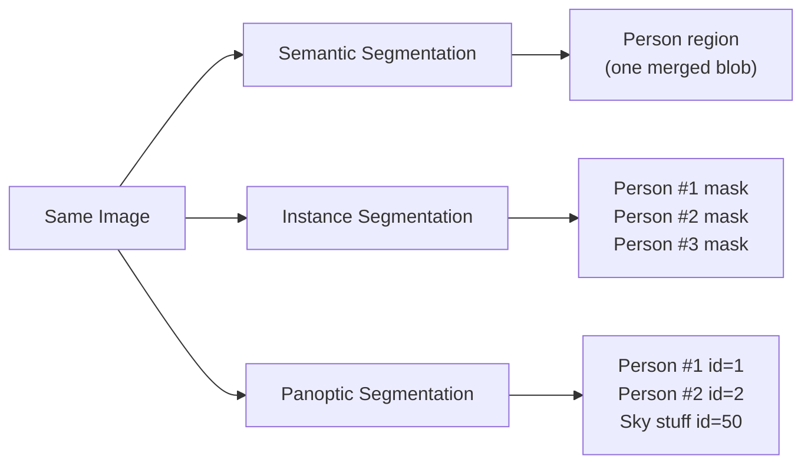
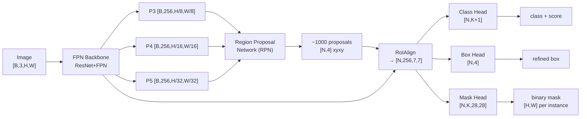
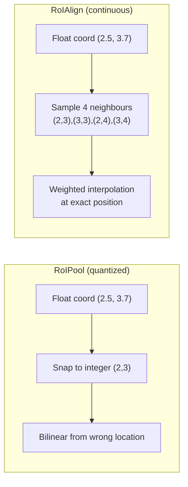
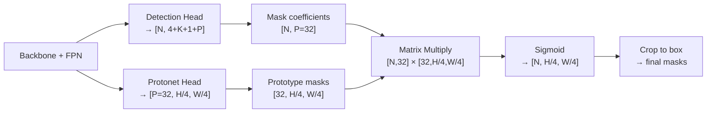
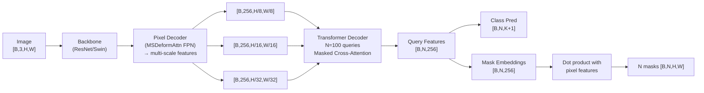
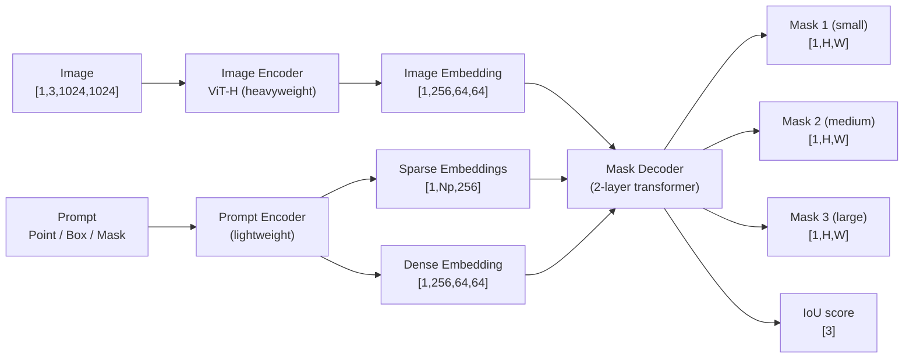

[← Back to Table of Contents](./README.md)

# Chapter 5 — Instance Segmentation

> *"Semantic segmentation asks 'what is here?' — instance segmentation asks 'what and which one?'"*

## Instance vs. Semantic Segmentation

Instance segmentation bridges object detection and semantic segmentation. While semantic segmentation assigns a class label to every pixel without distinguishing individual objects, instance segmentation assigns a unique identity to each object instance alongside its pixel-level mask.

**The key distinction**: three overlapping people produce three separate binary masks in instance segmentation, versus one merged "person" region in semantic segmentation.

**Output format**: a variable-length list of `(mask [H,W], class, score, box)` tuples per image, where N — the number of instances — can range from 0 to 100+.

| Property | Semantic Seg | Instance Seg | Panoptic Seg |
|---|---|---|---|
| Output | `[H,W]` class map | List of `(mask, class, score)` | `[H,W]` segment-ID map |
| Instances distinguished | ✗ | ✓ | ✓ |
| Stuff classes (sky/road) | ✓ | ✗ | ✓ |
| Variable output size | ✗ | ✓ | ✗ |
| Primary metric | mIoU | Mask AP | PQ |

**Applications**: medical cell counting and tracking, robot grasping (need individual object masks), augmented reality (occlude/highlight specific instances), video editing (background removal per person), industrial quality control.

**Challenges**: occlusion and touching objects (two adjacent people share a boundary), large scale variation, real-time inference with variable N, and mask quality at boundaries.



---

## Two-Stage Approach: Mask R-CNN

### Evolution from R-CNN to Mask R-CNN

Mask R-CNN (He et al., 2017) extends Faster R-CNN by adding a parallel mask prediction head. The lineage:

| Model | Key idea | Speed |
|---|---|---|
| R-CNN (2014) | Selective search crops → CNN per crop | ~47s/image |
| Fast R-CNN (2015) | Single forward pass + RoI Pooling | ~2s/image |
| Faster R-CNN (2015) | RPN replaces selective search | ~0.2s/image |
| Mask R-CNN (2017) | Add mask FCN head + RoIAlign | ~0.09s/image |

### Architecture



### RoIAlign Deep Dive

**The problem with RoIPool**: RoIPool quantizes floating-point RoI coordinates to integers, creating a spatial mismatch of up to half a cell. For a 7×7 output grid, this misalignment is minor for classification but catastrophic for pixel-precise masks.

**RoIAlign solution**: bilinear interpolation at fractional coordinates, no quantization.

For each output cell (i,j) in the target grid, RoIAlign samples 4 points and computes:

$$f(x,y) = \sum_{p \in \{p_{00},p_{01},p_{10},p_{11}\}} f(p) \cdot w(p, x, y)$$

where bilinear weights are:

$$w(p_{ij}, x, y) = \max(0, 1 - |x - p_{i}|) \cdot \max(0, 1 - |y - p_{j}|)$$

This allows the gradient to flow back to the correct feature map locations, significantly improving mask quality. Empirically: RoIAlign vs RoIPool gives +3.1 mask AP on COCO.



### Mask Head

The mask head is a small FCN applied to each RoI feature:

- Input: `[N, 256, 14, 14]` from RoIAlign
- 4× Conv(256, 3×3) + ReLU
- ConvTranspose(256→256, 2×2, stride=2) → `[N, 256, 28, 28]`
- Conv(256→K, 1×1) → `[N, K, 28, 28]` — K binary masks, one per class

During training, loss computed over ALL K masks. During inference, only the predicted-class mask is used.

**Key design choice**: K separate binary masks (not a single K-class softmax mask). This avoids competition between classes and lets the network specialize per class.

```python
# Mask R-CNN output structure (torchvision)
# outputs: List[Dict], one dict per image
# dict keys: "boxes" [N, 4], "labels" [N], "scores" [N], "masks" [N, 1, H, W]

import torch
import torchvision
from torchvision.models.detection import maskrcnn_resnet50_fpn

model = maskrcnn_resnet50_fpn(pretrained=True)
model.eval()

# image_tensor: [3, H, W], float32, range [0,1]
with torch.no_grad():
    outputs = model([image_tensor])  # List of dicts

for pred in outputs:
    boxes  = pred["boxes"]    # [N, 4]  — xyxy format, float32
    labels = pred["labels"]   # [N]     — class indices (int64)
    scores = pred["scores"]   # [N]     — confidence in [0,1]
    masks  = pred["masks"]    # [N, 1, H, W]  — soft masks (float32, 0→1)
    binary = (masks > 0.5).squeeze(1)  # [N, H, W]  — boolean binary masks

    # Filter by score threshold
    keep = scores > 0.5
    boxes, labels, scores, binary = boxes[keep], labels[keep], scores[keep], binary[keep]
```

### Training Loss

$$\mathcal{L} = \mathcal{L}_{cls} + \mathcal{L}_{box} + \mathcal{L}_{mask}$$

- $\mathcal{L}_{cls}$: cross-entropy over K+1 classes (K object + 1 background)
- $\mathcal{L}_{box}$: SmoothL1 for the 4 box regression deltas
- $\mathcal{L}_{mask}$: average binary cross-entropy over the 28×28 mask for the GT class only

Crucially, mask and class losses are **decoupled**: the mask head does not see class labels during training, and the class prediction does not depend on the mask. This makes training more stable.

---

## One-Stage Approaches

### YOLACT (2019)

YOLACT (You Only Look At CoefficienTs) factorizes instance masks into **prototype masks** (shared basis functions) and per-instance **linear coefficients**.

**Key idea**: Instead of predicting a full H×W mask per instance (expensive), predict:
1. P prototype masks `[P, H/4, W/4]` — shared across all instances
2. K coefficients per instance `[N, P]`
3. Final mask = sigmoid(coefficients @ prototypes)



- Speed: 33 FPS on Titan Xp, 29.8 mask AP on COCO
- Limitation: prototype masks are global, so masks of nearby instances can bleed together

### CondInst (2020)

CondInst generates **dynamic convolutional filters** conditioned on each instance's features. The controller head outputs the weights of a small FCN that is then applied to segmentation features.

- Per-instance: predict filter weights (e.g., three 3×3 conv layers = 169 weight values)
- Apply these dynamic filters to a shared feature map
- Result: per-instance mask at full resolution
- No prototypes needed; cleaner boundary handling
- Competitive with Mask R-CNN at 2× the speed

### SOLOv2 (2020)

SOLO (Segmenting Objects by Locations) assigns each grid cell to predict the mask kernel for the instance centered there.

- Grid: S×S cells, each predicts whether it contains an instance center
- Kernel branch: per cell predicts a conv kernel (256 channels)
- Feature branch: produces segmentation features at each resolution
- Apply predicted kernels → instance masks
- Matrix NMS for efficient parallel suppression

| Method | Mask AP (COCO) | FPS | Notes |
|---|---|---|---|
| Mask R-CNN (ResNet-50-FPN) | 34.6 | 8.6 | Two-stage baseline |
| YOLACT (ResNet-101) | 31.2 | 33.5 | Fast one-stage |
| CondInst (ResNet-50) | 35.9 | 18.0 | Dynamic filters |
| SOLOv2 (ResNet-101) | 39.7 | 10.4 | Kernel prediction |
| Mask2Former (Swin-L) | 54.1 | 3.5 | Query-based SOTA |

---

## Query-Based Approaches

### Mask2Former (2021)

Mask2Former unifies semantic, instance, and panoptic segmentation in a single architecture. It uses **masked attention** to focus each query on its predicted region.



**Masked attention** — the key innovation: cross-attention for query i is restricted to the foreground region predicted in the previous decoder layer:

$$\text{Attention}(Q, K, V) = \text{softmax}\!\left(\frac{QK^T}{\sqrt{d}} + M\right) V$$

where $M_{ij} = 0$ if pixel $j$ is in query $i$'s predicted region, else $-\infty$.

This forces each query to specialize on one instance, preventing "attention collapse" where all queries attend to the same salient region.

**Performance**: Mask2Former with Swin-L backbone achieves 57.8 PQ on COCO panoptic, 54.1 mask AP on COCO instance, 57.7 mIoU on ADE20K semantic.

### OneFormer (2022)

OneFormer adds a **task token** to guide the model: text token "semantic"/"instance"/"panoptic" conditions all decoder queries. One model, three tasks.

---

## Panoptic Segmentation — Unified View

Panoptic segmentation unifies semantic ("stuff": sky, road, grass) and instance ("things": person, car, cup) segmentation.

**Output**: every pixel assigned a unique `(class, instance_id)` pair. Stuff pixels share instance_id=0; thing pixels have unique IDs.

### Panoptic Quality (PQ)

$$PQ = \underbrace{\frac{\sum_{(p,g) \in TP} \text{IoU}(p,g)}{|TP|}}_{\text{SQ: Segmentation Quality}} \times \underbrace{\frac{|TP|}{|TP| + \frac{1}{2}|FP| + \frac{1}{2}|FN|}}_{\text{RQ: Recognition Quality}}$$

**Worked example** (3-class problem, IoU threshold = 0.5):

| Predicted Segment | Best Matching GT | IoU | Match? |
|---|---|---|---|
| Person #1 (id=1) | Person GT #1 | 0.82 | TP |
| Person #2 (id=2) | Person GT #2 | 0.61 | TP |
| Person #3 (id=3) | Person GT #3 | 0.38 | FP (IoU < 0.5) |
| Car #1 (id=10) | Car GT #1 | 0.75 | TP |
| Sky (id=0) | Sky GT | 0.91 | TP |
| Road GT | (unmatched) | — | FN |

- $|TP| = 4$, $|FP| = 1$, $|FN| = 1$
- $SQ = (0.82 + 0.61 + 0.75 + 0.91) / 4 = 0.7725$
- $RQ = 4 / (4 + 0.5 + 0.5) = 4/5 = 0.80$
- $PQ = 0.7725 \times 0.80 = 0.618$

| Method | PQ (COCO) | Mask AP (COCO inst) | Notes |
|---|---|---|---|
| Panoptic FPN | 40.9 | 37.5 | First panoptic model |
| Panoptic DeepLab | 43.9 | — | Bottom-up approach |
| Mask2Former (Swin-L) | 57.8 | 54.1 | Query-based SOTA |
| OneFormer (ConvNeXt-XL) | 60.1 | 55.4 | Task-conditioned |

---

## Segment Anything Model (SAM)

SAM (Kirillov et al., 2023) is a foundation model for promptable segmentation — given an image and a prompt (point, box, text, or mask), it outputs a mask.

### Architecture



**Prompt types**:
- **Point prompt**: foreground point (label=1) or background point (label=0), encoded as positional embedding
- **Box prompt**: two corner points (top-left and bottom-right)
- **Mask prompt**: previous mask logits as dense embedding
- **Text prompt**: available in SAM 2 via language encoder

**Three output masks**: SAM always outputs 3 candidate masks (for different granularities: part, object, group) plus IoU confidence scores. The user selects the most appropriate mask.

**SA-1B dataset**: 11M diverse images, 1.1B high-quality masks. Collected with a human-in-the-loop pipeline: (1) auto-generate masks, (2) human annotators refine ambiguous ones, (3) fully automated for final scale. Each image has ~100 masks on average.

### SAM 2: Video Extension

SAM 2 (Ravi et al., 2024) extends SAM to video:
- **Memory attention**: cross-attend to past frame embeddings stored in a memory bank
- **Memory encoder**: encodes the predicted mask + image embedding for storage
- **Streaming inference**: process frames sequentially, maintain consistent instance IDs
- Supports all SAM 1 prompt types + temporal propagation

```python
from segment_anything import sam_model_registry, SamPredictor
import numpy as np

# Load model
sam = sam_model_registry["vit_h"](checkpoint="sam_vit_h_4b8939.pth")
predictor = SamPredictor(sam)

# Set image — runs ViT-H encoder: [H,W,3] → [1,256,64,64]  (~100ms on A100)
predictor.set_image(image_rgb)  # image_rgb: [H,W,3] uint8

# ── Point prompt ──────────────────────────────────────────────────────────────
masks, scores, logits = predictor.predict(
    point_coords=np.array([[500, 375]]),  # [1, 2]  — (x, y) pixel coords
    point_labels=np.array([1]),           # [1]     — 1=foreground, 0=background
    multimask_output=True                 # return 3 masks at different granularities
)
# masks:  [3, H, W]  bool
# scores: [3]        IoU predictions per mask (higher = better)
# logits: [3, 256, 256]  low-res mask logits (can be fed back as prompt)
best_mask = masks[scores.argmax()]  # [H, W] bool

# ── Box prompt ────────────────────────────────────────────────────────────────
masks_box, scores_box, _ = predictor.predict(
    box=np.array([100, 200, 600, 500]),  # [4] — xyxy format
    multimask_output=False
)
# masks_box: [1, H, W]

# ── Everything mode (automatic mask generator) ───────────────────────────────
from segment_anything import SamAutomaticMaskGenerator
mask_generator = SamAutomaticMaskGenerator(
    sam,
    points_per_side=32,          # grid density
    pred_iou_thresh=0.88,        # filter low-quality masks
    stability_score_thresh=0.95, # stability filter
    crop_n_layers=1,             # hierarchical crop for small objects
)
all_masks = mask_generator.generate(image_rgb)
# all_masks: List[Dict] — each dict has 'segmentation'[H,W], 'bbox'[4], 'area', 'predicted_iou'
```

### Limitations and Practical Notes

- Image encoder (ViT-H) is slow: ~100ms per image on A100 (bottleneck)
- No text prompt in SAM 1 (added in SAM 2 via Grounding SAM variants)
- No semantic labels — outputs masks, not class names
- For class-labeled masks: combine with a classifier or use Grounded-SAM (SAM + Grounding DINO)

---

## Evaluation Metrics

### Instance Segmentation AP

Same framework as detection AP, but IoU is computed on **masks** instead of boxes.

**Mask IoU**:
$$\text{MaskIoU}(M_{pred}, M_{gt}) = \frac{|M_{pred} \cap M_{gt}|}{|M_{pred} \cup M_{gt}|}$$

where intersection and union are pixel counts (boolean AND / OR).

```python
def mask_iou(pred_mask: torch.BoolTensor, gt_mask: torch.BoolTensor) -> float:
    """
    pred_mask, gt_mask: [H, W] boolean tensors
    returns: IoU as float in [0, 1]
    """
    intersection = (pred_mask & gt_mask).sum().float()  # pixel count
    union        = (pred_mask | gt_mask).sum().float()  # pixel count
    return (intersection / union.clamp(min=1)).item()

# Vectorized: N pred masks vs M gt masks → [N, M] IoU matrix
def mask_iou_matrix(pred_masks: torch.Tensor, gt_masks: torch.Tensor) -> torch.Tensor:
    """
    pred_masks: [N, H, W]  bool
    gt_masks:   [M, H, W]  bool
    returns:    [N, M]     float IoU
    """
    pred_flat = pred_masks.flatten(1).float()  # [N, HW]
    gt_flat   = gt_masks.flatten(1).float()    # [M, HW]
    
    inter = torch.mm(pred_flat, gt_flat.T)                    # [N, M]
    pred_area = pred_flat.sum(1, keepdim=True)                # [N, 1]
    gt_area   = gt_flat.sum(1, keepdim=True)                  # [M, 1]
    union = pred_area + gt_area.T - inter                     # [N, M]
    return inter / union.clamp(min=1)                         # [N, M]
```

**COCO Instance Segmentation Metrics**:

| Metric | Description |
|---|---|
| AP (primary) | mAP averaged over IoU thresholds 0.50:0.05:0.95 |
| AP50 | mAP at IoU = 0.50 |
| AP75 | mAP at IoU = 0.75 (strict) |
| APS | AP for small objects (area < 32²) |
| APM | AP for medium objects (32² < area < 96²) |
| APL | AP for large objects (area > 96²) |

**Boundary IoU** (Cheng et al., 2021): computes IoU only within a narrow band around the boundary (e.g., d=2% of image diagonal). Better reflects perceptual mask quality at edges.

**Panoptic metrics**: PQ, SQ, RQ — see panoptic section above.

---

## Practical Inference Code

### Mask R-CNN (torchvision)

```python
import torch
import torchvision
from torchvision.models.detection import maskrcnn_resnet50_fpn, MaskRCNN_ResNet50_FPN_Weights
import numpy as np
import cv2

# Load pretrained model
weights = MaskRCNN_ResNet50_FPN_Weights.DEFAULT
model = maskrcnn_resnet50_fpn(weights=weights)
model.eval()
device = "cuda" if torch.cuda.is_available() else "cpu"
model = model.to(device)

# Preprocess
transform = weights.transforms()
img_tensor = transform(image_pil).to(device)   # [3, H, W], float32

with torch.no_grad():
    preds = model([img_tensor])[0]   # dict with boxes, labels, scores, masks

# Visualize
colors = np.random.randint(0, 255, (len(preds["labels"]), 3))
canvas = np.array(image_pil)
for i, (mask, label, score) in enumerate(
        zip(preds["masks"], preds["labels"], preds["scores"])):
    if score < 0.5:
        continue
    m = mask[0].cpu().numpy() > 0.5   # [H, W] bool
    canvas[m] = 0.5 * canvas[m] + 0.5 * colors[i]
```

### Mask2Former (HuggingFace)

```python
from transformers import Mask2FormerForUniversalSegmentation, Mask2FormerImageProcessor
import torch

processor = Mask2FormerImageProcessor.from_pretrained(
    "facebook/mask2former-swin-large-coco-instance")
model = Mask2FormerForUniversalSegmentation.from_pretrained(
    "facebook/mask2former-swin-large-coco-instance")
model.eval()

inputs = processor(images=image_pil, return_tensors="pt")
# inputs["pixel_values"]: [1, 3, H, W]
# inputs["pixel_mask"]:   [1, H, W]

with torch.no_grad():
    outputs = model(**inputs)

result = processor.post_process_instance_segmentation(
    outputs, target_sizes=[image_pil.size[::-1]]
)[0]
# result["segmentation"]: [H, W]  — segment ID map
# result["segments_info"]: list of dicts with id, label_id, score
```

---

## Key Takeaways

1. **Instance segmentation = detection + per-instance mask**: every modern approach builds on a strong detector backbone.
2. **RoIAlign over RoIPool**: bilinear interpolation avoids quantization artifacts, critical for mask quality.
3. **Two-stage (Mask R-CNN) vs one-stage (YOLACT/CondInst)**: two-stage is more accurate; one-stage is faster.
4. **Query-based (Mask2Former)** is state-of-the-art and unifies all segmentation tasks.
5. **SAM** enables zero-shot prompted segmentation; pair with Grounding DINO for class-labeled results.
6. **Panoptic segmentation = things + stuff**: PQ = SQ × RQ decomposes quality into segmentation and recognition.
7. **Mask AP threshold 0.50:0.95** is the right metric — AP50 alone is too easy.
8. **Boundary quality** matters for downstream tasks; use Boundary IoU alongside standard AP.

---

## Further Reading

| Resource | What you'll learn |
|---|---|
| He et al. (2017) — Mask R-CNN | Two-stage instance segmentation foundation |
| Bolya et al. (2019) — YOLACT | Prototype-based one-stage instance seg |
| Tian et al. (2020) — CondInst | Dynamic convolutions for instance seg |
| Cheng et al. (2021) — Mask2Former | Unified query-based segmentation |
| Kirillov et al. (2023) — SAM | Foundation model for promptable segmentation |
| Ravi et al. (2024) — SAM 2 | SAM extended to video |
| Kirillov et al. (2019) — Panoptic Segmentation | PQ metric and panoptic task definition |
| Cheng et al. (2021) — Boundary IoU | Better boundary evaluation metric |

**Next: [Chapter 6 — Object Tracking →](./06_object_tracking.md)**

---
*Last updated: May 2026*
